================================================================================
Acceleo Code Generation - Let's start with an Android example
================================================================================

:Authors:
	Laurent Goubet,
	Axel Richard,
	Jonathan Musset
:Contact:
	laurent.goubet@obeo.fr,
	axel.richard@obeo.fr,
	jonathan.musset@obeo.fr

Copyright |copy| 2008, 2010 Obeo\ |trade|.

.. |copy| unicode:: 0xA9 
.. |trade| unicode:: U+2122

Introduction
================================================================================

Pre-requisites
--------------------------------------------------------------------------------

The reader should have a minimal knowledge about MDA concepts, the eclipse
platform, Android and the java language.

Documentation for Acceleo
--------------------------------------------------------------------------------

This tutorial is part of a set offered by Obeo. Each document of this set deals 
with a different aspect of mastering Acceleo:

- Acceleo Operations Reference: description and explanation of each operation of the Acceleo script syntax;
- User Guide : documentation of Acceleo features;
- Acceleo Tutorial : how to create a new Acceleo project.

Goals
--------------------------------------------------------------------------------

This is a quick tutorial.

- Beginners will see a simple but concrete case-study;
- Acceleo addicts will discover some new killer features;
- Android experts will learn enough of the basics to be able to create advanced code generators in a few days.

Installation
================================================================================

Eclipse
--------------------------------------------------------------------------------

This tutorial is performed on the Eclipse 3.5 (Galileo) Modeling Bundle. 
This bundle contains all of the required components to follow through the whole tutorial (EMF, 
Acceleo, OCL, ...). You can download the appropriate Eclipse Bundle on the
`Eclipse Download Page <http://www.eclipse.org/downloads/>`_ .

Android
--------------------------------------------------------------------------------

Android works like Java. You need an Android Runtime in order to execute
your Android applications. 

You can download Android SDK and the Android Development Tool (ADT) Eclipse Plugin
on the `official download page <http://developer.android.com/sdk/index.html>`_.

For the installation, follow the
`official instructions <http://developer.android.com/sdk/installing.html>`_.

For this tutorial, the Android SDK starter package version is the R05, and the
SDK platform is the 2.1. The ADT Plugin version is the 0.9.6.

The last step of installation is to link Eclipse with the SDK:
 
1. In Eclipse, choose *Window > Preferences*.
2. Select *Android* in the left panel.
3. Click *Browse* and navigate to where the SDK is installed.
4. Click *Apply*. The list of SDK targets will be reloaded. 
5. Click *OK*.

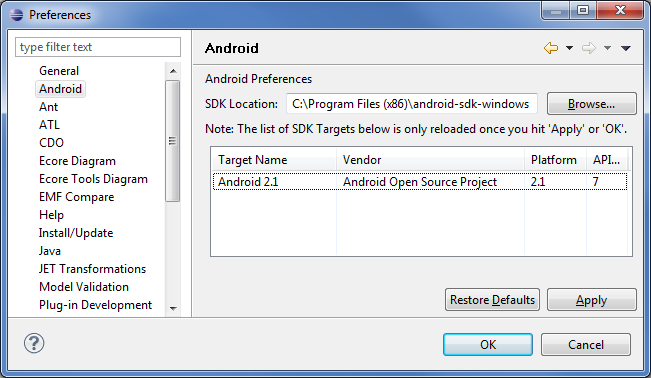

Create an Android Virtual Device
________________________________________________________________________________

To run an Android application, you have to create an Android Virtual Device 
(AVD). With Eclipse, select *Window > Android SDK and AVD Manager*. 

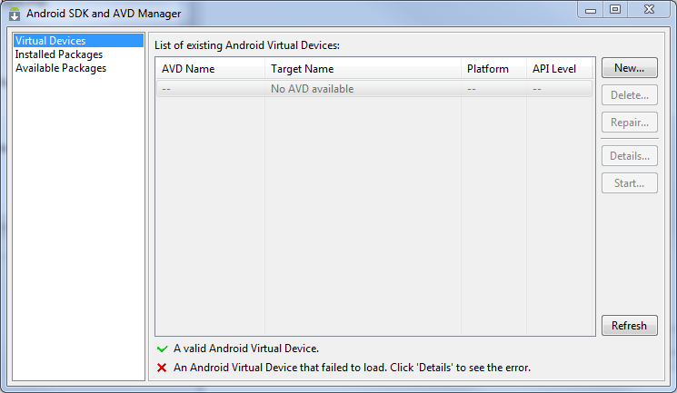

Create a new AVD.

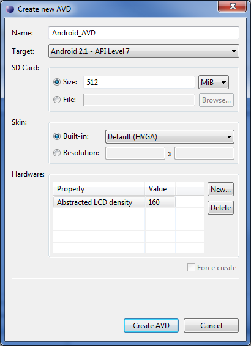

For more information about the AVDs : 
http://developer.android.com/guide/developing/tools/avd.html.

Prototype based approach - Starting from an example
================================================================================

Presentation
--------------------------------------------------------------------------------

The example presented in this tutorial is the creation of a classic Android 
application : *MyContacts*. This application is a contact manager with a screen
to edit people information.

You will see how you can create an Acceleo code generator in an Android context 
but it also works on other domains...

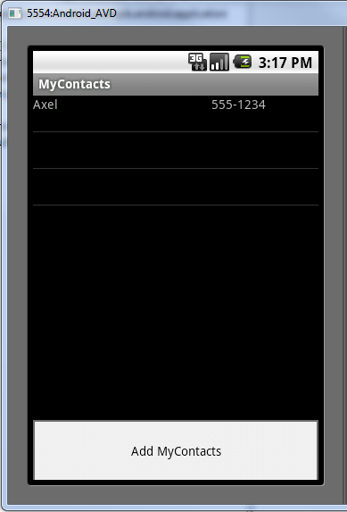

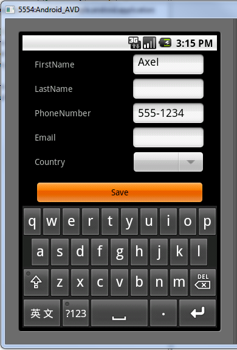

Creation of a Prototype
--------------------------------------------------------------------------------

The Android meta-model
________________________________________________________________________________

The Ecore meta-model describes what a simple Android application is with the 
*Activity* and *Widget* concepts. If you need more information about EMF and Ecore,
visit : http://www.eclipse.org/modeling/emf/.

Create the Ecore meta-model :
~~~~~~~~~~~~~~~~~~~~~~~~~~~~~~~~~~~~~~~~~~~~~~~~~~~~~~~~~~~~~~~~~~~~~~~~~~~~~~~~

1. Click *File > New > Other > Eclipse Modeling Framework > Ecore Model*. Click *Next*. 

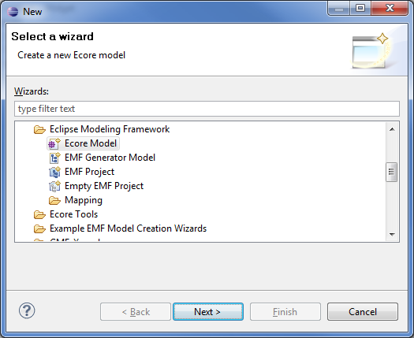

2. Choose the source folder where the model will be created.
3. Fill in an appropriate name for your model. Click *Next*.

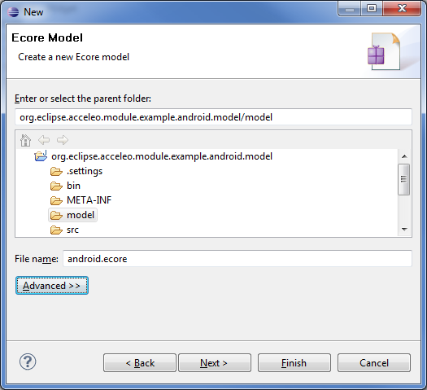

4. Select the Model Object and the encoding. Click *Finish*

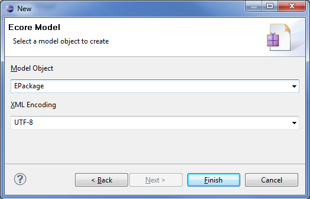

Construct the Ecore meta-model :
~~~~~~~~~~~~~~~~~~~~~~~~~~/images/android_tutorial/~~~~~~~~~~~~~~~~~~~~~~~~~~~~~~~~~~~~~~~~~~~~~~

An Android application is made up of a *Project*, *Activities* and *Widgets*. A 
Project contains activities. An Activity contains widgets. Several kind of 
widgets exist like TextFields, Spinners, Buttons... In our case, the meta-model
only contains concepts we need for the application. Add more widgets or other
concepts if needed.

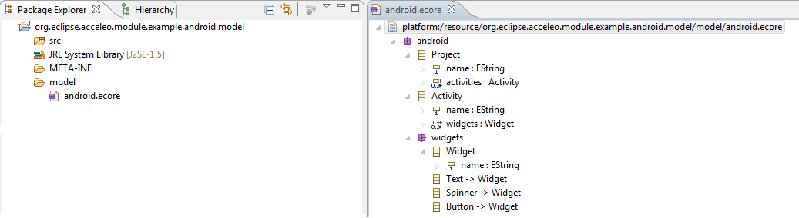

The root package must contains a Namespace URI (i.e. a unique identification) :

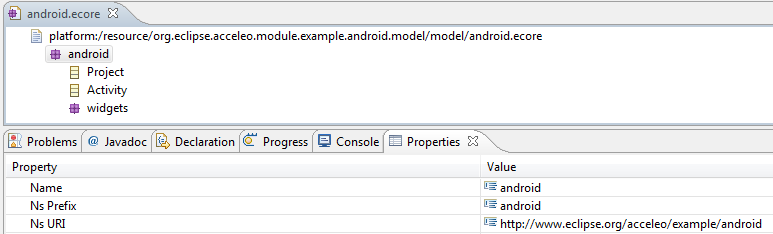

A Project can contains 0 or an infinity of activities (represented by *-1* in the
*Upper Bound*) :

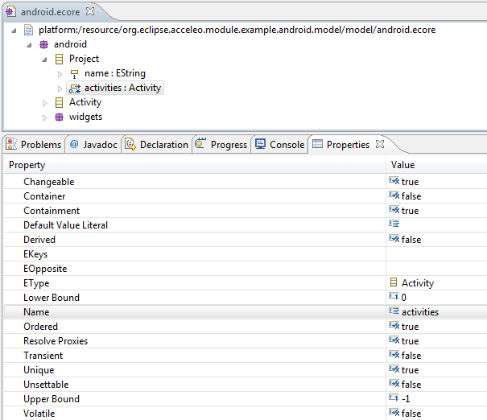

The *Widget EClass* is an interface for the different widget types :

.. image:: ../images/android_tutorial/android_Metamodel_4.png

The *Text EClass* is a subclass of *Widget* :

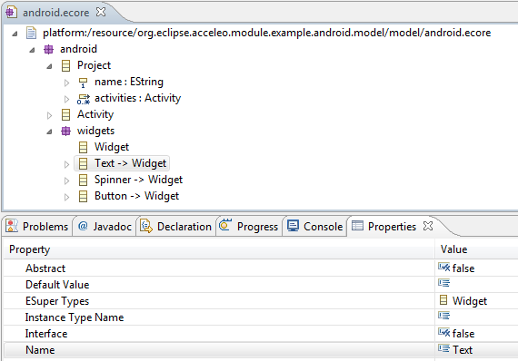

Create the EMF Generator model :
~~~~~~~~~~~~~~~~~~~~~~~~~~~~~~~~~~~~~~~~~~~~~~~~~~~~~~~~~~~~~~~~~~~~~~~~~~~~~~~~

The EMF Generator model will generate the code representing the meta-model.

1. Click *File > New > Other > Eclipse Modeling Framework > EMF Generator Model*. Click *Next*.

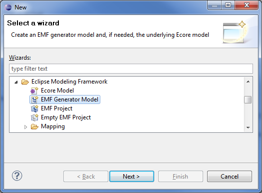

2. Choose the source folder where the generator model will be created.
3. Fill in an appropriate name for the generator. Click *Next*.

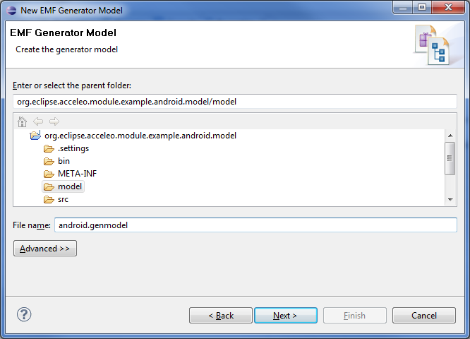

4. Select the Ecore model importer. Click *Next*.

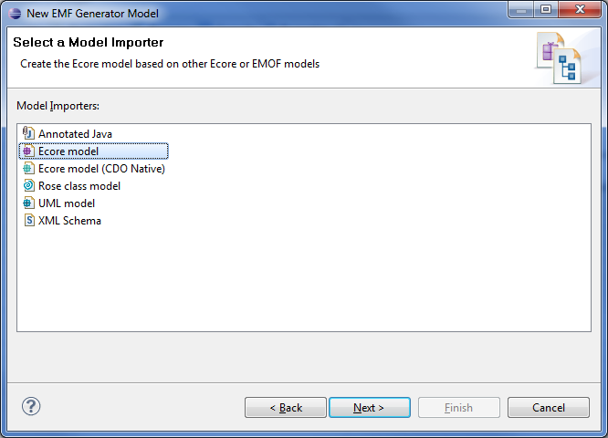

5. Import your Ecore meta-model. Click *Next*.

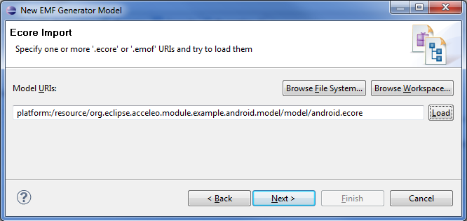

6. Select the root package. Click *Finish*.

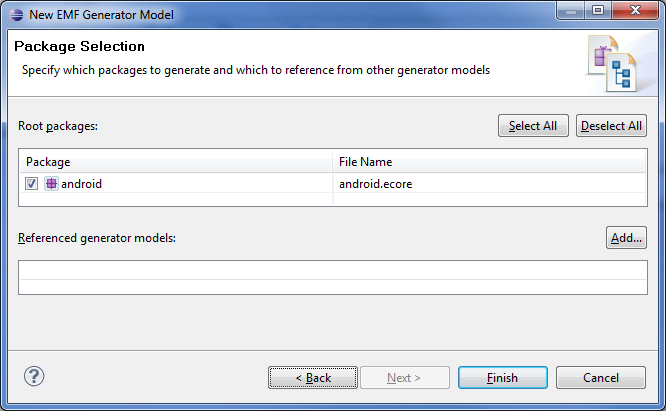

7. Open your new *.genmodel* file and edit the *Base Package* in the *Property View* as shown below :

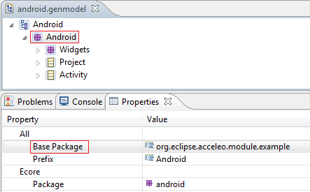

8. Likewise, edit the generation directories :

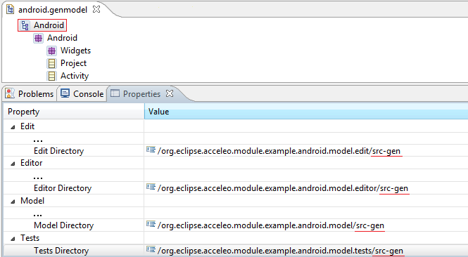

9. Right-click on the root element and select in order *Generate Model Code*, *Generate Edit Code*, and finally *Generate Editor Code*.

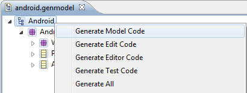

10. Your Package Explorer should look like this :

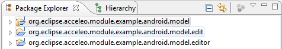

The Runtime environment
________________________________________________________________________________

Once the meta-model created, you have to create a *Run Configuration* that will 
allow you to use the meta-model (as a plugin).

1. Right-click and run: *Run > Run Configuration*.

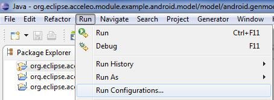

2. Right-Click on the *Eclipse Application* item and select *New*. Rename the
configuration, choose a location, and run it.

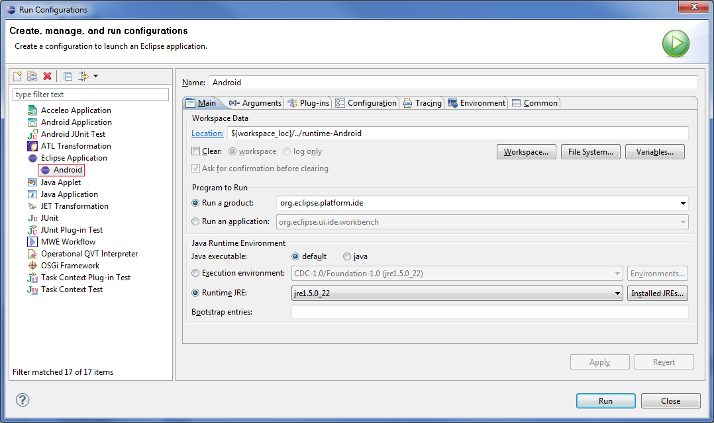

The Android Project
________________________________________________________________________________

In the new Eclipse Runtime environment, you are going to create a new Android 
Project.

1. Click *File > New > Other... > Android > Android Project*.

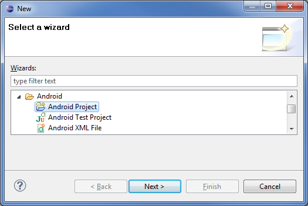

2. Fill in both the project name an the package name fields.

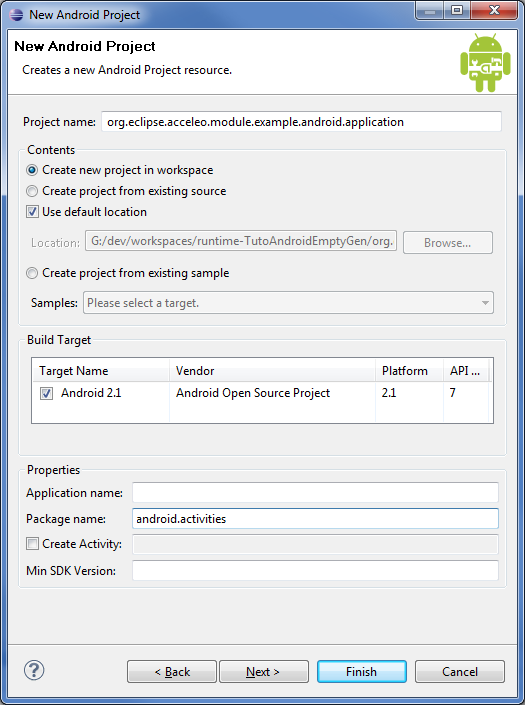

3. Your Package Explorer now looks like this :

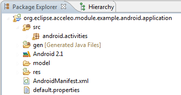

The prototype sources
~~~~~~~~~~~~~~~~~~~~~~~~~~~~~~~~~~~~~~~~~~~~~~~~~~~~~~~~~~~~~~~~~~~~~~~~~~~~~~~~

[PENDING Link to MyContacts zip]

The model of the application *MyContacts*
~~~~~~~~~~~~~~~~~~~~~~~~~~~~~~~~~~~~~~~~~~~~~~~~~~~~~~~~~~~~~~~~~~~~~~~~~~~~~~~~

We are going to create the model of our *MyContacts* application.

1. Click *File > New > Other...*. In the list, select *Example EMF Creation Wizard > Android Model*. Click *Next >*.

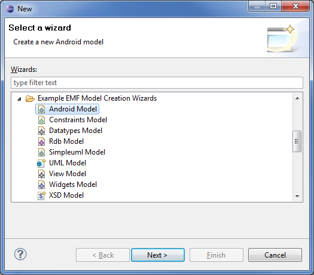

2. Select the parent source folder and fill in the name of the model as follows. Click *Next >*.

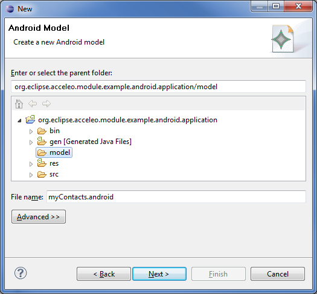

3. Select the *Model Object* and the *XML Encoding*. Click *Finish*.

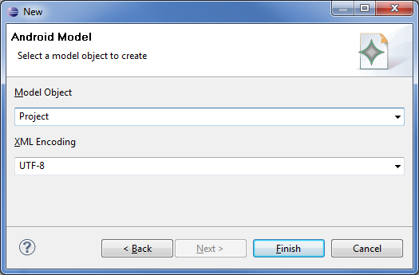

4. Using the java sources of the application, try to create a model representing it.

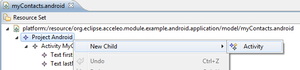

5. Your model must look like this. TextFields Widgets for the name, the phone number and the e-mail address. A Spinner for the country and a save Button. 

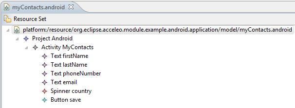

Initialize the Acceleo code generation project
--------------------------------------------------------------------------------

Now the Android project, the Android meta-model and the *MyContacts* model have 
been created, we are going to create the code generation project:

1. In the Acceleo perspective, run *File > New > Acceleo Project*. In this tutorial, the project will be named *org.eclipse.acceleo.module.sample.example.android*.
2. Click *Next >*.

.. image:: ../images/android_tutorial/android_Create_New_Acceleo_Project.png

3. Fill in the Android meta-model's NsURI in the *Metamodel URI* field or select it with the *Browse* button. Then, select the Activity type in the *Generate for type* list.
4. In our case we are going to use the *Advanced* mode to use the *Initializing a Project with an Example* feature. Push the *Advanced* button and check the *Initialize contents* checkbox.
5. Then, choose *Copy example content* in the list, and browse the first java source file of the *MyAccounts* application.
6. Fill in the name of the template file.
7. Check the *This will generate a file* checkbox.
8. Uncheck the *Create a main annotation @main* checkbox (we will see what this checkbox means later).
9. Repeat the operation for each kind of generated file.

.. image:: ../images/android_tutorial/android_Create_New_Acceleo_Project_2.png

The new project will appear in the package browser and a small *Acceleo* 
decorator will indicate that it is a generation project.

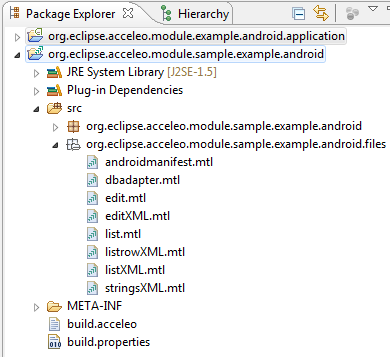

The *This will generate a file* checkbox means that the file will generate text 
in a file. Concretely, a *File Tag* appears in the template. The first argument 
is the filepath. 

10. Update filepath of each module so that they generate in the right folders.

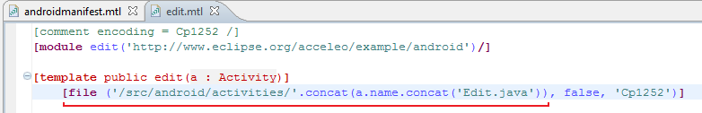

Initialize the workflow - The main entry point
--------------------------------------------------------------------------------

As mentioned in the OMG specification, MTL files (modules) can call for templates or queries defined in other MTL modules.

1. In the Acceleo perspective, in the modules package folder, right-clik and run: *New > Acceleo Module File*. If you are not in the Acceleo perspective, right-click and run: *New > Other > Acceleo Model To Text > Acceleo Module File*.
2. Push the *Advanced* button and check the *Create a main annotation @main* checkbox.

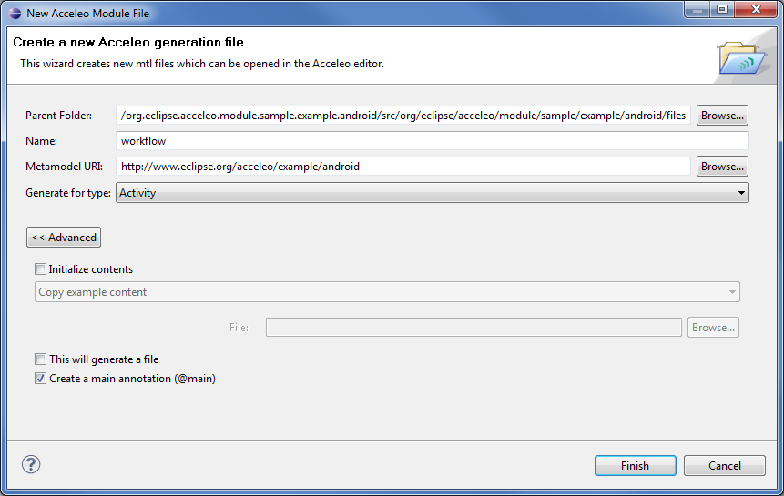

3. This template will call all the other modules that generate text. Import all the modules and call their templates that generate text.

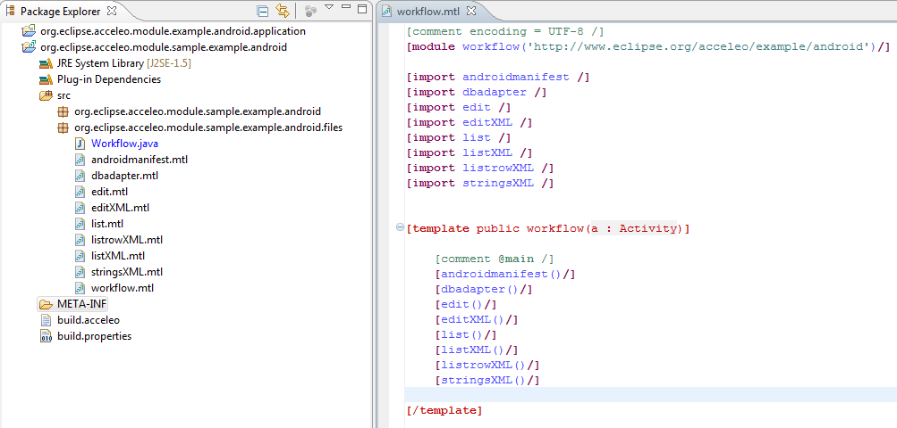

Editing the code generator
--------------------------------------------------------------------------------

Quick replacement
________________________________________________________________________________

With Acceleo, you can select any part of a static text in a template and the
completion will offer you to replace it by a dynamic Acceleo expression. It 
shows the number of occurrences that will be replaced along too. Here, we'll replace
all the occurrences of the String *MyContacts* in the different modules by the 
*[a.name.toUpperFirst()/]* Acceleo expression. Take note that the default 
Acceleo Expression proposed is *[name.toUpperFirst()]* in this case, but you can
write any expression you want.

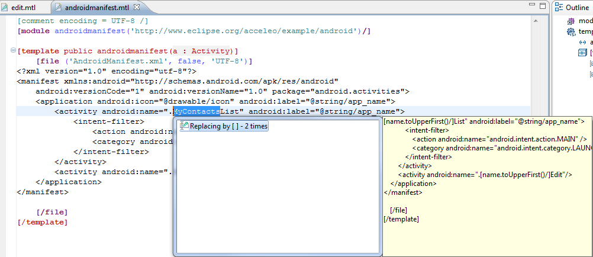

The expressions are automatically updated as you change the selected one.

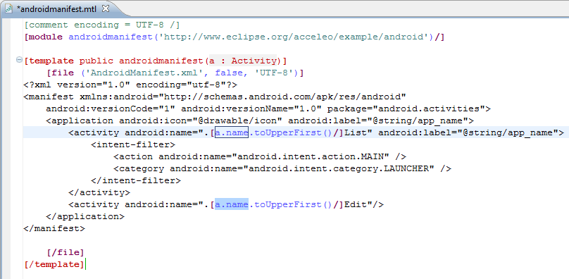

Quick hierarchy tree
________________________________________________________________________________

As For/If
~~~~~~~~~~~~~~~~~~~~~~~~~~~~~~~~~~~~~~~~~~~~~~~~~~~~~~~~~~~~~~~~~~~~~~~~~~~~~~~~

In the Android meta-model, you have different types of Widgets, like Text, 
Spinner, Button... Acceleo provides a way to customize quickly your code, 
and manage the different possibilities. With the combo *For/If*, you can apply
a specific treatment to each kind of Widgets.

1. In the modules that contains Widgets declarations or calls, select them and then right-click and run: *Source > As For/If*.

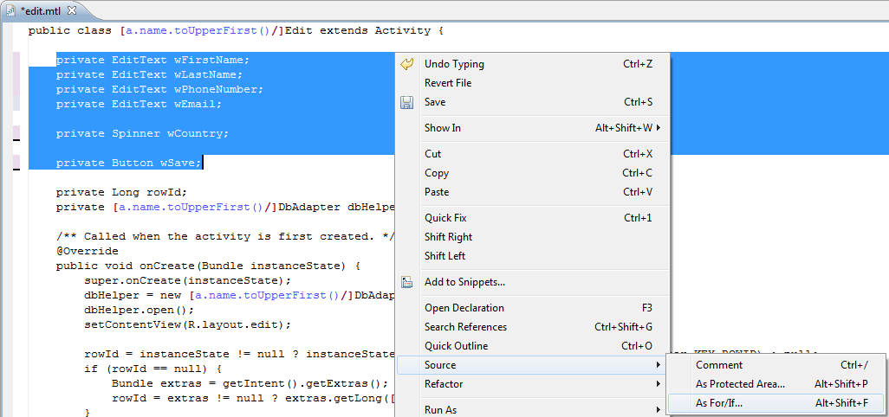

Each kind of Widget is isolated.

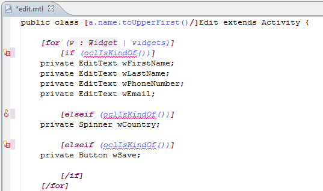

2. Then key in the appropriate type of Widget in each condition.

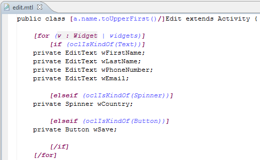

3. Leave just one TextField declaration and delete the other ones. Complete it by changing the static name of Widgets with a dynamic Acceleo expression by using the *Quick replacement* tool.

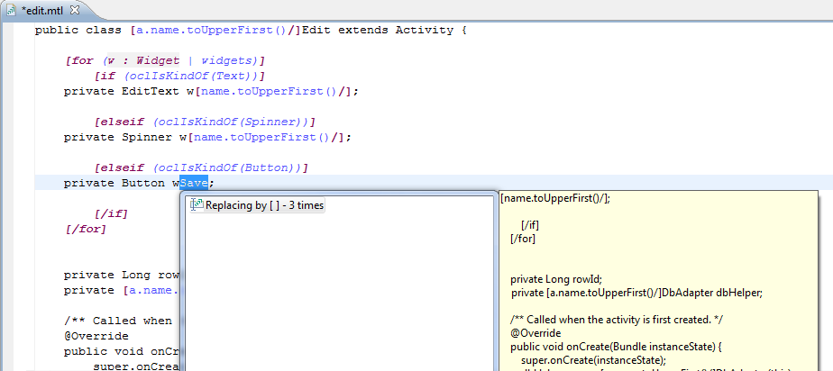

4. Repeat for the other files.

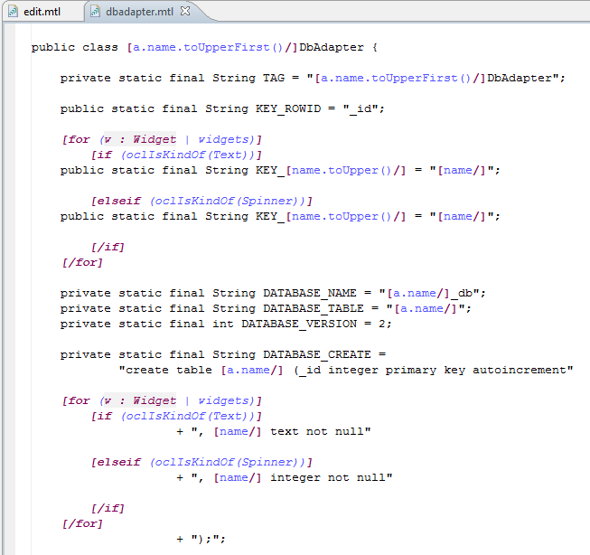

Be careful with the *For Loop*. Inside of it, use an explicit call for the name of the Activity.

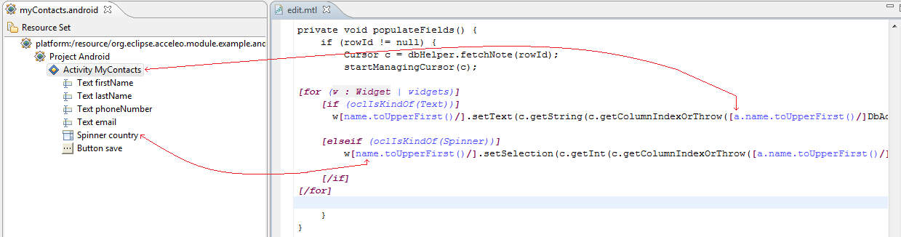

Extract Template
~~~~~~~~~~~~~~~~~~~~~~~~~~~~~~~~~~~~~~~~~~~~~~~~~~~~~~~~~~~~~~~~~~~~~~~~~~~~~~~~

You can also use the *Extract Template* tool by selecting a static text, 
right-click and run: *Refactor > Extract Template...*.

.. image:: ../images/android_tutorial/android_Extract_Template.png

Rename and edit your new template.

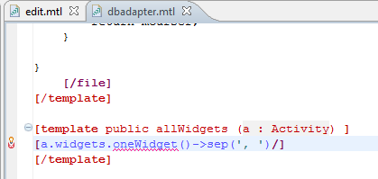

Quick fixes
~~~~~~~~~~~~~~~~~~~~~~~~~~~~~~~~~~~~~~~~~~~~~~~~~~~~~~~~~~~~~~~~~~~~~~~~~~~~~~~~

The Quick fixes allow you to create templates and queries easily. When you are
in an Acceleo expression, write the name of the template/query you want to 
create and then right-click and run: *Quick Fix*. Then, you can choose the
adapted operation you want, like *Create template - after last member*.

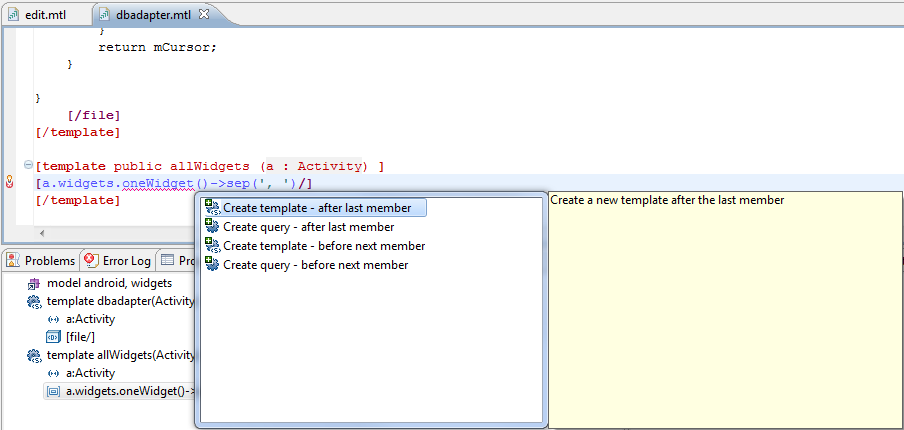

Fill in the template body.

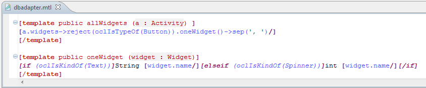

Use this new template.

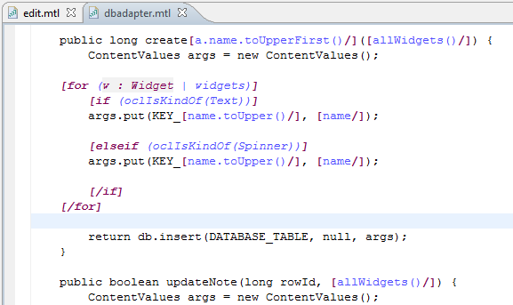

Run and test the generated version of the prototype
--------------------------------------------------------------------------------

You are ready to run and test your own version of the application. 

Generate the code
________________________________________________________________________________

1. Delete the original source files.

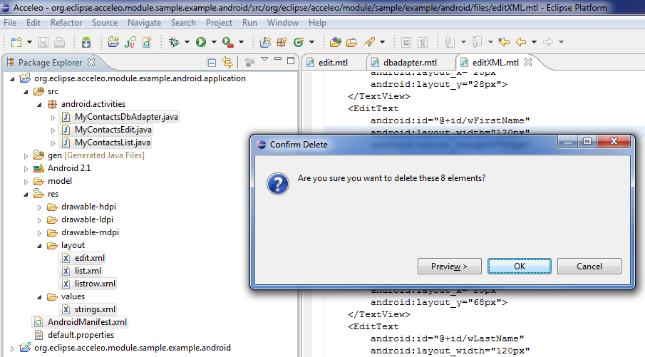

2. We'll create the generator's *Run configuration*. Right-click on the main entry point module and run: *Run As > Launch Acceleo Application*.
3. Select the *MyContacts* model in the *Model* field.
4. Select the target folder, where the new source files will be generated.

.. image:: ../images/android_tutorial/android_Run_And_Test_2.png

5. Push the *Run* button.
6. That's it! The files have been generated in the Android project.

Run the application
________________________________________________________________________________

1. Now, let's create the Android application's *Run configuration*. Right-click on the Android project and run: *Run As > Run Configurations*.
2. Right-clik on the *Android Application* item in the list and select *New*.
3. Change the configuration name.
4. In the *Project* panel, click *Browse* to select the Android application.
5. In the *Launch Action* panel, select the *Launch* radiobutton and choose *MyContactsList* Activity.

.. image:: ../images/android_tutorial/android_Run_And_Test_3.png

6. Push the *Run* button. Here we go ! Your own Android *MyContacts* application is running.

Run on other models to create new applications...
--------------------------------------------------------------------------------

Your generation project is reusable with another model. In a few clicks, you can
create a model of an application that will count the OlympicGames medals and 
generate it !

1. Create the model such as on :

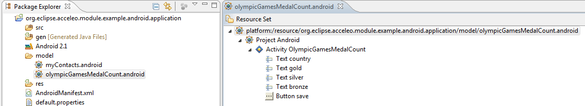

2. Update the Acceleo *Run Configuration*.

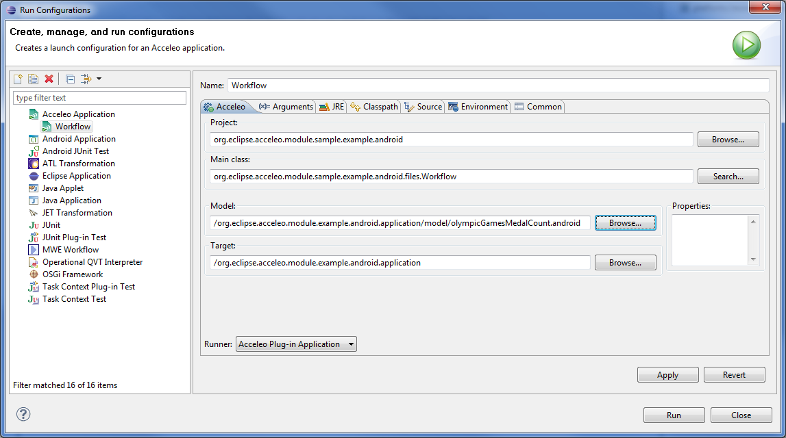

3. Generate the code.

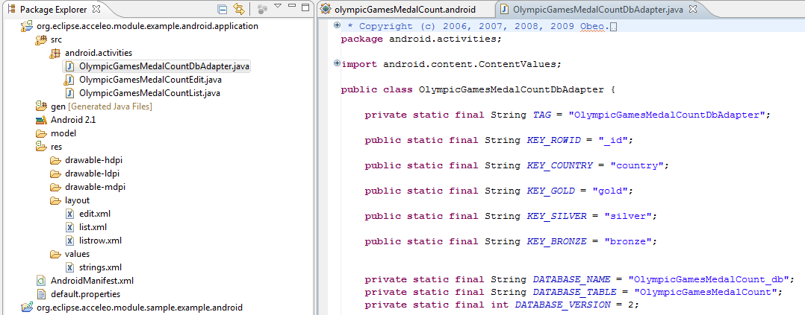

4. Update the Android *Run Configuration*. 

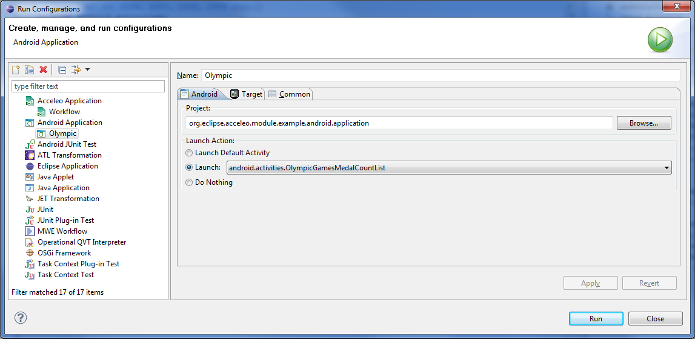

5. Launch and see the result !

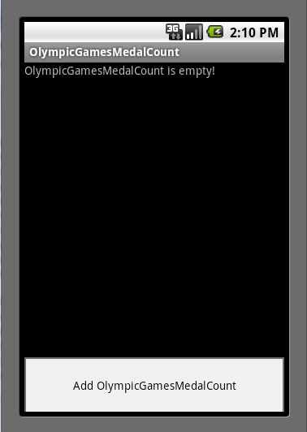
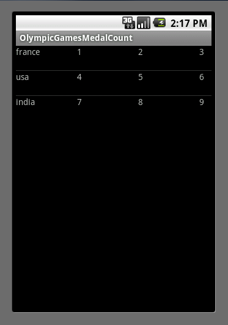

A little bit about incremental generation
--------------------------------------------------------------------------------

The incremental generation consist in defining specific zones with user tags 
[protected] in order to keep you own code between the generations.

1. Select the code you want to keep, right-click and run: *Source > As Protected Area*.

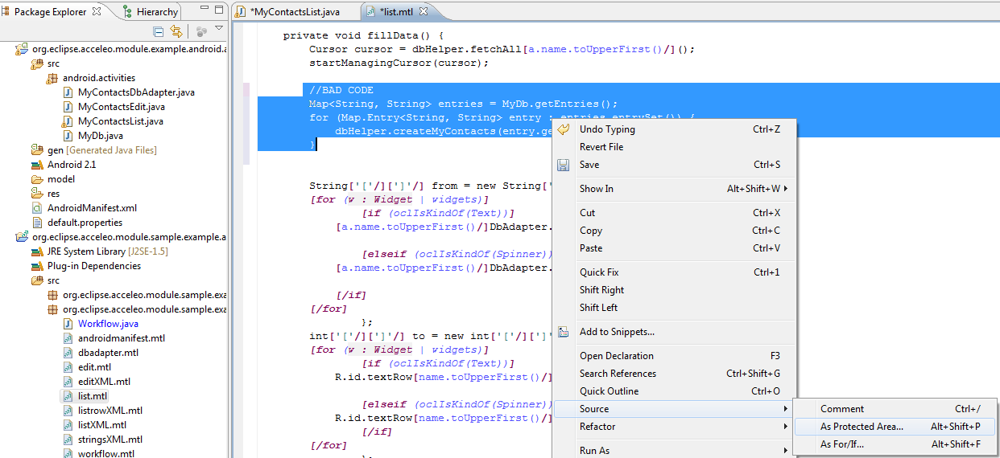

User tags now surround your initial code selection.

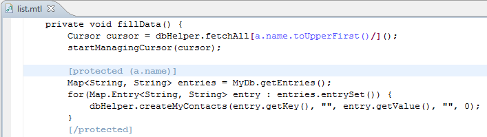

2. Comment the *User tags*, and cut the code inside the tags. 

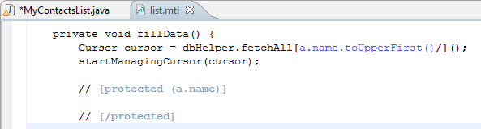

3. Launch a generation. You can see the *User tags* in the generated file.

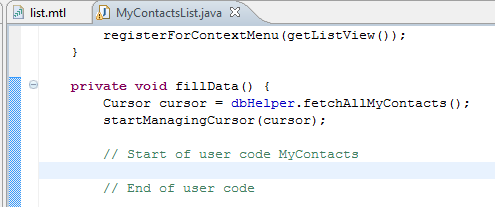

4. Paste the code inside the protected tags in the generated source file.

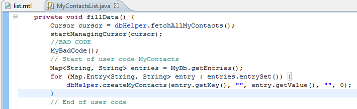

From now on, the code inside the *User tags* will be kept by any subsequent 
generation. Manual code entered outside of the *User tags* will be ignored and
overwritten on the next generation. In this example, the "BAD CODE" String will not
be there after the next generation, because it has been written outside *User tags*
in a generated file.

Workbench Acceleo views
--------------------------------------------------------------------------------

Acceleo provides tools to easily edit and maintain the code.

The *Result View*
________________________________________________________________________________

The *Result View* shows how the text, the templates, and the models are 
synchronized. 
After a generation, select any element in the *Result View* and the associated
generated code will be highlighted. Likewise, select any piece of code in a
generated file, and you will see the associated element in the *Result View*.

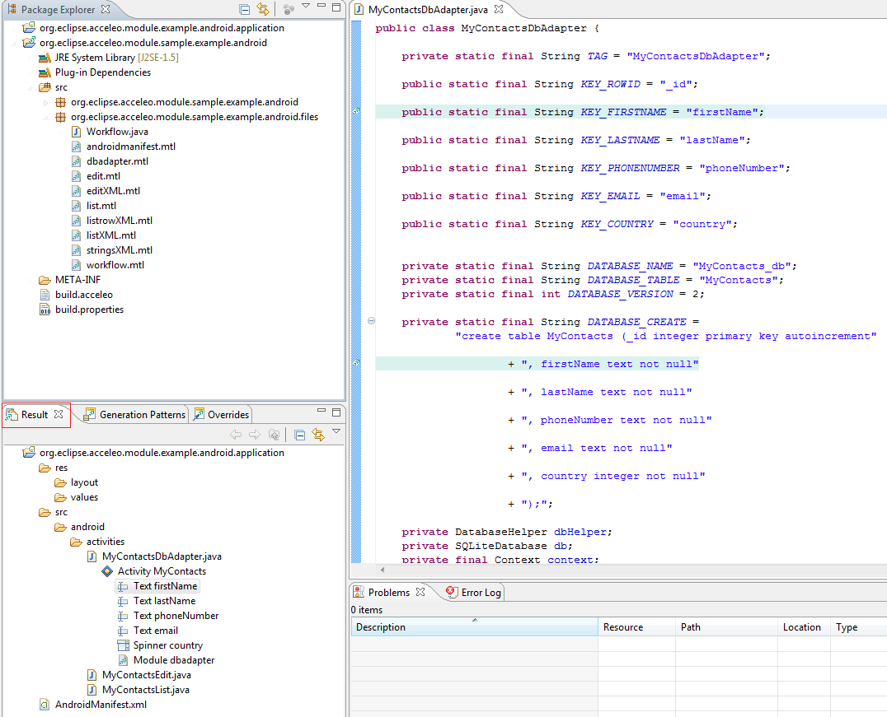

You can also right-click on an element in the *Result View* and run: 
*Open declaration*. This will open the Acceleo expression associated with the 
element.

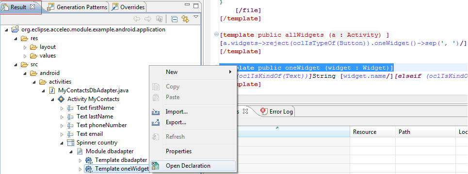

The *Patterns View*
________________________________________________________________________________

The *Patterns View* is a tooling view where you can define you own completion 
proposal item for the Acceleo editor.

As an example, if you want to define a query for each kind of Widget, check 
*[query] for all selected types* and each kind of Widgets. Then, in a module, 
the completion will propose the pattern you defined.

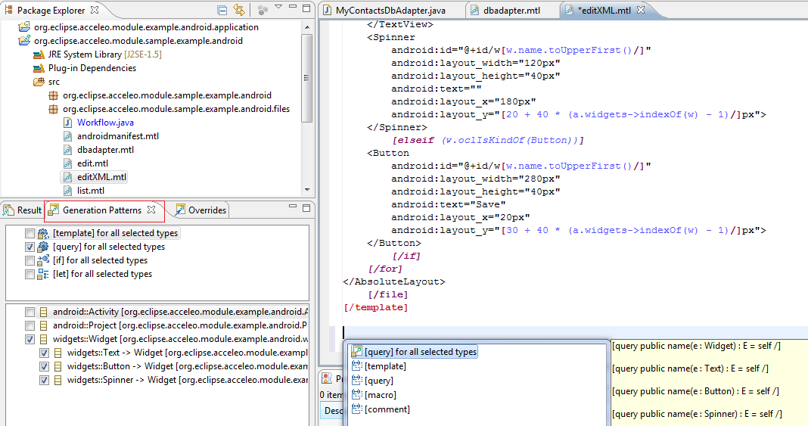

Just rename the queries and add the return type.

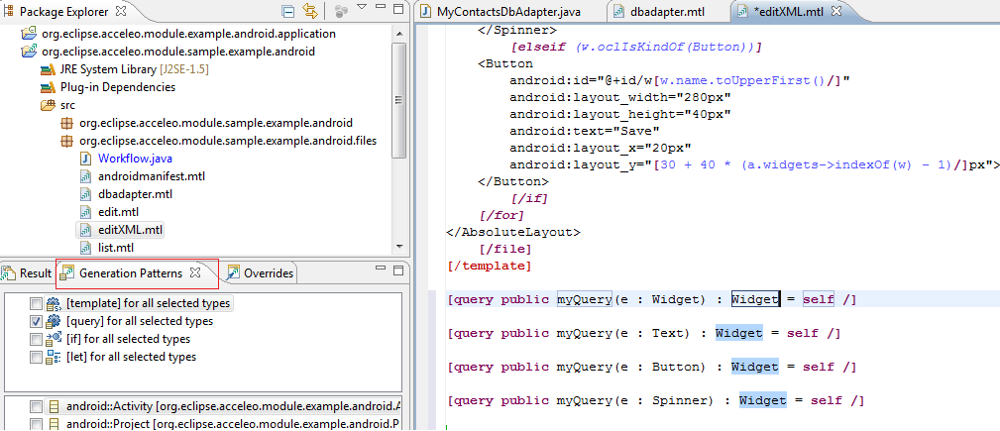

The *Overrides View*
________________________________________________________________________________

The *Overrides View* is an entry point to easily override an existing template 
behavior.

In the *Overrides View*, select the template you want to override. Then, in a 
module, the completion will offer to override the template you selected.

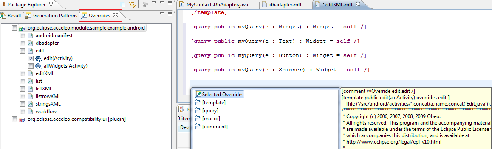

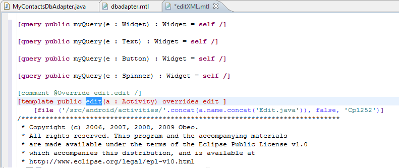

Conclusion
================================================================================

Now you can make a complete Android code generator with more widgets...

The original project sources : [PENDING sources of the original project]

This tutorial also exists in a slide-presentation version : [PENDING original eCon presentation]

