================================================================================
Acceleo User Guide
================================================================================

:Authors:
	Laurent Goubet,
	Laurent Delaigue
:Contact:
	laurent.goubet@obeo.fr

Copyright |copy| 2008, 2010 Obeo\ |trade|.

.. |copy| unicode:: 0xA9 
.. |trade| unicode:: U+2122
.. _JMerge: http://wiki.eclipse.org/JET_FAQ_How_does_JMerge_work%3F
.. _EMF: http://www.eclipse.org/modeling/emf/
.. contents:: Contents

Introduction
================================================================================

Pre-requisites
--------------------------------------------------------------------------------
The reader should have a minimal knowledge about MDA concepts, the eclipse
platform, and the java language.

Overview
================================================================================

Acceleo is the reference implementation of the OMG MTL Specification.
It is an Open-Source implementation, fully integrated in the eclipse platform,
though generations can also be run outside of eclipse.
Acceleo is fully compatible with the `Eclipse Modeling Framework
<http://www.eclipse.org/modeling/emf/>`_. Consequently, Acceleo is compatible
with any editor using EMF metamodels, like the eclipse UML implementations.

[PENDING - Links towards general MDA documentations]

Installation
--------------------------------------------------------------------------------
The simplest way of installing Acceleo is to use a version of eclipse where it
is already installed!
Some versions of Eclipse Helios contain Acceleo, just pick your preferred
version at `the eclipse download site <http://www.eclipse.org/downloads/>`_.

Otherwise, it is always possible to install Acceleo like any other feature in
eclipse. Use the `Help > Install New Software` menu and use the official eclipse
Helios update site.

Eclipse Integration
--------------------------------------------------------------------------------

Acceleo is fully integrated within the eclipse platform. This means that
editing, running, debugging can all be executed within eclipse, by using the
usual eclipse paradigms.
Let's first examine the main elements available for Acceleo in eclipse.

The Acceleo Perspective
________________________________________________________________________________

The Acceleo perspective allows users to work in an environment which provides
every facility to increase productivity while working with Acceleo.
For instance, Acceleo-specific menus are available by default in the Acceleo
perspective in order to make it easy to create projects or templates, and so on.

To switch to the Acceleo perspective, click on *Window > Open Perspective >
Other...*, select the perspective named *Acceleo* (Beware, if you have Acceleo
2.x installed, you may see two Acceleo perspectives available ; they can be
told apart with their icons).

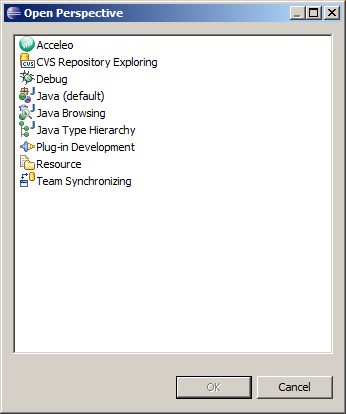

This perspective can also be opened with the "perspectives" button available on
the top right corner of eclipse.

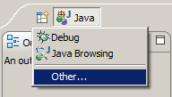

By default, the views displayed in the Acceleo perspective are:

- Package explorer;
- Editor area (okay, it's not a view);
- Outline;
- Problems;
- Error Log;
- 3 Acceleo-specific views:

  - The Result view;
  - The Overrides view;
  - And the GenerationPatterns view.

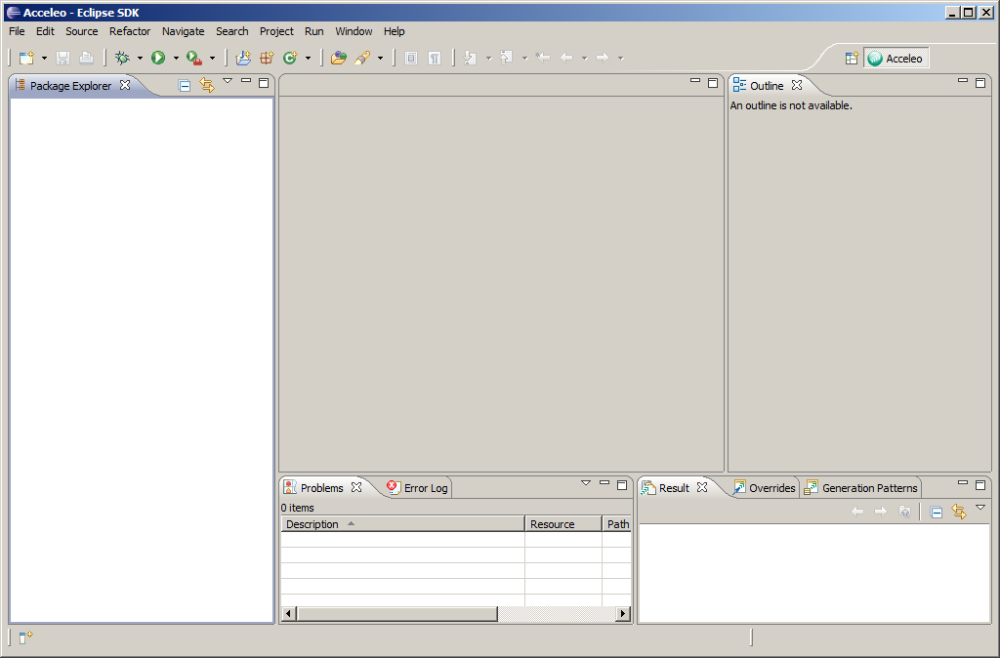

In the Acceleo perspective, the pop-up menu available on the package explorer
allows users to easily create Acceleo artifacts (such as projects or modules).

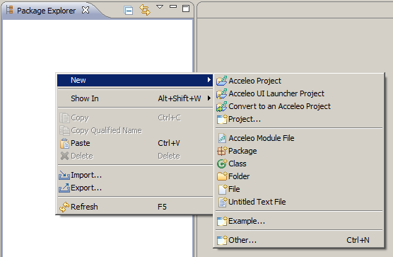

Acceleo Projects
--------------------------------------------------------------------------------
Acceleo projects are eclipse projects associated with the Acceleo nature.
Such projects contain Acceleo modules, java code, and anything required for the
needs of the code generation to achieve.

**Note:** It is recommended to use a naming that respects the `eclipse plug-ins
naming conventions <http://wiki.eclipse.org/Naming_Conventions>`_. Of course, 
the name prefix has to be adapted to your specific context, but remember that
using a naming convention that prevents naming conflicts is a good idea.

Creating an Acceleo Project "From Scratch"
________________________________________________________________________________

The aim of an Acceleo project is to generate text from a model (or from a set of
models).
For this tutorial, we will create a new Acceleo module for generating java beans
from a UML model.

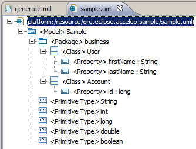

To create a new Acceleo project, right click on the package explorer view then
select *New->Acceleo Project*.

.. image:: ../images/new_acceleo_module_project.png

Choose a correct plug-in name for the project, then click next.

.. image:: ../images/new_acceleo_module_project_1.png

This wizard page allows you to initialize the project by creating one or
several Acceleo module files.

- Select the folder in which you want to create the new module file.
- Fill in the module name
- Optionally, you can select an existing file which will be copied into the new
  module file. This could be useful to create a module from an existing "target"
  file.
- Then, select the metamodel from which your generation file will take its types
  (in this example, UML)
- Finally, choose the metaclass that will be used to generate the file (in this
  example, Class). This can be modified later at any time directly in the module
  files.

**Note:** Other options are available to initialize the new module with existing
content. These options will be discussed later.

.. image:: ../images/new_acceleo_module_project_2.png

You can create more than one module file in this project by using the "Add"
button on the left.

Clicking on finish will create the module file(s), and some files automatically
generated from it (more on these below).

.. image:: ../images/new_acceleo_module_project_result.png

Creating an Acceleo UI Project
________________________________________________________________________________
This action can only be performed on an existing Acceleo project.

It allows you to create and initialize a plug-in project that will contain
everything needed to launch the Acceleo generations of your project through
actions available in pop-up menus, integrated in eclipse.
This facilitates a lot the deployment of Acceleo generators in the eclipse
platform.
The created UI plug-in project is configured to create a popup menu on files with
a given extension and to generate files in a folder found by evaluating a java
expression, which can be customized.

To perform this, just right-click on your Acceleo project, then select
*Acceleo > Create Acceleo UI Launcher Project*.

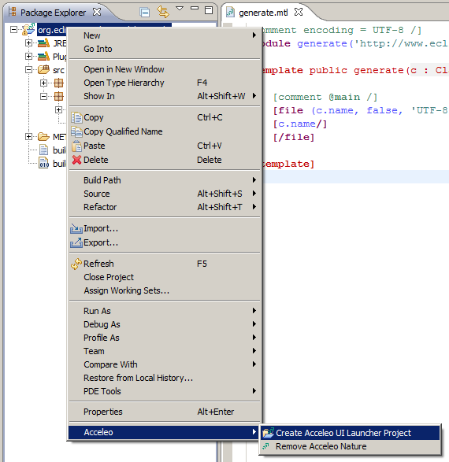

This will start a wizard that will guide you through the creation process.
First, enter the target UI plug-in project name.

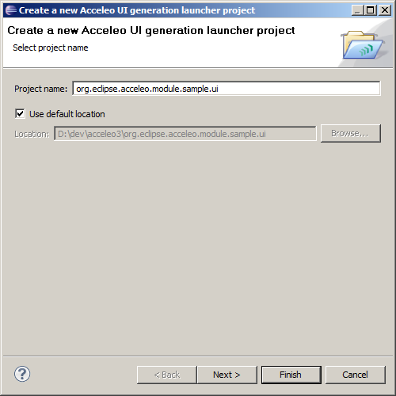

Then, select the projects this UI plug-in will depend on. In our example, we only
depend on our Acceleo generator project, but in real life, an UI project could
require several Acceleo projects, plus optionally other projects depending on
your working environment.

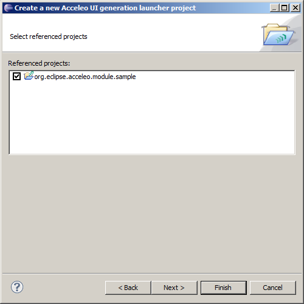

The wizard now requires the following information:

- The generator name (this name will be displayed to users in the UI);
- The model filename filter, which indicates on which file extensions the popup
  menu will appear;
- The java code that is responsible to find the target folder and assign it to a
  ``target`` variable of type ``IContainer``.
  By default, the wizard proposes some code which uses the ``src-gen`` folder in
  the project that contains the model chosen by the user.

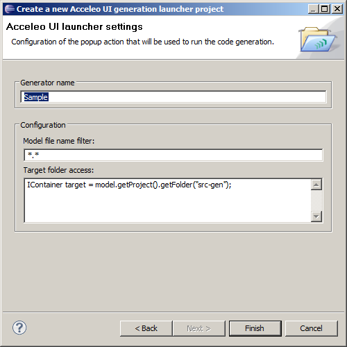

Click on *Finish*.

A new plug-in project is then created in the workspace with the previously
entered information. This plug-in can be maintained as any other plug-in project
in eclipse.

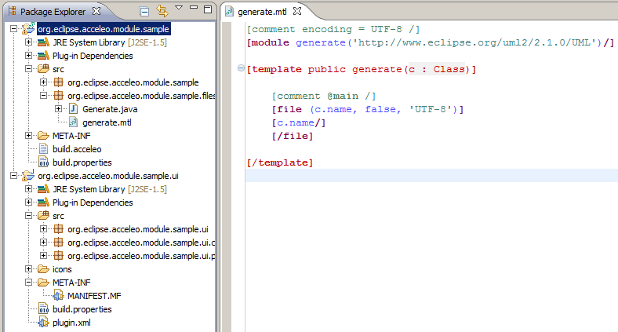

To see this plug-in in action, just open the plug-in's MANIFEST.MF, and click on
the "Launch an Eclipse application" link in the "Testing" paragraph.

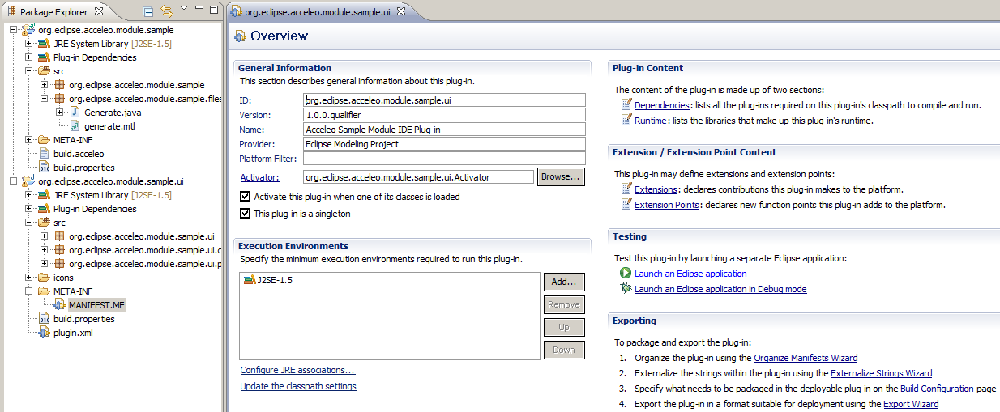

A new action appears in the pop-up menu when right-clicking on files whose
name matches the name filter declared in the extension described in the
``plugin.xml`` file of the UI plug-in.

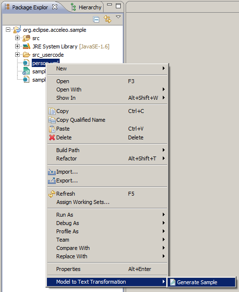

By default, the generated UI plug-in matches any file.

The menu where the generation action appears and everything else can be adapted
to your needs via the eclipse extension mechanism.
For example, the name filter for which this action will be proposed can be
modified like this:

- Open the MANIFEST.MF file;
- Go to the *Extensions* tab;

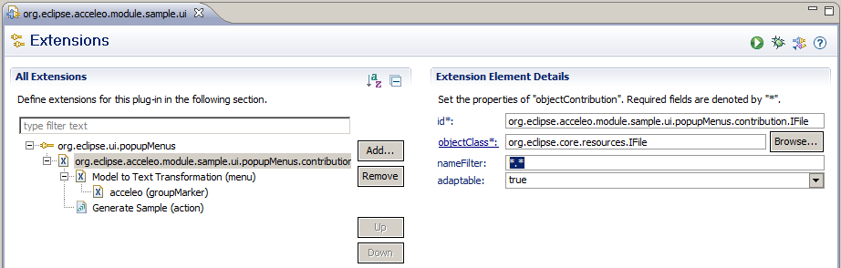
  
- Modify the *nameFilter* field of the *popupMenus* extension.

For more information about the eclipse extension mechanism, please refer to the
eclipse Plug-in Development Environment (PDE) documentation.

Transforming an Existing Project into an Acceleo Project
________________________________________________________________________________
Acceleo provides a facility to convert an existing project into an Acceleo
project.
Technically, this means that the *Acceleo nature* will be added to the project's
natures.

This can be achieved by right-clicking in the package explorer, then selecting
*New > Convert to an Acceleo Project*.

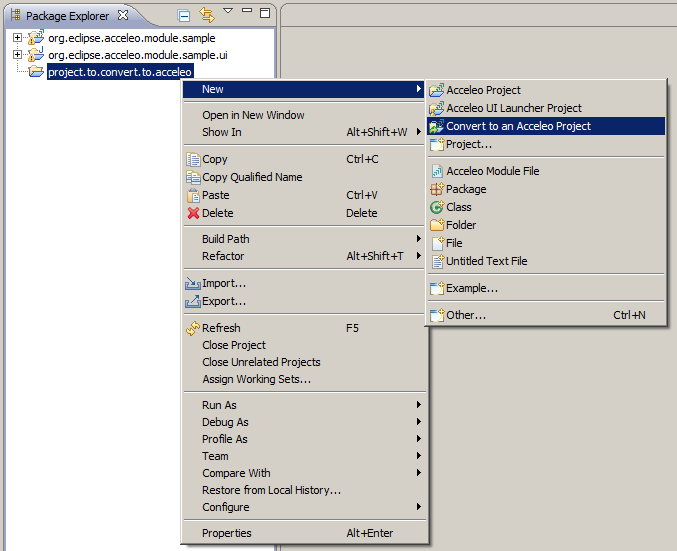

Select the project(s) that must be turned into Acceleo project(s), and click on
*Finish*.

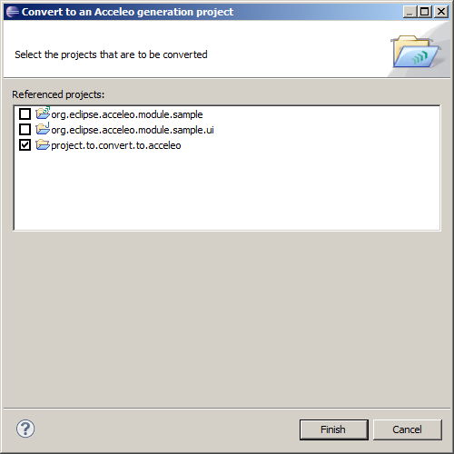

**Note:** The *Acceleo nature* can be removed from an Acceleo project simply by
right-clicking on the project and selecting *Acceleo > Remove Acceleo Nature*.

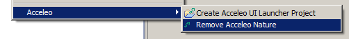

Installing an Example Acceleo Project
________________________________________________________________________________
Acceleo provides several example projects which you can use to get started and
take a look at how to organize generator projects.

To install one of these examples in your workspace, right-click in the package
explorer and select *New > Other...*. Go to the "Examples" folder, then to
"Acceleo Plug-ins" and select the example to import into your workspace. Each
example has a small description displayed at the top of the window.

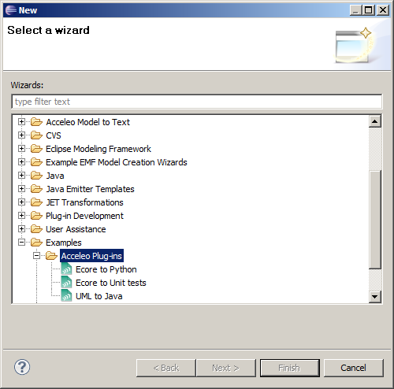

Click on *Finish*, and one or several new projects appear in your workspace.

These example are really useful to start with Acceleo, so don't hesitate to
import them, examine them, and modify them!

Acceleo Modules
--------------------------------------------------------------------------------

A module is a ``.mtl`` file, which contains templates (to generate code) and/or
queries (to extract information from the manipulated models).

The file must start with the module declaration in the form

``[module <module_name>('metamodel URI 1')]``

A module can *extend* another module, in which case its templates will be able
to *override* its parent's "public" and "protected" templates.

Imports
________________________________________________________________________________

An Acceleo module generally depends on other modules for its execution.
Consequently, Acceleo modules explicitly declare the modules they depend on via
*import* declarations.

The syntax is the following:

``[import qualified::name::of::imported::module /]``

The content assistant (*Ctrl + Space*) will propose you all accessible modules.
Select the module you want to import and its qualified name will be inserted.

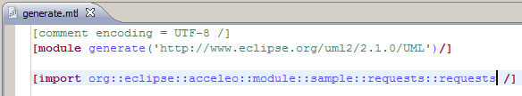

*Note:* It is possible to use a non-qualified name in an import, but this is
not recommended since it can easily lead to bugs that are hard to understand in
case of name conflicts between Acceleo modules.

The content assistant can be invoked to generate an import tag:
just enter ``import``, then *Ctrl + Space*, and the completion proposes
"[import]" and generates an ``[import /]`` tag.

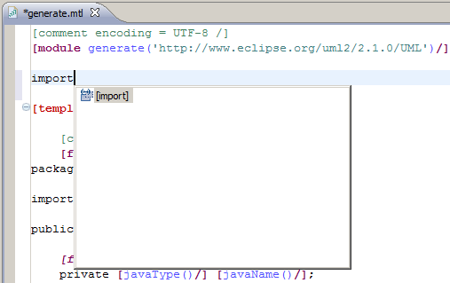

Templates
________________________________________________________________________________

Templates are sets of Acceleo statements used to generate text. They are
delimited by ``[template]...[/template]`` tags.

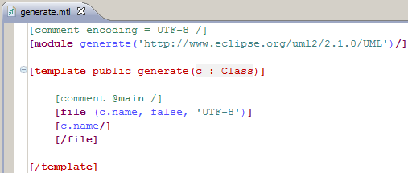

To create a new template, just place the cursor in an Acceleo module file at a
relevant position (*i.e.* one where it is possible to insert a template!) and
hit *Ctrl + Space*. The content assistant proposes, among other things, to
create a new template. It's also possible to type ``template``, *Ctrl + Space*,
then *Return*, and a new template is created:

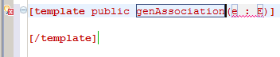

You can fill-in its name, parameter name, and parameter type. Just hit *Tab* to
pass from an element to the next.

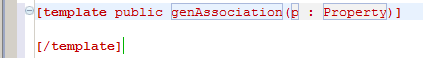

Templates can also have optional elements:

- Overriding (which will be detailed in `The Overrides View`_);
- Pre-conditions (or guard conditions);
- Post-treatments;
- Variable initializations.

Once again, the content assistant can help you here. just hit *Ctrl + Space*
before the final ``]`` of your template declaration, and see what it proposes.

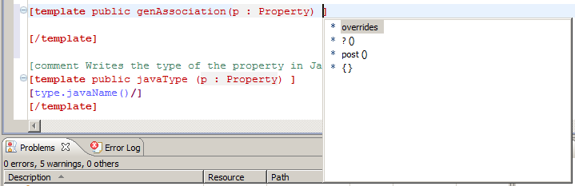

Pre-Conditions
~~~~~~~~~~~~~~~~~~~~~~~~~~~~~~~~~~~~~~~~~~~~~~~~~~~~~~~~~~~~~~~~~~~~~~~~~~~~~~~~

Imagine you want to implement different behavior for a template depending on
certain conditions.

One way to do that would be to use ``if`` blocks to distinguish between those
cases.

Another, more elegant, way is to use pre-conditions. Let's say that you want to
generate different code for associations whether or not they are declared
*ordered*.

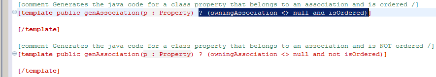

The above example shows the ``? (condition)`` syntax that tells Acceleo that the
template must only be run if the pre-condition is satisfied.

**Note:** The order of declaration of templates in a module is important: The
first template for which the guard condition evaluates to **true** will be
executed.
No guard condition on a template is exactly equivalent to ``? (true)``.

**Note:** Pre-conditions also exist on ``for`` blocks. 

Post-Treatments
~~~~~~~~~~~~~~~~~~~~~~~~~~~~~~~~~~~~~~~~~~~~~~~~~~~~~~~~~~~~~~~~~~~~~~~~~~~~~~~~

It is often useful, especially for code formatting, to apply certain treatments
on the text generated by a template before actually writing it to the output
file.

For instance, trimming the result of a template is really very useful to make
sure of your formatting while keeping a readable formatting for your templates.

Let's see an example to make things clear:

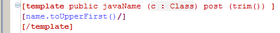

In the above example, without the post-treatment ``post (trim())``, the template
invocation would write the name **followed by a carriage return**. With the
post-treatment, whenever the template is called, it will just write the expected
name, without a carriage return, which is probably what you need.

The most common uses of post-treatments is output code formatting, thanks to
``post (trim())``. It's up to you to figure out what else you will use it for!

Variable Initializations
~~~~~~~~~~~~~~~~~~~~~~~~~~~~~~~~~~~~~~~~~~~~~~~~~~~~~~~~~~~~~~~~~~~~~~~~~~~~~~~~

Templates (and other blocks as well) can define some variables and initialize
them directly in their main syntactic block.

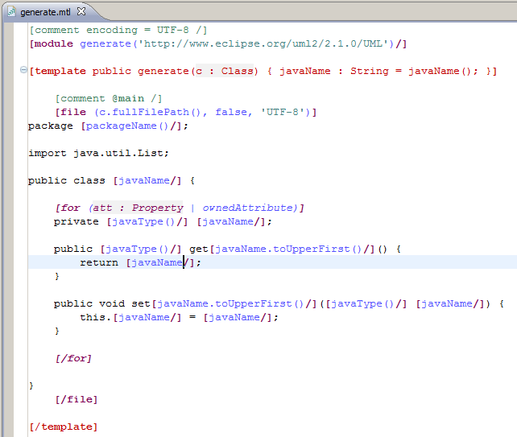

You can declare 0, 1, or several variables. If you declare several variables, it
may be opportune to format the template this way:

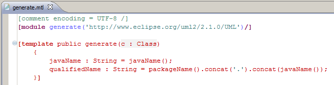

**Note:** Variable initilization also exists on ``for`` blocks. 

Queries
________________________________________________________________________________

Queries are used to extract information from the model.
Queries return values, or collections of values.
They use OCL, enclosed in a ``[query ... /]`` tag.

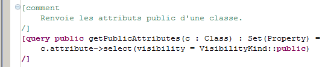

Queries are specified to always return the same value each time they are invoked
with the same arguments. 

Basic Language Constructs
________________________________________________________________________________

File Tags
~~~~~~~~~~~~~~~~~~~~~~~~~~~~~~~~~~~~~~~~~~~~~~~~~~~~~~~~~~~~~~~~~~~~~~~~~~~~~~~~
File tags are used to tell the Acceleo engine it must generate the content of
the ``[file]`` tag in an actual file.

The syntax is the following:

``[file (<uri_expression>, <append_mode>, '<output_encoding>')] (...) [/file]``

- ``<uri_expression>`` denotes the output file name;
- ``<append_mode>`` (optional) indicates whether the output text must be
  appended to the file or replace its content;
- ``<output_encoding>`` (optional) indicates the encoding to use for the output
  file. This encoding need not be the same as the module's encoding.

**Note:**
A template that contains a ``[file]`` tag does not necessarily have an annotation
``@main``.
``@main`` annotations are used to indicate to the Acceleo eclipse plug-in that
a java class must be generated to encapsulate the code required to run a
generation.
``@main`` annotations can be placed on templates which have no ``[file]`` tag,
but such templates must eventually call one or more templates that do have
``[file]`` tags if you want to get a result!

Please refer to
`the official MTL Specification <http://www.omg.org/spec/MOFM2T/1.0/>`_ for
more details.

For Loops
~~~~~~~~~~~~~~~~~~~~~~~~~~~~~~~~~~~~~~~~~~~~~~~~~~~~~~~~~~~~~~~~~~~~~~~~~~~~~~~~

For loops in Acceleo can be expressed with two syntaxes:

- The full syntax (conformant with the MTL specification): ``[for (iterator :
  Type | expression)] (...) [/for]``
- The light syntax: ``[for (expression)] (...) [/for]``

**Note:** When using the light syntax, an implicit variable ``i`` is created,
which contains the index of current iteration, starting at 1.

Content assistant can be very helpful to make sure you use the right
syntax. For example, imagine that you want to insert a for loop, but you don't
remember for sure the Acceleo syntax for these loops.

Just type ``for`` in the editor, then *Ctrl + Space*. Acceleo proposes the for
loop to be automatically inserted.

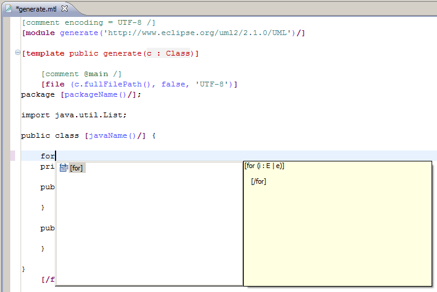

Hit *Return* to confirm that you actually want to insert a for loop:

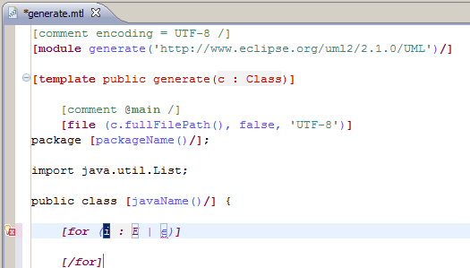

You can now enter:

- The iterator variable name;
- The iterator type;
- The iterable expression.

Just hit the *Tab* key to jump from one element to the next, as usual with
eclipse code templates.

Here is an example of a for loop to generate some code for each attribute of
a UML class:

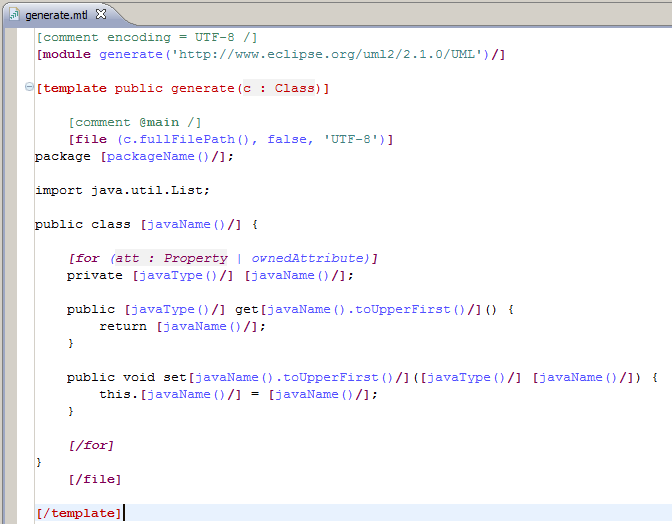

Finally, it is useful to know that it is possible to specify behavior to be run
before, between, or after each iteration of a for loop.

The content assistant proposes the corresponding options when invoked in the
declaration of a for loop, as can be seen on the picture below.

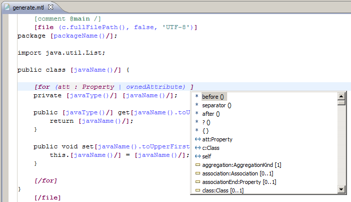

The syntactic structure are respectively ``before()``, ``separator()``, and
``after()``.

**Example:**

``[for (Sequence{1, 2, 3}) before ('sequence: ') separator (', ') after (';')]
[self/][/for]``

Will generate the following text:

``sequence: 1, 2, 3;``

If Conditions
~~~~~~~~~~~~~~~~~~~~~~~~~~~~~~~~~~~~~~~~~~~~~~~~~~~~~~~~~~~~~~~~~~~~~~~~~~~~~~~~

If conditions are written like this:

``[if (condition)] (...) [/if]``

You can enter "if", hit *Ctrl + Space*, then *Return*, and the Acceleo editor
will insert the right syntax so you just have to enter the condition expression.

And that's all there is to it!

Variables : Let
~~~~~~~~~~~~~~~~~~~~~~~~~~~~~~~~~~~~~~~~~~~~~~~~~~~~~~~~~~~~~~~~~~~~~~~~~~~~~~~~

**It is important to understand that variables in Acceleo are ``final``, which
means that their value cannot be changed after they have been initialized**.

**Please also note that the Acceleo ``let`` hasn't got the same semantics as
the OCL ``let``.**

The syntax is the following:

``[let variableName : VariableType = expression] (...) [/let]``

Where ``variableName`` is the variable's name and ``VariableType`` the
variable's type, and ``expression`` is an expression which value will be
assigned to the variable if its type corresponds (Acceleo ``let`` blocks are
equivalent to ``if (expression.oclIsKindOf(VariableType)``).

Variables only exist inside of a let block. Their lifetime consequently cannot
exceed that of their template. They are only visible inside of the let block,
which means that templates called within this block cannot "see" them. If you
need a sub-template to access a variable, you have to pass it as an argument.

Variables are especially useful to store a value and prevent computing it
several times in a row.

You can enter "let", hit *Ctrl + Space*, then *Return*, and the Acceleo editor
will insert the right syntax so you just have to enter the variable name and
type.

Main Modules in Acceleo
________________________________________________________________________________

"Main" Acceleo modules are entry points, that is to say modules which are used
to describe, in some way, the generation workflow.

Such modules can be created from standard acceleo modules, they just have to
**contain the ``@main`` annotation**.

They **do not necessary have to contain ``[file]`` tags**: Main modules are the executable
modules, they need not be modules that actually generate files.

Nevertheless, Acceleo proposes a facility to create main modules.
Right-click in the package explorer, if possible on the package in which you
want to create a new main module though this is not necessary.
Select *New > Other...* (or *Ctrl + N*).
Select *Acceleo Main Module File* in the *acceleo Model to Text* category.

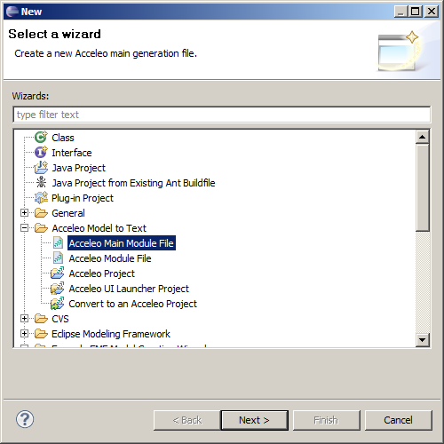

Click on *Next >*.
Enter the name of the module to create (without the ``.mtl`` extension) and
the folder in which it must be created, if the proposed folder is inconvenient.

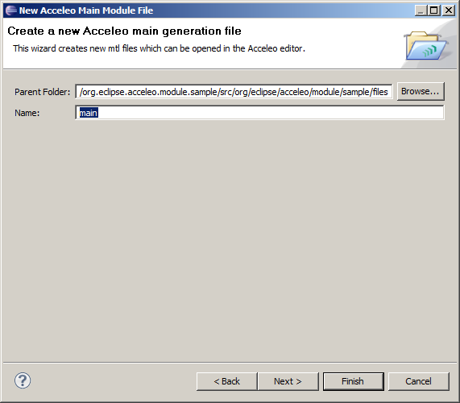

Click on *Next >*.
Select the templates that this main module will call to actually generate files.

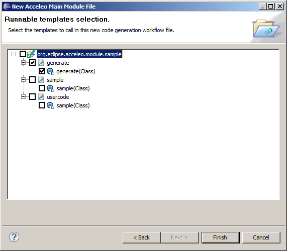

Click on *Finish*.
A new Acceleo module is created, which contains the ``@main`` annotation and
consequently has a generated java file attached.
This module imports the modules that have been selected in the preceding
wizard page, and just calls them one after the other.

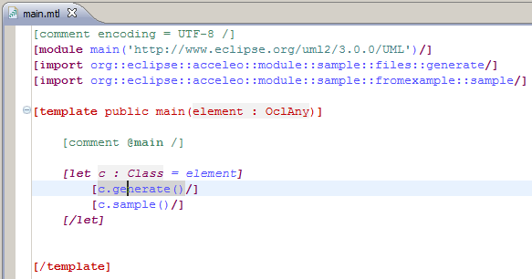

You can now freely edit the content of this module to implement the workflow
you need. The created file is just an accelerator to initialize this task. It
will be sufficient in most cases but can be modified at will.

Organizing Acceleo modules
================================================================================

Naming conventions
--------------------------------------------------------------------------------
We recommend using naming conventions in your Acceleo modules, since it is an
easy way to achieve readability and thus improve maintainability. Such
conventions also prevent name conflicts.

The name of Acceleo projects should follow the following pattern:

*<namespace>* **.** *<input_metamodel>* **.gen.** *<target_architecture>*

For example, a project to generate .NET code from a UML model, developed by
Obeo, will be called ``fr.obeo.uml.gen.dotnet``.

Module file names and module names should start with a lowercase letter.

Module files should be located in packages with the same prefix as the project,
but feel free to create subpackages.

Template and query names should start with a lowercase letter, and use the
``camelCase`` convention just like methods in java (uppercase letters are used
to separate words).

Design your module as you would for APIs
--------------------------------------------------------------------------------

The usual design principles apply when designing Acceleo modules:
Maintainability, reusability, robustness are the objectives.
To reach them, organize your modules carefully:

- Use the visibility of templates and queries to define the public contract of
  your modules;
- Design the allowed dependencies between your modules in advance, and stick to
  your design;
- Document your modules, templates and queries!
  Use ``[comment]`` tags in the module's header to describe the module and
  before each template and query to describe them;
- Queries and templates should be small. Templates more than one page high
  should be refactored as soon as possible;
- Modules should be organized in a sensible way:

  - One module per kind of file to generate, all located in a ``main`` package;
  - Shared modules used by several others should be in a package called
    ``common``;
  - Queries should be separated from templates, in their own package as well,
    called ``requests``;

- Use guard conditions rather than multiple ``if`` statements;
- Prefer multiple small templates and queries to few larger templates/queries;
- Do not directly use metamodel attributes to generate text, even if they seem
  appropriate.
  
Why this last one?
Because when you generate a piece of text, it captures a generation rule.
It often happens (espacially at the beginning of a module development) that
such rules are very simple, like "write the class name".

And then the rule changes to become "write the class name but make sure that
it starts with an uppercase letter, and that the resulting text is not a
reserved word, in which case, suffix it with an underscore".
And now you have to look for every place where you generate a class name in
your templates, and you do that all the time, and the correction is not only
tedious, but also very error-prone.
  
If this logic is captured from the very beginning in a dedicated template
whose responsability is to write a class name, you just have to modify this
one template and you're done.

Tests
--------------------------------------------------------------------------------

Of course, the importance of tests cannot be stressed enough.
Each Acceleo project should be accompanied by a test project that contains:

- Small models, each of them allowing you to test some particular generation rule;
- The expected result for each model;
- A main java class that runs all generations and ensures that the result is as
  expected.

Test projects have the same name as the project they test, suffixed by
``.test``.

Tips and Tricks
--------------------------------------------------------------------------------

- Use ``post (trim())`` to properly format your templates and let them be
  readable while making sure the generated text will also be properly formatted. 
- When navigating a reference that points to an interface, always implement a
  default behavior on the target interface that will generate a warning text to
  indicate a probable generation problem.
  Then, implement the relevant behaviors on the interface subtypes.
  This convention makes it easy to detect cases when an expected behavior is not
  implemented;

For example:

::

  [template genJavaTypeName(c : Classifier) post (trim())]
  /* TODO Implement template genJavaTypeName for type [eClass().name/] */
  [/template]
  
  [template genJavaTypeName(c : Class) post (trim())]
  [name.toUpperFirst()/]
  [/template]

This implementation makes sure that whenever you will invoke ``genJavaTypeName``
on an element of type "Classifier" or one of its subtypes, you will produce text
in the output file.
This will contain a warning message if you forgot something in the generator.

Do not implement each possible case of the different subtypes by testing the
type of the template's parameter!
Instead, let Acceleo dispatch the template invocation to the right template and
implement a template for each possible subtype.

Very often module developers expect to find only one of the possible
subtypes and forget to implement the behavior for other subtypes.
This pattern ensures that they will be warned as soon as they test their
generator on a model that contains what they did not expect.

Edition
================================================================================

The Acceleo Editor
--------------------------------------------------------------------------------

The module editor provides the following features:

- Syntax highlighting;
- Content assistant (*Ctrl + Space*);
- Error detection;
- Quick fixes (*Ctrl + Shift + 1*);
- Dynamic outline;
- Quick outline (*Ctrl + O*);
- Code folding;
- Open declaration (either with *Ctrl + Left Click* or *F3*);
- Search references (*Ctrl + Shift + G*).

These features will be detailed hereafter.

For more information about the Acceleo syntax, please read the official OMG
specification accessible from `the official MTL Specification
<http://www.omg.org/spec/MOFM2T/1.0/>`_.

Editing modules
--------------------------------------------------------------------------------

The Acceleo editor is by default associated with the ``.mtl`` file extension.

Syntax Highlighting
________________________________________________________________________________
The editor uses specific colors for Acceleo templates:

- red is used for template tags;
- purple is used for other tags (queries, modules, imports, ...);
- blue is used for dynamic expressions in templates or other places;
- green is used for comments and String literals;
- black is used for static text or query bodies.

Content Assistant
________________________________________________________________________________

The content assistant is traditionally invoked with *Ctrl + space*.
We have already met it severral times in this guide.
It proposes a choice of all elements that make sense at the place of invocation.
It is available everywhere, so don't hesitate to hit *Ctrl + space* anywhere!

Example of content assistant on a type:

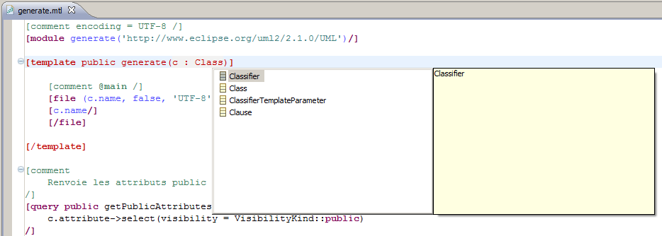

On a metamodel:

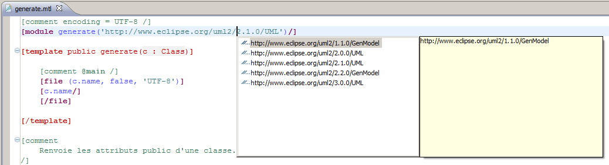

Content assistant is also very useful in a multitude of situations. We will
give some examples, simply remember to hit *Ctrl + Space* whenever you want, it
will probably help you a lot!

Here is a view of all options you get when hitting *Ctrl + Space* in a template:

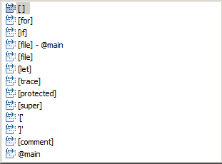

And here is the options proposed out of a template, when hitting *Ctrl + Space*
directly in an Acceleo module file:

Comments
________________________________________________________________________________

Comments are entered in ``[comment]`` blocks, and appear in some shade of green.
The ``[comment]`` tag can be self closed:

``[comment Here is some comment of utter importance/]``

But you can also surround a block of text between comment tags:

::

	[comment]
	Here is some commented text, which cannot contain a right bracket character.
	[/comment]

Such comments are part of the official MTL specification. They cannot be placed
inside OCL code, such as queries for instance. They cannot be placed in the
middle of an Acceleo statement either.

It is possible to comment some portion of code or text of an Acceleo module
with the *Ctrl + /* shortcut, or by right-clicking on the selected text and then
*Source > Comment*.

The behavior depends on what is selected:

- If nothing is selected, the current line (not the line you right-clicked on,
  but the line where the cursor is located) is surrounded with
  ``[comment]...[\comment]`` tags.
- If some text is selected, it is surrounded with ``[comment]...[\comment]``
  tags, whether it spans multiple lines or not.

Code Folding
________________________________________________________________________________

Templates and comments can be folded thanks to a marker located in the left
margin in front of each of these elements.

.. image:: ../images/acceleo_code_folding.png

Rapid Text Replacement
________________________________________________________________________________

Here is a very useful trick in Acceleo. Rapid text replacement allows you to
quickly replace all occurrence of a chosen piece of text by some template
invocation. Case differences are inferred generating ``toUpper()`` or
``toUpperFirst()`` depending on what's needed.

Here is an example:

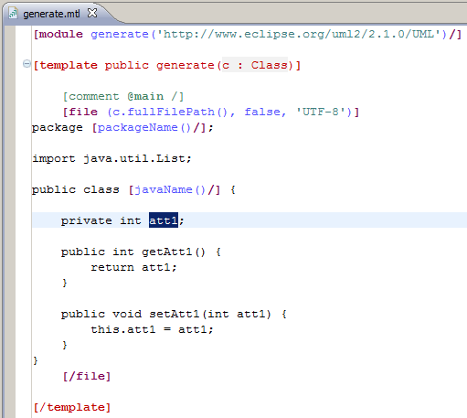

In a classical bottom-up approach, you have written your code first, and you now
implement the Acceleo template from this code.
What you want to do here is to replace all occurrences of "att1" by a dynamic
behavior, *i.e.* by a template call.

The easiest way to do this is to select one of the "att1" in the editor, and
invoke the content assistant by hitting *Ctrl + Space*.

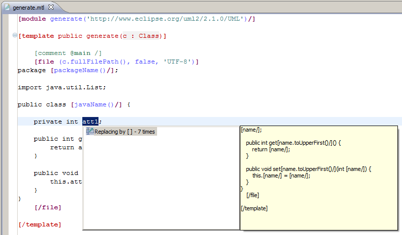

The completion assistant proposes to replace all occurrences of the selected
text by a template call. A preview of the result is displayed in a tooltip close
to the completion window.

When you accept this option, all occurrences are replaced and you can
immediately enter the template invocation needed, which is simultaneously
replaced in all relevant locations.

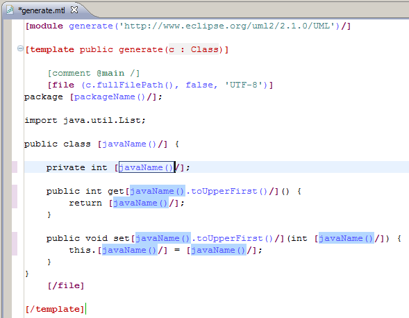

All occurrences of ``att1`` have been replaced by ``[javaName()/]`` (because
``javaName()`` is what was entered manually), but ``Att1`` has been replaced by
``[javaName().toUpperFirst()/]``.

The next thing you'd want to do in the above example is to replace all
occurrences of ``int`` by something like ``[javaType()/]``, and implement the
``javaType`` template to write the java type of the class attributes.

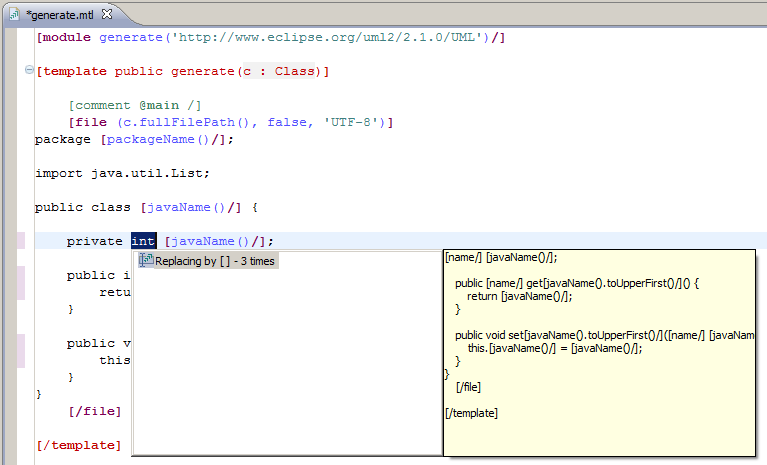

Just proceed the same way and you're done. No risk to forget any occurrence of
your type anymore!

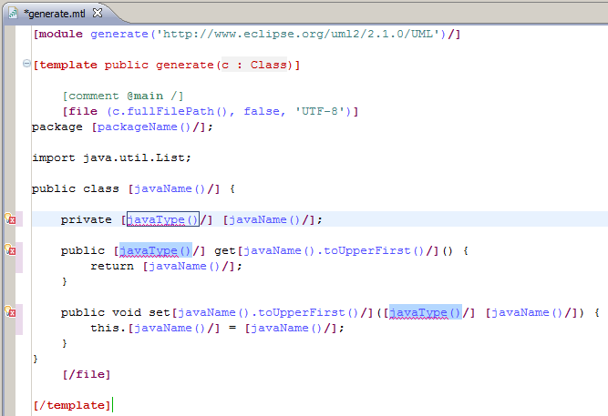

Rapid For/If Blocks
________________________________________________________________________________

You will probably not use this feature every day, but it is important to know
that it exists because it can bring you comfort from time to time.

[PENDING Find a meaningful example and document the feature.]

The Acceleo Views
--------------------------------------------------------------------------------

Acceleo provides a few specific views to improve productivity when working with
templates.
These views will be detailed later on, in the relevant chapters.
Let's just summarize their purpose to get the big picture.

As usual, they can be opened by clicking on *Window > Show View* and selecting
the appropriate view in the menu. Note that in the Acceleo perspective, Acceleo
views are proposed by default directly in this menu, which will not be the case
in another perspective where you'll have to find them in the *Other...* popup.

The Generation Patterns View
________________________________________________________________________________

Generation patterns have been introduced in acceleo because we noticed that
something that happens really often when developing code generators is the need
to implement some behavior on an interface and all or part of its subtypes.

For example, let's imagine you are implementing a java generator from UML.
What you want is to have a template called ``javaName`` which will generate the
name of any classifier, with some default behavior and some specific behavior on
classes and interfaces.

This is where the **Generation Patterns** view comes into play:

- Locate the cursor in the template, at the position where you want to insert
  your ``javaName`` templates;
- In the Generation patterns view, select "[template] for all selected types" in
  the top part
- Select the types for which you want to create ``javaName`` templates for.

Note the bottom part of the Generation Patterns views presents a
hierarchical view of the metamodel you are using. Each node represents a type of
the metamodel and contains all of its subtypes. So, one type can appear several
times in this view, one time for each of its super-classes or super-interfaces.
When you select a node (by checking the combo-box before it), all its
descendants are also selected by default, but you can uncheck those you don't
need.

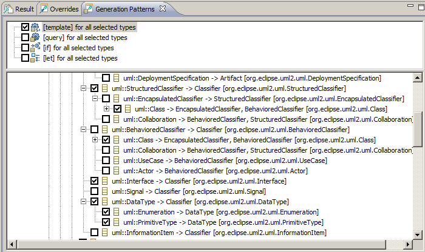

Once you have selected the types you need, go back to the editor and activate
the completion by hitting *Ctrl+Space*. The first choice should be
"[template] for all selected types", select it.

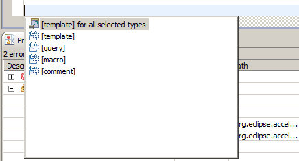

New templates are then inserted into you Acceleo module. They are called "name"
by default but you can immediately rename them by just entering the name you
want. All templates will be renamed simultaneously.

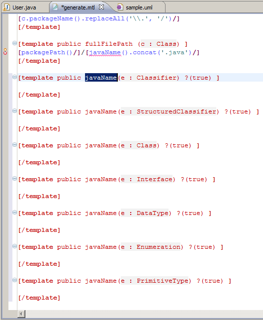

Here, Acceleo has done his job, now it's time for you to do yours: implement
these newly created templates!

The Overrides View
________________________________________________________________________________

This view presents you with every Acceleo element that is accessible in your
workbench (no matter your current project's dependencies). You can select
one or several elements (use the checkboxes) and override them.

**Note:** If the meaning of "override" is not clear, you may want to refer to
the `official MTL Specification <http://www.omg.org/spec/MOFM2T/1.0/>`_.

Templates displayed in this view can be anywhere in your workspace or in your
plug-ins.

So, this view can be used for:

- Selecting templates you want to override (which is its main purpose);
- Navigating to templates in your plug-ins to see their implementation without
  having to explicitly import their plug-in(s) in your workspace.

To override one or several existing templates, just select them in this view by
checking their checkboxes. Then, edit the module in which you will override the
templates, place the cursor where you want to insert the overriding templates,
and hit *Ctrl + Space*.

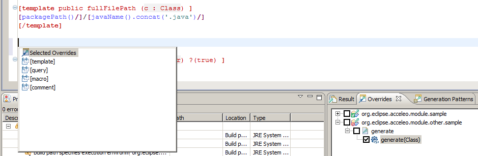

Select the first choice ("Selected Overrides") and hit *Return*.
The overriding templates are then created. Note that by default, their
implementation is initialized with their original implementation.

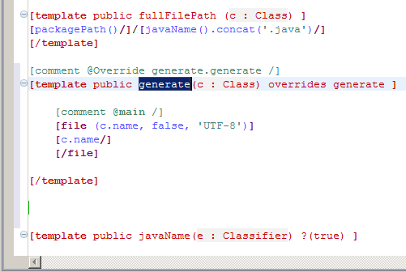

**Note:** A marker indicates whether a given project is accessible from yours.
If this is the case, a green mark indicates everything is fine.
Otherwise, a red marker indicates that you need to import the project in yours
to be able to override a template it contains.
For example, in the screenshot below,
``org.eclipse.acceleo.module.other.sample`` needs be imported in your current
project before you can successfully override one of its templates.

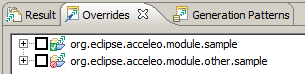

Nevertheless, you **can** declare the overriding, it will just **not compile**
while you have not imported the relevant project (which is done in the
``MANIFEST.MF`` file of your Acceleo project).

Dynamic overriding vs static overriding
________________________________________________________________________________
Acceleo allows static overriding as described in the MTL specification.
Acceleo also allows another kind of overriding, which is called "dynamic".

Dynamic overriding allows you to override any template called by a given module
even if the launcher of this module knows nothing about your project.
It takes precedence over any static template overriding.
With dynamic overriding, you can make sure a specific template will be called
while calling the original generator (the initial java class that launches the
generation).
Dynamic overriding only works "out-of-the-box" inside of eclipse.

To activate dynamic overriding, you must place the overriding template on a
plug-in which will extend the ``org.eclipse.acceleo.engine.dynamic.templates``
extension point.

To do that, open the ``META-INF/MANIFEST.MF`` file of your plug-in, go to the
*Extensions* tab, and click on the "Add..." button.

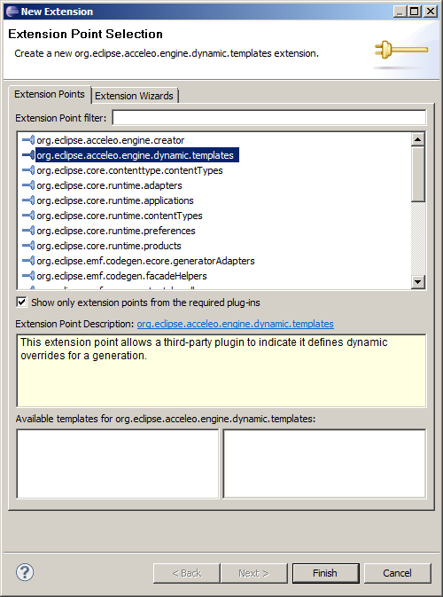

Click on "Finish".

The extension point requires only one piece of information, which is the path to
a module file or folder.
If it is a folder, Acceleo looks for modules recursively and takes them all into
account for dynamic overriding.

You can use the "Browse..." button to select the file or folder.

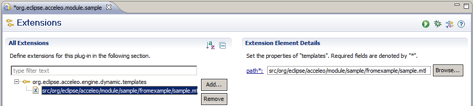

**Note:** Your plug-in must be a singleton to declare an extension.

The Result View
________________________________________________________________________________

This view displays the results of the latest generation run.
It displays the list of projects where some code has been generated.
In each project, the files that have been generated (in their folders).

For each file, the view displays:

- A list of model elements used for their generation, in a hierarchical way;
- A list of Acceleo modules used for their generation.

You can double-click on any element to visualize the related portions of
generated text.

You can right-click on any element and select *Open Declaration* to navigate
to any atomic element used during the generation, be it a model element or an
Acceleo element (template, query).

This view's behavior will be further detailed in chapter
`Using the Result View`_.

Outlines
--------------------------------------------------------------------------------

The Dynamic Outline
________________________________________________________________________________

The traditional eclipse outline view is used by Acceleo to display the module's
structure. imports, templates, queries can be seen there, and double-clicking on
any of them places the cursor at the corresponding position in the module (in
the editor).

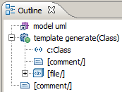

The Quick Outline
________________________________________________________________________________

The quick outline, which can be displayed using *Ctrl + O*, displays just the
necessary information to access any element in the current module.
So, hitting *Ctrl + O* displays a pop-up with a list of templates and queries.

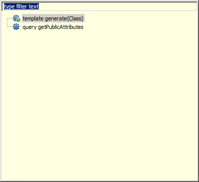

A text field at the top allows you to quickly filter the content in order to
easily find what you are looking for. 

Navigating Acceleo Modules
--------------------------------------------------------------------------------

One of the great benefits of modern IDE tooling is the capacity to easily
navigate in code from elements to their declarations and, vice-versa, from
declarations to usages.

These features are available in Acceleo.

Open Declaration
________________________________________________________________________________

The traditional shortcut *F3* is supported by Acceleo, along with *Ctrl +
click*, which both take you to the declaration of the selected or clicked
element.
This is supported for all kinds of elements: templates, queries, metamodels,
metamodel elements, EOperations, etc.

This can also be achieved by right-clicking on an element, then *Open
Declaration*.

Search References
________________________________________________________________________________

Conversely, it is possible to get all the elements that refer to a given element.
The shortcut is *Ctrl + Shift + G*, but it can also be achieved by right-clicking
on the element then *Search References*.

The relevant elements are displayed in the Search view.

Detecting and Solving Problems
--------------------------------------------------------------------------------

Error Markers
________________________________________________________________________________

Obviously, Acceleo displays error markers when errors are detected.
Error markers also appear in the eclipse Problems view, as usual. Files with
errors also appear with an error decorator.

Just hover the marker in the editor margin with the mouse to get a tooltip to
appear with an explanation of the problem.

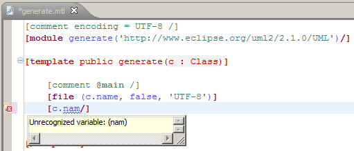

Acceleo displays error markers whenever a module file cannot be compiled,
whatever the reason. But more, Acceleo also displays error markers when it finds
inconsistencies between a module and other elements, such as the containing
plug-in's ``MANIFEST.MF`` file.
For instance, if a module's main file is located in a package which is not
exported by its plug-in, an error marker is added because the main file cannot
be run if the plug-in does not export its package.

Errors appear in the "Problems" view (generally displayed at the bottom of the
perspective), and double-clicking on an error in this view directly takes you
to the file where it is located.

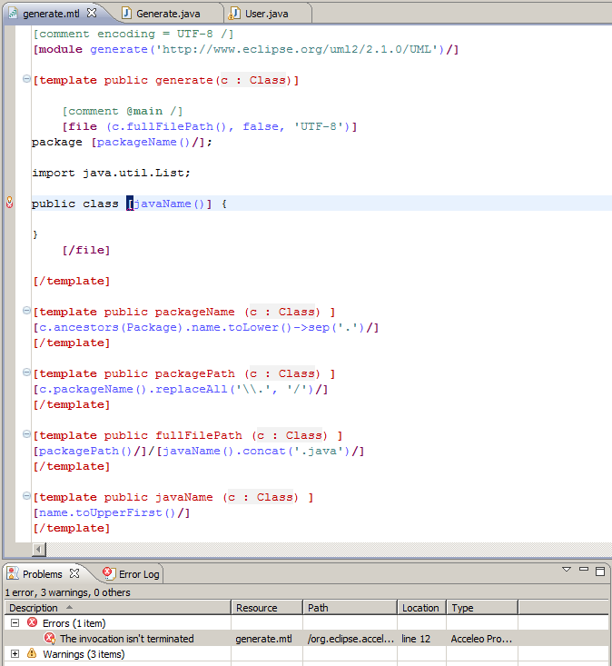

In the example above, the ``[javaName()]`` tag is never closed. Just replace it
with ``[javaName()/]`` (notice the slash to close the tag) and the error
disappears.

Quick Fixes
________________________________________________________________________________

Quick fixes are available with the shortcut *Ctrl + 1*.

Currently, quick fixes propose to create a supposedly missing template or query,
before or after the current template.

In the following example, we just write the call to a template that does not
exist yet, and use the quick fix to create it immediately.

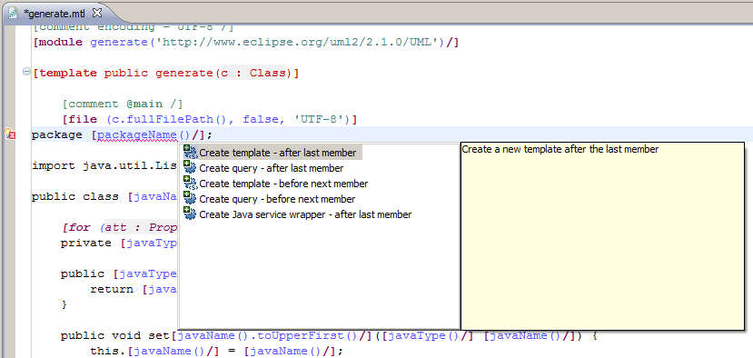

Another quick fix available creates a new query that wraps a java service, as
described in the `Wrapping Java Services`_ section.

Imagine you have java methods called ``service1``, ``service2``, ``service3``
(which of course are not recommended names!) in a class that you can access
from your Acceleo project (it is either directly in your project, or imported).
Enter ``service`` in your template and save it.
A red marker appears since it does not compile.

Hit *Ctrl + 1*, and select *Create Java service wrapper*.

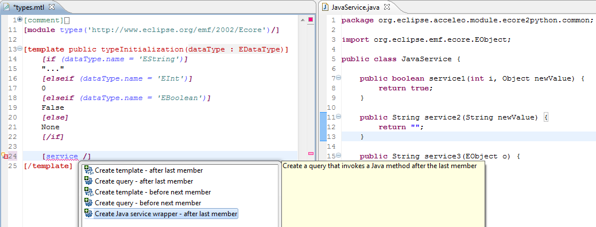

Acceleo looks for a method starting by "service" in the accessible classes and
creates queries for each of them, inserting them at the end of your module file.

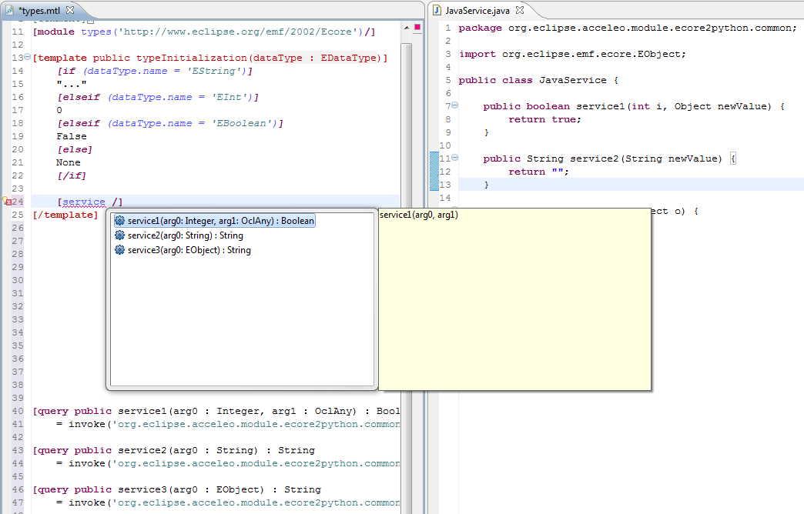

**Note:** More quick fixes will be provided in the next versions of Acceleo.

Refactoring
--------------------------------------------------------------------------------

Renaming
________________________________________________________________________________

The renaming functionality is accessible via *Alt + Shift + R*, as usual in
eclipse.
This allows templates and variables to be renamed in a coherent manner: All
references to the renamed element are updated to use the new name, as expected.

Note that when selecting an element in the editor, all the occurrences of the
same element are highlighted, which makes it very easy to find where a given
template is being used.

When hitting *Alt + Shift + R*, a window appears where the new name must be
entered.
Names already in use are forbidden.

From here, it is possible to preview the changes that will be made by clicking
on the *Preview >* button, or to make the changes immediately by clicking on
*OK*.

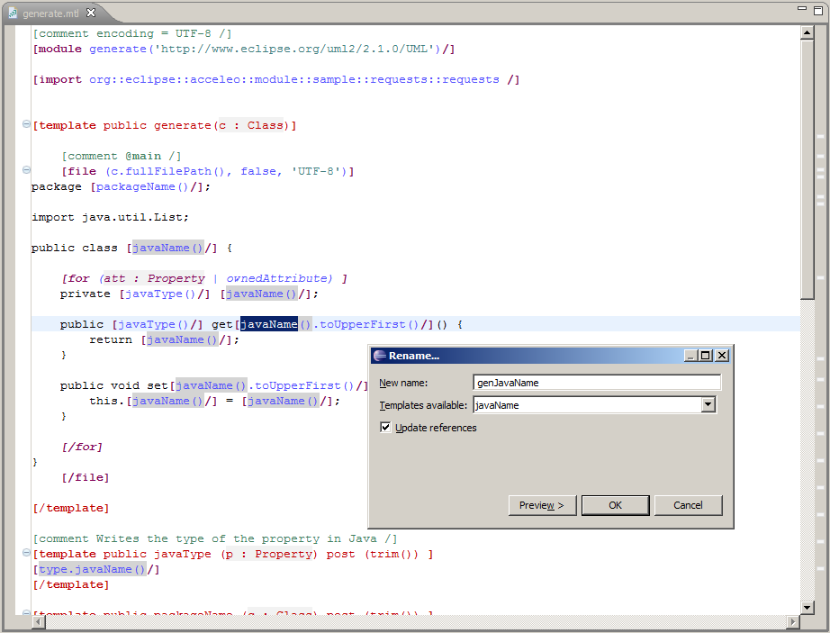

The preview displays the files that will be modified and for each of them the
changes that are to be applied to their content.

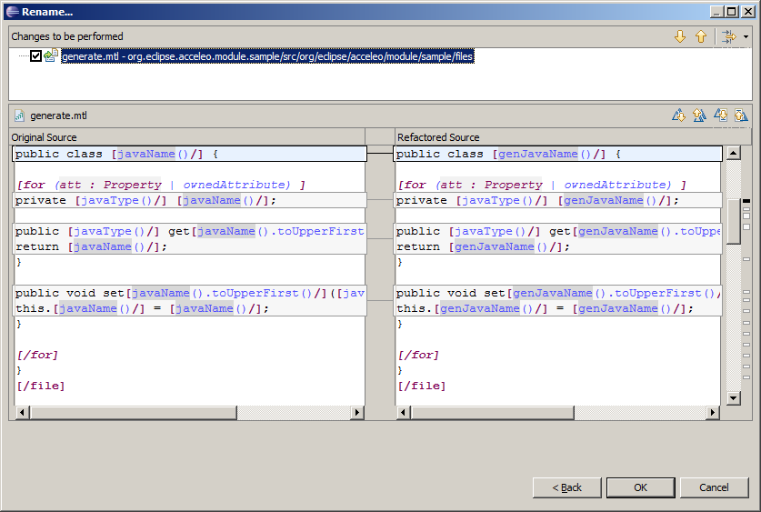

The left side of the preview displays the current state of the module, and the
right side displays the future state of the module after the renaming takes
place.

Extract as Template
________________________________________________________________________________

When you develop Acceleo templates, you will sooner or later (and probably
sooner than later) wish to extract a piece of code into a template in order to
prevent the copy/paste syndrom.

Well, don't worry : you can do it with no effort!

Just select the piece of text you want to extract in another template, and
right-click then choose *Refactor > Extract Template* (or just hit *Alt + Shift
+ T*).

.. image:: ../images/acceleo_extract_template_before.png

The selected text is then extracted in another template. Note that the selected
text needs to be consistent : you cannot of course extract text that partially
spans blocks of code and get an adequate result.

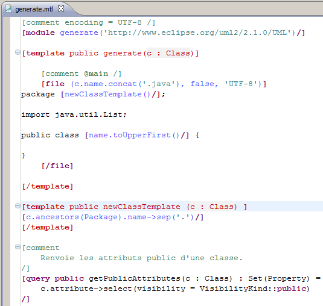

Transform to Protected Area
________________________________________________________________________________

Similarly, it is very useful to mark some code area as protected.
For example, in the following code, it may be useful to protect the imports area
in order to keep imports required by user code after each regeneration.

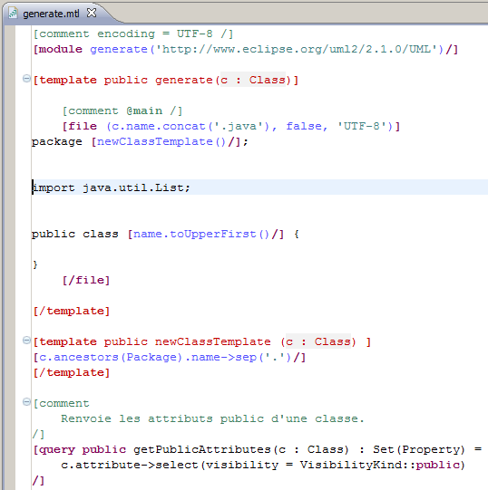

Rather than manually entering the ``[protected]`` blocks, you can just select
the portion of code to protect, right-click on it then choose *Source > As
Protected Area...* (or use the *Alt + Shift + P* shortcut).

.. image:: ../images/acceleo_mark_as_protected2.png

The selected text is then surrounded with ``[protected]`` markers, with an
automatically inferred id.

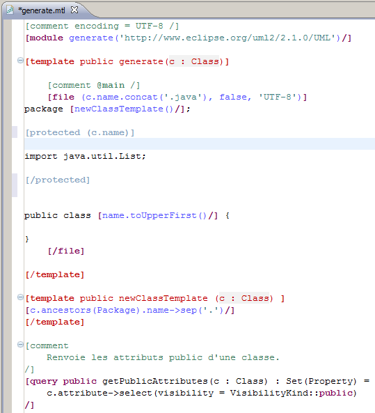

Don't forget to add the comment markers at the beginning of the protected lines.
Since such comment markers depend on your target language, Acceleo cannot infer
them (we use java for this document's examples).

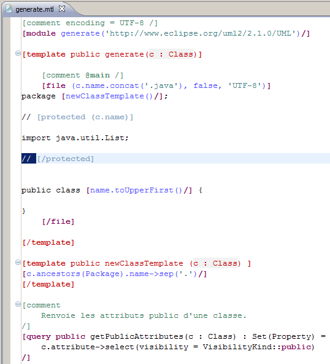

**Note:** You may have to modify the id used to make sure the marker works like
you want, as ids have to be unique for a given file.

Transform to For/If Block
________________________________________________________________________________

[PENDING]

Other Facilities
--------------------------------------------------------------------------------

Wrapping Java Services
________________________________________________________________________________

It is sometimes useful to invoke some java code from inside an Acceleo template.
The acceleo non-standard library provides a service `invoke` which allows just
that. The invoked java service can be wrapped in an Acceleo query.

To facilitate the creation of such a wrapper, proceed like this:

#. Right-click on the package you want to create your Acceleo module in, and
   select *New > Acceleo Module File*

   .. image:: ../images/acceleo_services_wrapper1.png

#. In the wizard, enter the relevant information in the usual fields, then click
   on the *Advanced >>* button
#. Check the *Initialize Content* checkbox
#. Select *Create a Java services wrapper* in the listbox below

   .. image:: ../images/acceleo_services_wrapper2.png

#. Select the java file that contains the services to wrap

   .. image:: ../images/acceleo_services_wrapper3.png

#. Click on the *Finish* button

   .. image:: ../images/acceleo_services_wrapper4.png

That's it!

An Acceleo module is created, with a query for each service found in the
original java class.

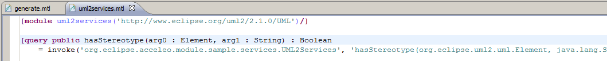

Initializing a Project with an Example
________________________________________________________________________________

It is often useful (actually, it is recommended) to use a bottom-up approach
to develop Acceleo templates.
So, before beginning to write templates, start by prototyping your target files,
make sure they work as expected, and then you are ready to start generating them.
An existing application can be used as a starting point to create an Acceleo
module.
By the way, it is a good idea to mimick the target's organization in the Acceleo
module's organization: One generation module per kind of file to generate, each
located in a package named after the target package's name.

At that time, you'd like to import the content of some files into a new template.

Let's imagine you have written the following class sample in your bottom-up
approach. (Of course, this is a stupid example, you'll have to work a bit more
for this approach to prove useful!)

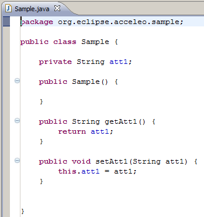

#. Right-click on the package you want to create your Acceleo module in, and
   select *New > Acceleo Module File*
   
   .. image:: ../images/acceleo_from_sample2.png
   
#. In the wizard, enter the relevant information in the usual fields, then click
   on the *Advanced >>* button

   .. image:: ../images/acceleo_from_sample3.png
   
#. Check the *Initialize Content* checkbox
#. Select *Copy example content* in the listbox below (which should be selected
   by default)
#. select the file that contains the example code

   .. image:: ../images/acceleo_from_sample4.png
   
#. Click on the *Finish* button

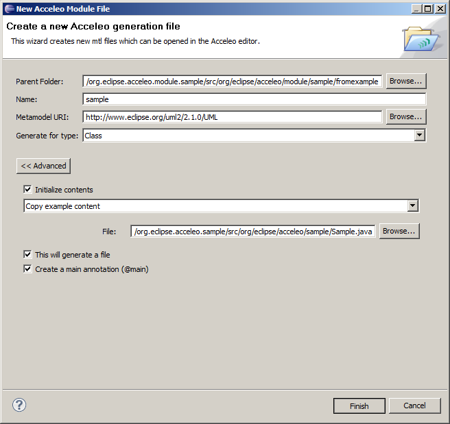

An Acceleo module is created, and the content of the example java file is copied
into this module's primary template.

.. image:: ../images/acceleo_from_sample6.png

**Note:** You may have noticed that error marker at the top left of the Acceleo
editor area. This is due to the package containing the newly created module not
being declared as exported by the plug-in.
It is necessary to add relevant packages to the exported packages list
in your plug-in's ``MANIFEST.MF`` file. Especially, templates that contain an
``@main`` annotation and are located in a package which is not exported are
marked with an error marker to remind you that.

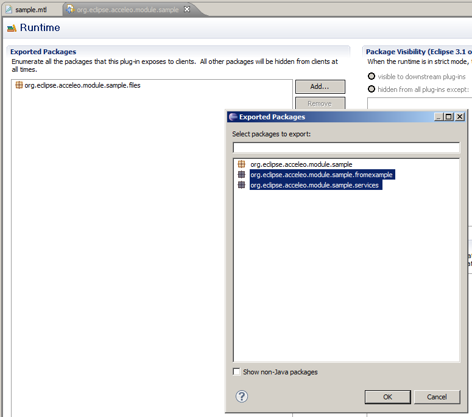

Declaring the package as exported by the plug-in removes the error marker, all is
well that ends well.

Migrating Acceleo 2.x templates
________________________________________________________________________________

**Warning: This feature will probably evolve in future versions.**

**Important note: It is necessary to use a version of eclipse >= 3.5 in order
to successfully convert Acceleo 2.x projects or templates into Acceleo 3
modules.**

[PENDING]

Compilation
================================================================================

Acceleo templates are compiled into models, materialized by ``.emtl`` files in
the ``bin/`` folder of Acceleo projects.

Of course, Acceleo complies to eclipse settings for compilation, which means
that compiled files are placed in the default output folder as defined in the
Java Build Path settings of the package (usually the ``bin/`` folder).

Compilation Compliance Mode
--------------------------------------------------------------------------------

The Acceleo compiler can be set to be "strict" or "pragmatic", "pragmatic" being
the default mode.

The "strict" mode is 100% compliant with the OMG specification and guarantees
that the compiled generators will work in any MTL-compilant engine. In this
case, non-standard libraries are not allowed.

The "pragmatic" mode is not 100% MTL-compliant since non-standard libary operations
are allowed, but this makes it way easier to develop powerful modules.

This can be set project by project in each project's properties page:

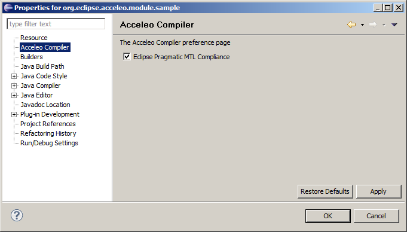

Just select the project and click *Alt + Return*, or right-click on it and
select *Properties*.

Check the "Strict MTL Compliance" option to activate the strict mode, which is
off by default.

Execution
================================================================================

Running an Acceleo Generation
--------------------------------------------------------------------------------

There are several ways of launching a generation with Acceleo. We will now
examine how to generate code inside eclipse, then outside of eclipse.

Launch Acceleo Application
________________________________________________________________________________

Right-click on an Acceleo module (``.mtl``) file, then select *Run As > Launch
Acceleo Application*.

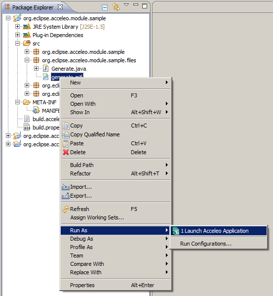

This opens a wizard to create a launch configuration if such a configuration
does not already exist for this file.

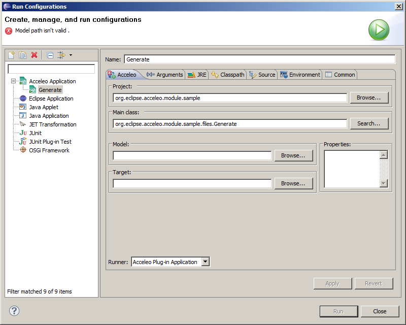

If a launch configuration already exists, the generation is launched immediately.

**Note:** If an invalid launch configuration exists for the selected Acceleo
module, it is used even if it produces no result or an error. So, if nothing
happened when following the preceding steps, try and check whether a launch
configuration already exists for your template.

Now, let's examine what information must (or can) be provided to Acceleo launch
configurations.

Launch Configurations
________________________________________________________________________________

Launch configurations for Acceleo can be created as described above, or by
opening the *Run Configurations* window, and then right-clicking on the *Acceleo
Application* category to the left, and selecting *New* or *Duplicate*.

An acceleo launch configuration requires:

- A project (which contains the java entry point to run)
- A java class to run (contained in the above project)
- An input model

  .. image:: ../images/acceleo_launch_config2.png

- An output folder (which will be the "root" from which to resolve relative paths
of the files that are to be generated)

  .. image:: ../images/acceleo_launch_config3.png

Optionally, properties can be specified directly in the launch configuration.
Here is what a ready launch configuration looks like:

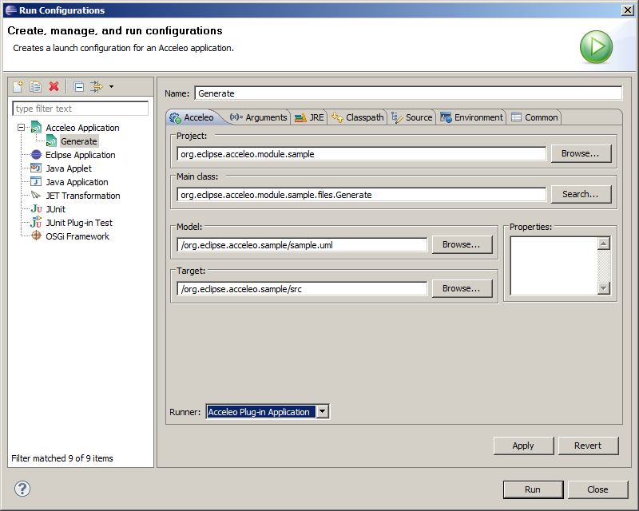

**Note:** The "Arguments" tab shows that the model and target arguments are
simply text arguments passed to the java class that handles the generation.

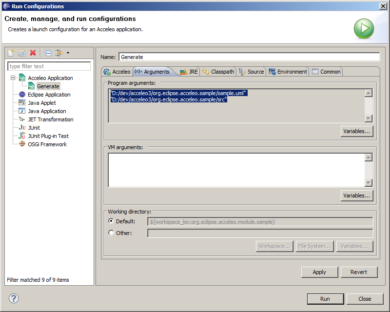

Execution environment
~~~~~~~~~~~~~~~~~~~~~~~~~~~~~~~~~~~~~~~~~~~~~~~~~~~~~~~~~~~~~~~~~~~~~~~~~~~~~~~~

There are two ways to run an Acceleo generation in eclipse.
This can be parameterized in the launch configuration, in the field "Runner":

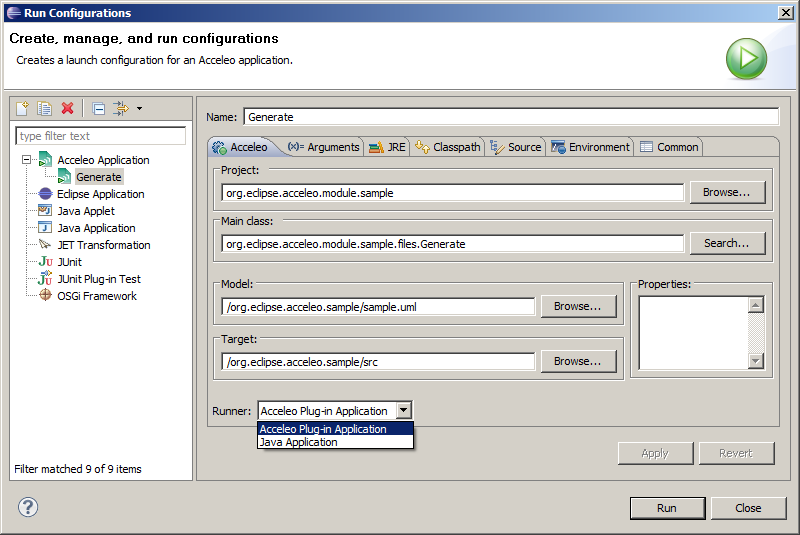

The **Acceleo Plug-in Application** mode runs the generation inside eclipse.
In this mode, The Acceleo engine uses eclipse APIs to manipulate resources.
Besides, generated files are refreshed in eclipse at the end of the generation.
In this mode, debugging stops on Acceleo module breakpoints, but not on java
code breakpoints.
The "Result view" is populated.
In short, this is the recommended mode to use during the development process of
Acceleo modules.

The **Java Application** mode runs the generation as if it were run outside of
eclipse. In this mode, the Acceleo engine uses only core java features, such as
``java.io.File`` for manipulating files.
As for the generated files, they are not refreshed in eclipse, and the "Result"
view is not populated:
The generation is actually completely unaware of the running eclipse.
Contrary to the previous mode, breakpoints located in java services called from
your templates are taken into account, but breakpoints located in Acceleo
templates are not.
Consequently, this is the recommended mode for testing and validating Acceleo
modules to make sure they behave as expected when run outside of eclipse.

The Generated API
________________________________________________________________________________

To help users, Acceleo creates an API that can launch an Acceleo template.
This API can easily be customized to fit your specificities, if any.

It is important to note that Acceleo inspects modules for ``@main``
annotations in comments, and treats those templates specially.
For every module containing at least one ``@main`` annotation, a java file
is generated alongside it. This class contains whatever plumbing code
is needed to run the generator.

**Note:**
Templates marked with an ``@main`` annotation can be used to encapsulate the
workflow logic of your generation.

The generation can then be run by calling the main() method of the generated
class, or instantiating it and calling ``doGenerate()``.

+---------------------------------+---------------------------------------------------------------------+
| API                             | Meaning                                                             |
+=================================+=====================================================================+
| ``<constructor>``               | Three constructors are generated by default:                        |
|                                 |                                                                     |
|                                 | - One which receives:                                               |
|                                 |                                                                     |
|                                 |   - The input model's URI;                                          |
|                                 |   - The target folder (as a java.io.File);                          |
|                                 |   - A list of arguments (as a java.util.List);                      |
|                                 |                                                                     |
|                                 | - Another which receives the model's root element instead of the    |
|                                 |   model's URI                                                       |
|                                 |                                                                     |
|                                 | - A default one which just allows an easy instantiation, but        |
|                                 |   requires one of the ``initialize`` methods to be called before    |
|                                 |   generating anything.                                              |
+---------------------------------+---------------------------------------------------------------------+
| ``main()``                      | A java entry point which can be used to launch a standalone         |
|                                 | generation (outside of eclipse).                                    |
+---------------------------------+---------------------------------------------------------------------+
| ``doGenerate()``                | Launches the generation, using the given EMF progression monitor.   |
+---------------------------------+---------------------------------------------------------------------+
| ``getGenerationListeners()``    | Entry point that allows users to provide listeners of generation    |
|                                 | events if needed.                                                   |
+---------------------------------+---------------------------------------------------------------------+
| ``getGenerationStrategy()``     | Entry point that allows users to change the way files are           |
|                                 | generated. Files can be generating using a ``DefaultStrategy``, a   |
|                                 | ``PreviewStrategy`` or a ``WorkspaceAwareStrategy``, depending on   |
|                                 | what and where the generation must be run.                          |
|                                 | Just return the right type of strategy, and refer to the            |
|                                 | generated javadoc for more details.                                 |
+---------------------------------+---------------------------------------------------------------------+
| ``getModuleName()``             | Returns the module name without file extension.                     |
|                                 | The default implementation should be convenient in most cases.      |
+---------------------------------+---------------------------------------------------------------------+
| ``getProperties()``             | This method allows you to add properties or properties files that   |
|                                 | will subsequently be available during the generation.               |
+---------------------------------+---------------------------------------------------------------------+
| ``getTemplateNames()``          | Returns the list of templates to call during the generation process |
|                                 | The default implementation should be convenient in most cases.      |
+---------------------------------+---------------------------------------------------------------------+
| ``registerPackages()``          | Allows you to register EMF packages depending on the metamodels you |
|                                 | need in your generators.                                            |
|                                 | This is only useful when launching standalone generations.          |
|                                 | This will be necessary if you use UML for example.                  |
|                                 | You need to register every EMF package URI that is necessary to     |
|                                 | load the models you use.                                            |
|                                 | Refer to the EMF documentation if the meaning of this section is    |
|                                 | unclear.                                                            |
+---------------------------------+---------------------------------------------------------------------+
| ``registerResourcefactories()`` | Can be used to update the resource set's resource factopry registry |
|                                 | with all needed  factories. For advanced users only!                |
|                                 | This is only useful when launching standalone generations.          |
|                                 | This will be necessary if you use UML or any other metamodel that   |
|                                 | has its own resource factory.                                       |
|                                 | Refer to the EMF documentation if the meaning of this section is    |
|                                 | unclear.                                                            |
+---------------------------------+---------------------------------------------------------------------+

Customizing Acceleo Generations with Properties
~~~~~~~~~~~~~~~~~~~~~~~~~~~~~~~~~~~~~~~~~~~~~~~~~~~~~~~~~~~~~~~~~~~~~~~~~~~~~~~~

It is very convenient to use properties to parameterize portions of generators
or even generation rules.
For example, properties can be used to parameterize which elements need be
generated, making it easy to regenerate only a subset of files if required.
This can also be used for internationalization.

Properties must be provided via the ``getProperties()``API, which returns a
``java.util.List<String>``.
The returned list must contain the qualified names of the resource bundles from
which the properties will be read, without extensions.

For example, returning "org.eclipse.acceleo.module.sample.My" will
have Acceleo looking for:

- A class named ``org.eclipse.acceleo.module.sample.My`` that implements
  ``ResourceBundle``;
- A properties file named ``My.properties`` in the
  ``org/eclipse/acceleo/module/sample/`` source folder;
- Properties files named ``My_en.properties``, ``My_fr.properties``, and so on
  depending on possible locales in the ``org/eclipse/acceleo/module/sample/``
  source folder.

The mechanism used by Acceleo is that of ``ResourceBundle``, which is a standard
and widespread java mechanism. Please refer to your JDK's javadoc for more
information about resource bundles and properties files.

**Note**: The resource bundles (i.e. properties files) must be accessible by the
class loader used, so the simplest way is to put them in the module's class
path.

Generation Strategies
~~~~~~~~~~~~~~~~~~~~~~~~~~~~~~~~~~~~~~~~~~~~~~~~~~~~~~~~~~~~~~~~~~~~~~~~~~~~~~~~

For the time being, Acceleo proposes 3 generations strategies:

- The ``DefaultStrategy`` generates files on disk gradually during the whole
  generation process;
- The ``PreviewStrategy`` generates no file at all, but returns a
  ``java.util.Map<String, String>`` in which keys are the file names and values
  are generated code for these files;
- The ``WorkspaceAwareStrategy`` generates in memory, then asks elipse whether
  output files can be overridden. (This is an SCM-friendly mode, which works
  well with, for instance, ClearCase).
  
Just use a new instance of the right strategy and return it in your
implementation of the ``getGenerationStrategy()`` method.

**Note**: The generation strategy mechanism is API and you can create your own
subclasses in the unlikely case that the three Acceleo proposes aren't sufficient
for your needs.

Using the Result View
________________________________________________________________________________

As mentioned above, the Result View displays the result of the latest Acceleo
generation run.

Let's suppose we have the following Acceleo module to generate a class:

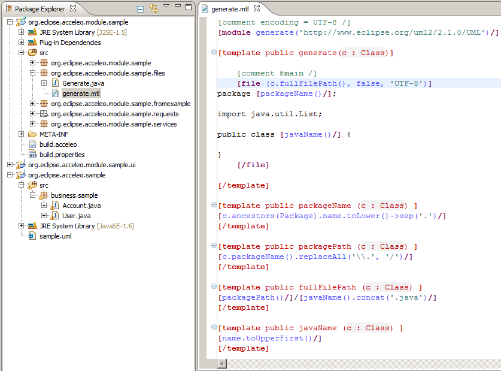

Let's run this on a UML model that contains two classes ``User`` and
``Account``. It generates two java files, and the Result view looks like this:

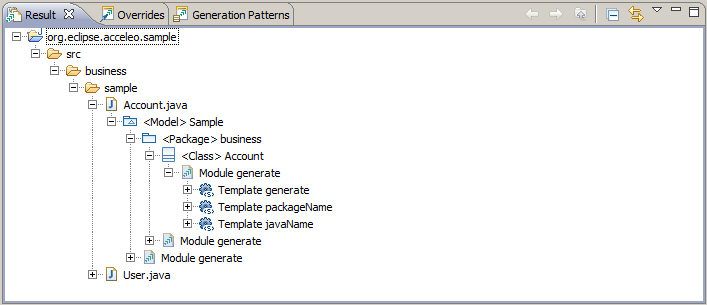

As you can see, each generated file appears in its project and folder hierarchy.

Inside of each generated file, the model elements used to generate it appear
first, followed by the Acceleo module used to generate it.

What is really useful with this view is the synchronization between the
generated code, the model elements used, and the templates.

For example, double-clicking on model element in this view (say, on "User")
automatically opens the corresponding generated code.

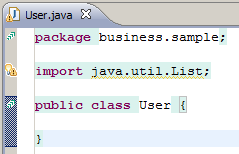

It is also possible to open the input UML model on this specific element, by
right-clicking on it, then selecting *Open Declaration*.

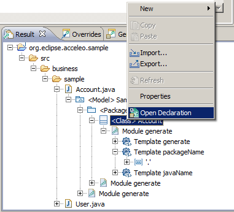

The associated model element is then displayed in the editor:

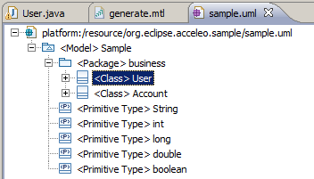

Double-clicking on a template element in this view automatically displays the
corresponding portion of generated code.

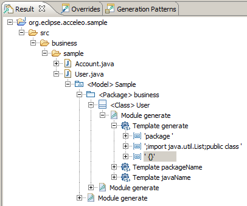

Once again, right-click and select *Open Declaration* to open the associated
Acceleo module, with the relevant portion of template highlighted.

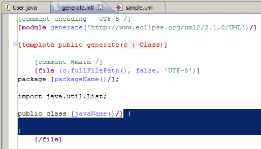

When you click on a portion of generated code in the editor, the associated
template is simultaneously selected in the Result view, and vice-versa.

Notice the little Acceleo markers in the left margin of the generated files:
They indicated portions of text generated by different templates. When you hover
these markers with the mouse, a tooltip appears to explain with which elements
it is related in the model and in the templates. Clicking on it synchronizes the
Result view with the related portion of generated text.

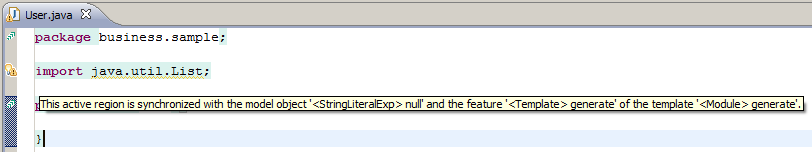

The Result view is very useful to understand where unexpected results in your
generated code come from. By just selecting the unexpected text, you'll be able
to know which model element and which template(s) created it.

Standalone Execution
________________________________________________________________________________

Debugging an Acceleo Generation
--------------------------------------------------------------------------------

Breakpoints
________________________________________________________________________________

To add a breakpoint somewhere in a template, just double-click in the left
margin on the line where you want to add the breakpoint. A nice bluish marker
should appear, which should be very familiar to eclipse users.

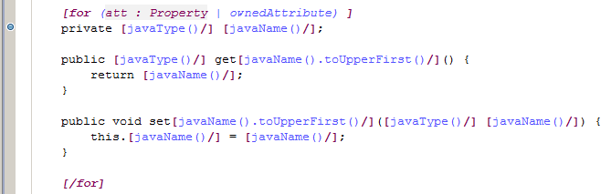

You can add conditions on breakpoints, so that execution will only stop at the
breakpoint if a given condition is fulfilled. To put a condition on a
breakpoint, just left-click on it once. A small window should appear where you
can enter your condition (using OCL).

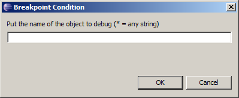

Step by Step Execution
________________________________________________________________________________

To debug an Acceleo generation, two possibilities:

- Right-click on your ``.mtl`` file, and select
  *Debug As > Launch Acceleo Generation*;

.. image:: ../images/acceleo_debug_debugas_launch.png

- If you have already run the generation you want to debug, click on the debug
  icon and select your generation.

Eclipse may display a pop-up window to ask you whether you want to open the
debug perspective:

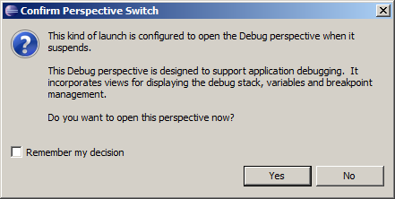

It is actually recommended to switch to the debug perspective, which is really
more appropriate to debug executions.

The debug perspective should be quite familiar to people used to the eclipse
IDE. The "Debug" view (on the top left) displays the stack of the current
execution. Clicking on any element of the stack will simulatenously display the
corresponding Acceleo code in the edition area.

The "Variables" view displays currently accessible variables. In the example
below, the execution has met a breakpoint when computing ``javaType()`` for a
class attibute, so the current input is a class attribute (of type ``Property``
in UML2). The "Variables" view tells us that the current attribute is called
"firstName".

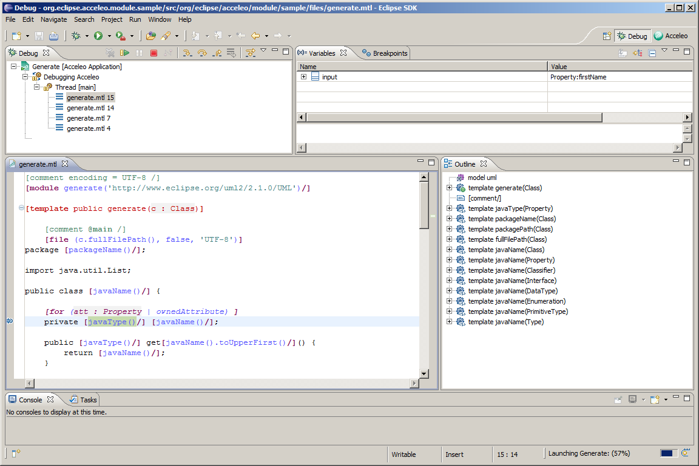

As usual, it is possible to:

- Step into a template (*F5*);
- Step over a template (*F6*);
- Step Return (*F7*), which means "go to the end of the current template";
- Resume execution (*F8*);
- Stop execution (*Ctrl + F2*).

The icons above the "Debug" view serve the same purpose.

On each step, the debugger stops just before the evaluation, and just after, in
which case it displays the produced text in a field called "output" in the
"Variables" view.

.. image:: ../images/acceleo_debug_execution2.png

Acceleo breakpoints can be temporarily deactivated, thanks to the "Breakpoints"
view. Just uncheck the checkbox in front of a breakpoint to deactivate it. Here
is an example of a deactivated breakpoint in this view:

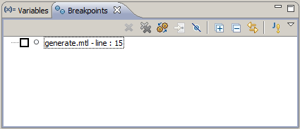

Profiling an Acceleo Generation
--------------------------------------------------------------------------------

Acceleo ships with a built-in profiler which allows you to keep track of
executions and see where time is consumed during a generation, thus making it
easier to identify (and hopefully fix) bottlenecks.

Profile Configurations
________________________________________________________________________________

The first thing to do to profile an Acceleo generation is to create a "Profile
Configuration", which is as we will see very similar to a Launch Configuration.

To create a Profile Configuration, right-click on an Acceleo module file, and
select *Profile As > Profile Configurations...*.
 
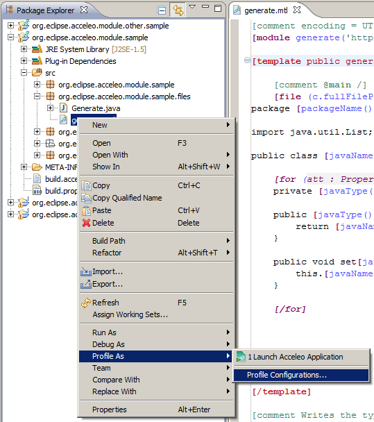

A configuration page appears, which looks very much like the traditional launch
configuration page. Actually, there is just one additional information to enter,
which is the path to the profiling result file where Acceleo will store the
profiling information of subsequent executions.

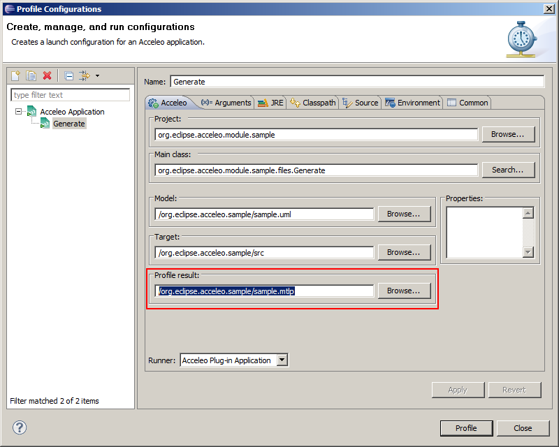

Profile files must have the file extension ``.mtlp``. If you try another file
extension, the configuration page displays an error message and the
configuration cannot be saved.

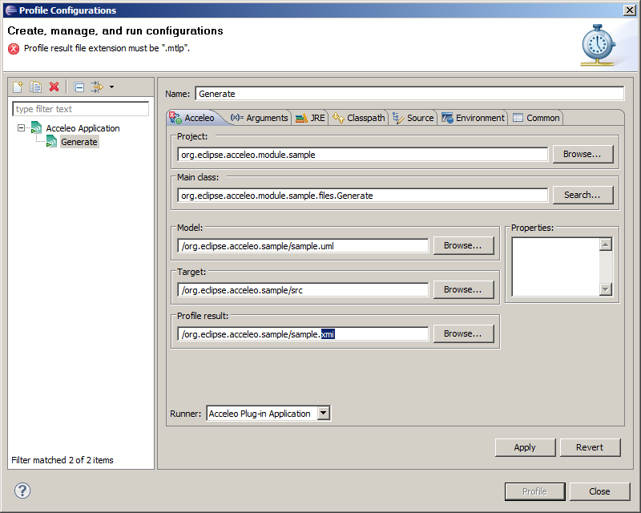

Acceleo Profile Files
________________________________________________________________________________

Acceleo stores the result of a profiled execution in a file which extension is
``.mtlp``. This file is actually just a serialized EMF model.

To profile an Accele generation, you have to launch it by right-clicking on the
Acceleo module file and selecting *Profile As > Launch Acceleo Application*.

.. image:: ../images/acceleo_profiling_launch.png

The generation is then executed, and the profile result file is created (or
updated if it was already there).

Let's take a closer look at it.

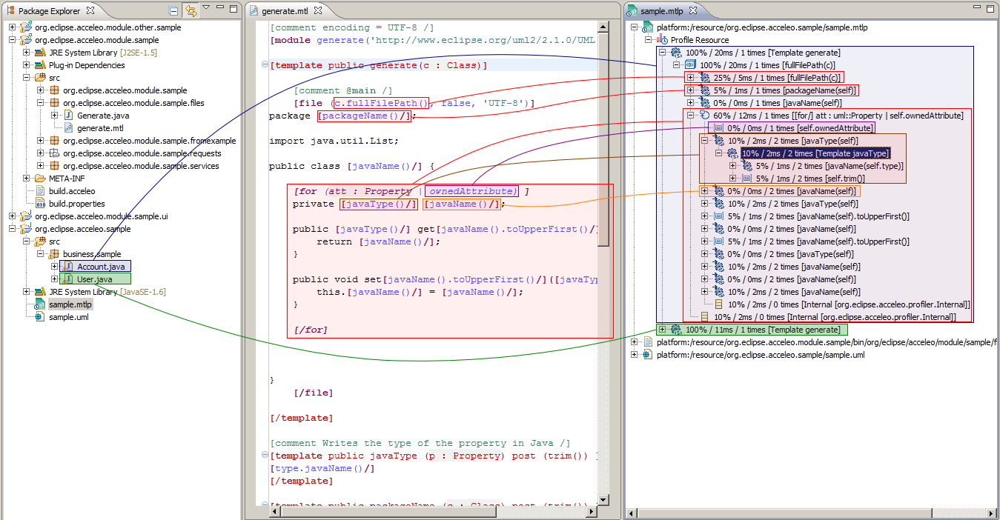

The above image shows the content of an ``mtlp`` file, and correspondances
between the generated files or the Acceleo template elements and the profiled
data.

For each generated file, there is one entry in the root node of the profile (see
the main blue and green areas).

Inside of each generated file block, there is profiling information for each
template instruction. The containment of profiled data follows the structure of
executed templates. For example, a ``[for]`` instruction contains other template
calls, so the profiled data has a node for the ``for`` which contains a node
for each template call executed inside this ``for``.

So, by looking at the profiling data, we know that the generation of the first
file (the blue one) took 20ms, while the second file's generation took 11ms.
For the first file, 60% of the generation time was used in the ``for`` loop
that manages the class attributes.

Deployment
================================================================================

Exporting Generator Projects as Plug-ins
--------------------------------------------------------------------------------

Acceleo Projects are eclipse plug-in projects. As such, they need to be exported
as plug-ins in order to be deployed or made available to others.

To do this, just right-click in the package explorer view, click on *Export...*
and select *Plug-in Development > Deployable plug-ins and fragments*.

The following wizard page appears:

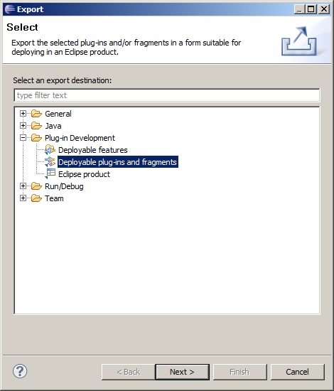

Click *Next >* and select the projects to export as deployable plug-ins.
Projects that were selected in the package explorer are already selected.
Enter the destination of export which can be a directory, an archive file or an
eclipse host repository.

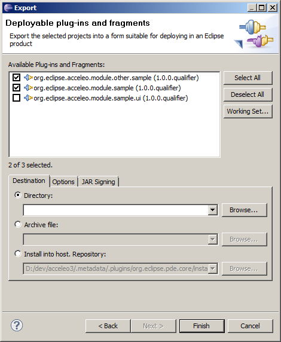

Click on *Finish*, and the selected projects are exported in the chosen
destination.

This looks like the usual way of exporting plug-ins, and it actually is, but
behind the scenes, Acceleo has a few special treatments to run during the export
to make sure the plug-ins will run smoothly after deployment.

**Note**: You must select a coherent set of projects for the export
to work right. Especially if you want to export a project that depends on
others, the dependent projects must be selected too.

As usual with plug-ins, they can be aggregated in features, themselves possibly
bundled in update sites. For more information about plug-in deployment, refer
to the eclipse PDE documentation.

As described in section `Creating an Acceleo UI Project`_, Acceleo provides
facilities to create an eclipse plug-in that makes it possible to run your
generators via an eclipse action that appears in a pop-up menu.

These projects can be exported, bundled, or deployed like any other plug-in.

Miscellaneous
--------------------------------------------------------------------------------

It is important to understand that, because of limitations of older versions of
OCL that ship with older versions of eclipse, Acceleo modules may compile well
in eclipse 3.6 but not in eclipse 3.5 or 3.4.

There is a topic about this on `the Acceleo wiki site, paragraph "Compatibility"
<http://wiki.eclipse.org/Acceleo#Compatibility>`_.

In some cases, Acceleo modules compiled on eclipse 3.5 will work in eclipse 3.4
even if they would not compile in eclipse 3.4!
