=================
 Acceleo Tutorial
=================

:Authors:
	Laurent Goubet,
	Laurent Delaigue
:Contact:
	laurent.goubet@obeo.fr

Copyright |copy| 2008, 2010 Obeo\ |trade|.

.. |copy| unicode:: 0xA9 
.. |trade| unicode:: U+2122
.. contents:: Contents
.. _JMerge: http://wiki.eclipse.org/JET_FAQ_How_does_JMerge_work%3F

New Acceleo project
===================

The aim of an Acceleo project is to generate text from a model (or from a set of models).
For this tutorial, we will create a new Acceleo module for generating java beans from a UML model.

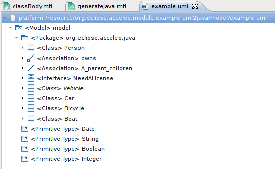

To create a new Acceleo project, right click on the package explorer view then select *New->Acceleo Project*.

.. image:: ../images/new_acceleo_module_project.png

Choose a correct plugin name for the project, then click next.

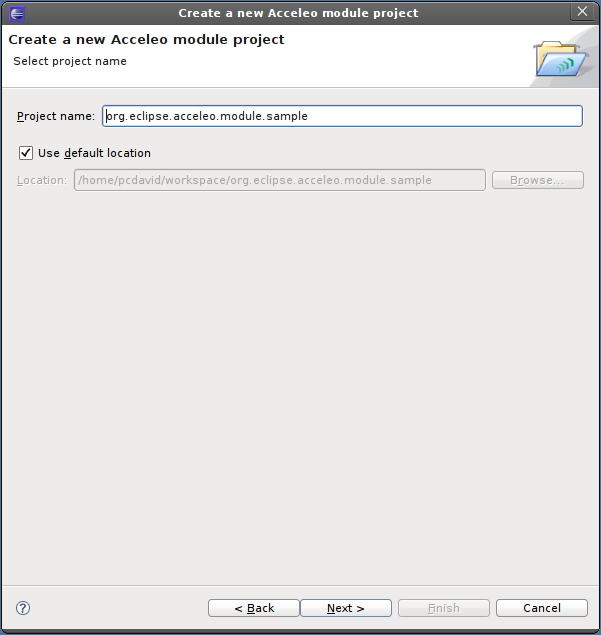

This wizard's page allows you to initialize the project by creating one or several Acceleo module files.

- Select the folder in which you want to create the new module file.
- Fill in the module name
- Optionally, you can select an existing file which will be copied into the new module file. This could be useful to create a module from an existing file.
- Then, select the metamodel from which your generation file will take its types (in this example, UML)
- Finally, choose the metaclass that will be used to generate the file (in this example, Class). This can be modified later at any time directly in the module files.

**Note:** Other options are available to initialize the new module with existing content. These options will be discussed later.

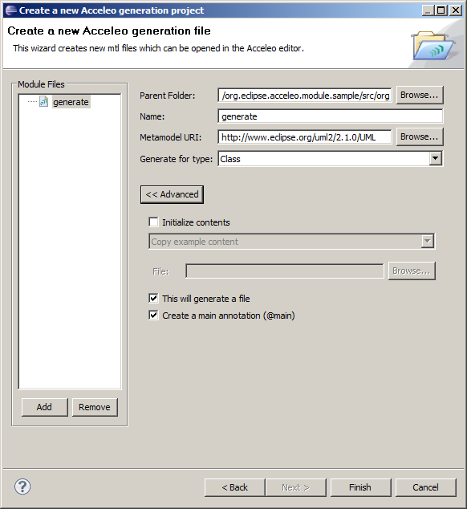

You can create more than one module file in this project by using the "Add" button on the left.

Clicking on finish will create the module file(s), and some files automatically generated from it (more on these below).

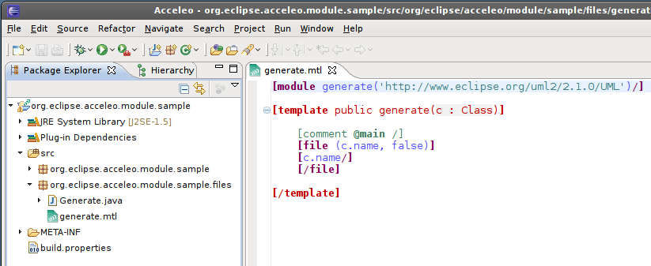

back to Contents_

The Acceleo editor
==================

The module editor provides the following features:

- Syntax highlighting
- Content assistant (ctrl + space)
- Error detection
- Quick fixes (ctrl + shift + 1)
- Dynamic outline
- Quick outline (ctrl + O)
- Code folding
- Open declaration (either with 'ctrl + left click' or 'F3' on selection)
- Search references (ctrl + shift + G)

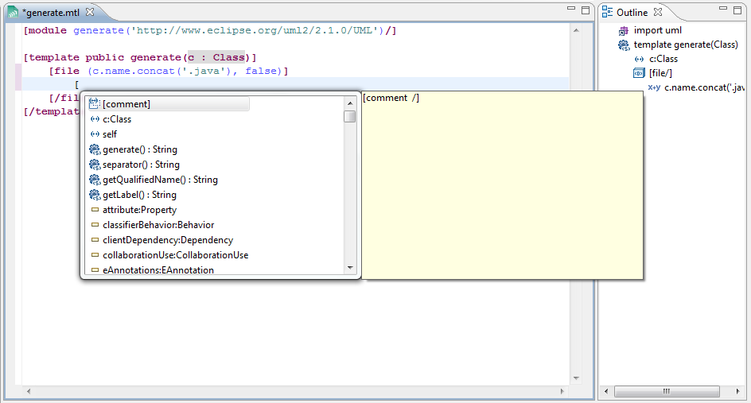

For more information about the Acceleo syntax, please read the official OMG specification accessible from `the official MTL Specification <http://www.omg.org/spec/MOFM2T/1.0/>`_.

back to Contents_

Creating a module to generate java beans
========================================
We would like to create a bean for each of the classes defined in the model. Here is the code for the module file: 

:: 

	[module generate('http://www.eclipse.org/uml2/2.1.0/UML')/]

	[template public generate(c: Class)]
		[file (c.name.concat('.java'), false)]
		public class [c.name.toUpperFirst()/] {
		[for (p: Property | c.attribute)]
		private [p.type.name/] [p.name/];
		[/for]
		[for (p: Property | c.attribute)]
		public [p.type.name/] get[p.name.toUpperFirst()/]() {
			return this.[p.name/];
		}
		[/for]
		[for (o: Operation | c.ownedOperation)]
		public [o.type.name/] [o.name/]() {
			// TODO should be implemented
		}
		[/for]
		}
		[/file]
	[/template]

As shown below, the content assistant provides choices from the UML metamodel:

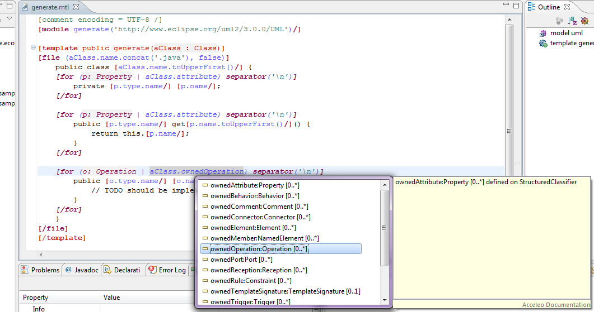

The resulting java file generated by  launching this module file will look like this:

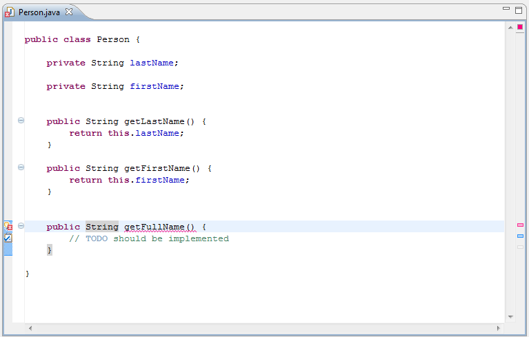

back to Contents_

User-code blocks
================
Acceleo supports 2 ways of specifying user-code blocks in the generated code. User-code blocks delimit portions of text that are only generated once.
Such blocks are not modified during subsequent generations. This is very useful to allow users to add code in some places of generated files
while keeping the rest of the file under the control of the generator.

The first way of specifying user-code blocks is to use the standard ``[protected (id)]...[/protected]``, as shown below:

.. image:: ../images/acceleo_usercode_1_editor.png

The above module produces the following code:

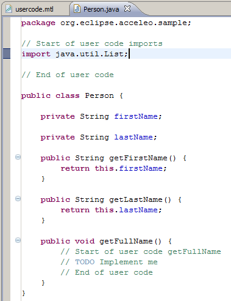

The second way, which is specific to generators that target the java language, is to add ``@generated`` annotations on the javadoc of elements that must be generated.
Other elements (those that do not have such annotations in their javadoc, or in which the annotation has been slightly modified (i.e: ``@generated NOT`` or
``@not-generated`` ... or whatever you fancy)) are considered not to be modified by subsequent generations.

If a file contains at least one annotation ``@generated``, the merge of the former java file and the newly generated one is delegated to JMerge_.
``@generated`` annotations must be added in the javadoc of the relevant java elements.
They are **not** JDK5 annotations.

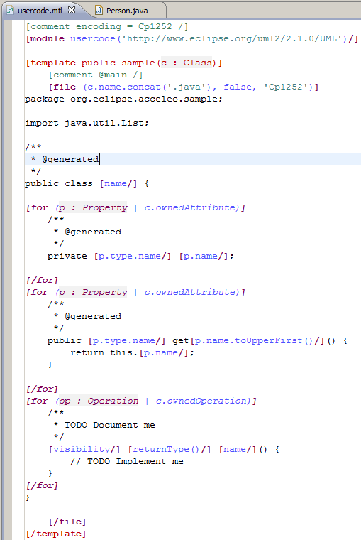

The above module produces the following code:

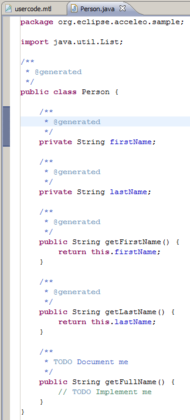

back to Contents_

Java services wrappers
======================

As mentioned earlier, it is possible to initialize the content of a new Acceleo module file with content that comes from

- An existing Acceleo module file (a copy of this file is made)
- Some java code that you need to access from your Acceleo templates

We will detail here the second possibility which makes it possible to execute standard java code from any Acceleo template or query.

Let's suppose you have a class UML2Services in which you have implemented some specific behavior that you'd like
to access from your generators. A good idea would be to put this class in a package ``*services``.

Right-click on the package and select *New > Acceleo Module File*.

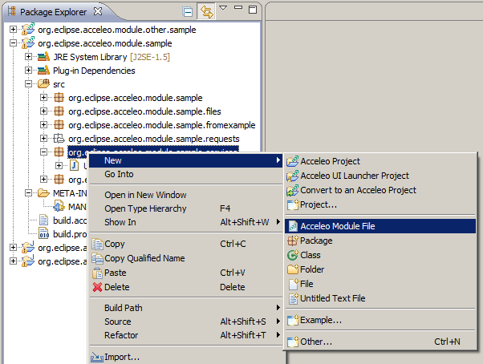

In the wizard window, enter the relevant information in the fields, then activate the *Advanced* button in order to gain access
to the advanced options.

Check the *Initialize Contents* checkbox and select the second choice in the combo: *Create a Java services wrapper*

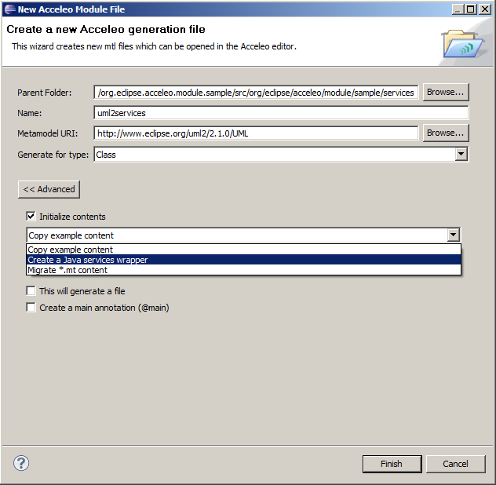

Browse to find the Java file containing your services, then click *Finish*.

This creates a new Acceleo Module file that contains one or several queries (one per java method in your java class)
whose role is just to delegate its behavior to the java class, thus making it accessible to your templates.

This is simply achieved thanks to the non-standard ``invoke`` operation.

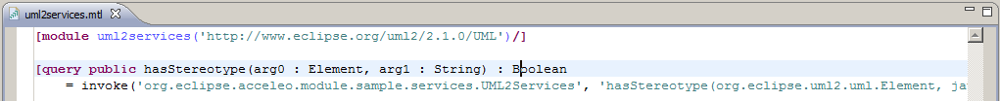

The java helper file
====================

**Note:** This feature may evolve in future releases.

Next to each module file containing a **[comment @main]** annotation, a java file with the same name is automatically
generated.
This file captures the plumbing code that has to be written in order to launch the Acceleo generation.
The entry point for generating is the ``doGenerate()`` method.
To actually launch a generation, you can either create a new instance of the class, or call its ``main()`` method.

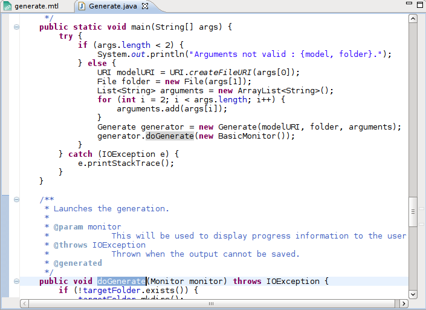

Remember that right-clicking on the template, and selecting *Run As > Launch Acceleo Application* will create a relevant
launch configuration.

back to Contents_

The ant task
============

**Note:** This feature may evolve in future releases.

If you create a ``tasks`` folder at the root of your project, an ant file will be generated which can be used
to launch a generation with the specified template. In order to use this build file, copy it inside the project
containing the model to generate from, rename it to ``build.xml`` for example, then change the *MODEL* and *TARGET*
properties accordingly. Launch the build via *External Tools > Run As > Ant Build*.

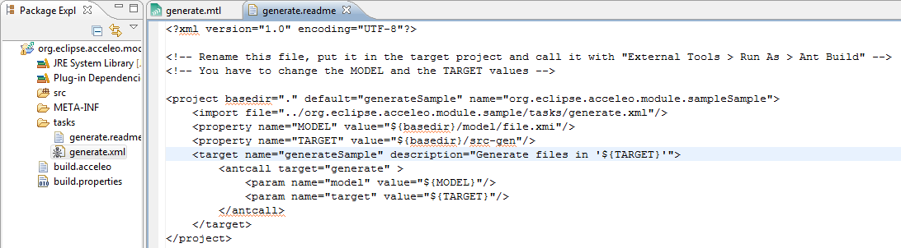

back to Contents_
