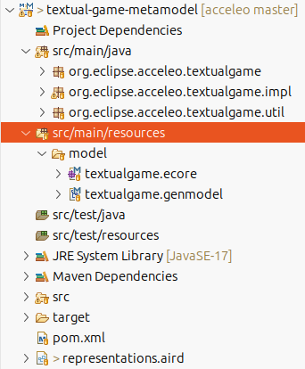
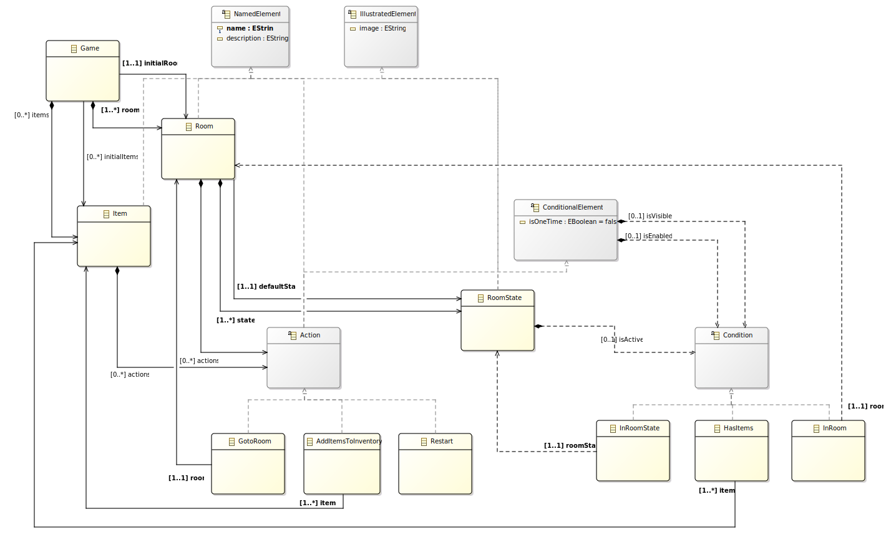
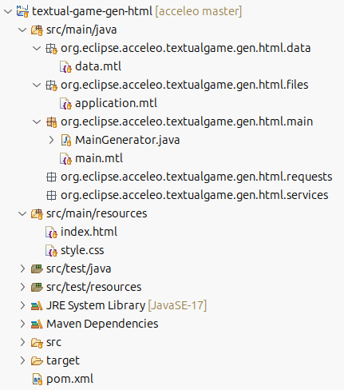
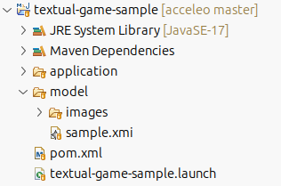

= Textual game turtorial
Learn more about Acceleo in a maven environment
:toc:
:toclevels: 3
:toc-title: Table of Content
:sectnums:
:icons: font
:source-highlighter: highlightjs
:listing-caption: Listing
:idprefix: 
:idseparator: -

<<<

== Introduction

This tutorial will guide you through a small scenario to show you different features of Acceleo.

You will contribute to a HTML/Java script textual game.

== Installation

To start this tutorial you will need to download an Eclipse modeling package from the following https://www.eclipse.org/downloads/packages/release/2025-09/r/eclipse-modeling-tools[download page]. Make sure you selected the package for your operating system and your processor architecture.
Then you will need to unpack the downloaded archive an launch the `eclipse` executable. You can now https://github.com/eclipse-acceleo/acceleo/blob/master/plugins/org.eclipse.acceleo.aql.doc/pages/index.adoc#installation[install Acceleo].

Since we are working with Maven projects, you will also need to install the Maven to Eclipse integration tooling:

 - select the menu Help > Install New Software...
 - select the update site from your Eclipse release
 - search for `M2E - Maven Integration for Eclipse`
 - proceed with the install  

You will need to clone the Acceleo git repository that contains example projects needed for this tutorial:

----
git clone https://github.com/eclipse-acceleo/acceleo.git
----

You can now import projects from the https://github.com/eclipse-acceleo/acceleo/tree/master/examples/maven-textual-game[examples/maven-textual-game] folder.

 - right click in the model explorer on the right
 - menu Import...
 - select the General > Existing Projects into Workspace
 - select the https://github.com/eclipse-acceleo/acceleo/tree/master/examples/maven-textual-game[examples/maven-textual-game] folder you cloned before
 - finish the wizard

We are going to have a look at the different existing projects.

== Overview of existing projects

In the existing generator you can find three different projects:

 - **textual-game-metamodel** the project containing the metamodel definition. This metamodel is used to define the model structure.
 - **textual-game-gen-html** the generator project that produce text for concepts defined in the metamodel.
 - **textual-game-sample** the generation project that contains a sample model and the corresponding generated code.

=== Metamodel

The metamodel project contains the definition of the metamodel. It's the `textualgame.ecore` file.

The `textualgame.genmodel` file contains information for the generated Java code of the metamodel. The generated Java code is in the `src/main/java` folder. If you plan to have custom Java code in the same project, it's recommended to use a separate source folder for generated code.

One last file is present but not mandatory to work with EMF, the `representations.aird` file. This file is used by https://eclipse.dev/sirius/[Sirius] to store graphical representations created with the https://eclipse.dev/ecoretools/[Ecore Tools] editor used to edit Ecore files. Note that Sirius could also be used to create an editor for our game metamodel or any other metamodel based on EMF.

The metamodel is defined like this:

The root element of the metamodel if the `Game` EClass that will contains `Room` and `Item`. A `Room` is a location in the game, it can be in different `RoomState` depending on a `Condition`. `Item` and `Room` can define `Action` that can be `isEnable` and/or `isVisible` depending on a `Condition`. The metamodel definition is also known as a domain specific language (DSL). Here the domain is a textual game but you can create your own metamodel related to your business if needed.

When you will write Acceleo generators, you will reuse the metamodel definition to navigate the model. This make writing Acceleo modules easier for people already knowing the domain.

=== Generator

The generator project contains different Acceleo modules and Java classes needed to generate the game from a textual game model. A textual game model is an instance of model conforming to the above metamodel. The naming convention of a generator project is the name of the source metamodel followed by `gen` and the generated output.

Content of the project:

The game we want to generate has static resources that we can find in the `src/main/resources` and also a file `app.js` that contains the game engine that will be statically generated and the game data a json data structure. This structure will be dynamically generated using Acceleo from the game model. Other resources like images will also be copied as we will see in the sample project.

Acceleo modules are the `*.mtl` files in the different Java packages:

- `data` contains the module needed to generate the json data structure of the game (this is specific to this sample generator)
- `files` contains all modules that generate a file. It's recommended to place all template that produce files in a `files` package.
 - in the module you can find the https://github.com/eclipse-acceleo/acceleo/blob/313fd2ee759db6e9a0d6c725e0d8b304dd4ab805/examples/maven-textual-game/textual-game-gen-html/src/main/java/org/eclipse/acceleo/textualgame/gen/html/files/application.mtl#L18-L22[file statement] that specify the output file name. Here the name is a simple `String` but you can use an https://github.com/eclipse-acceleo/acceleo/blob/master/query/plugins/org.eclipse.acceleo.query.doc/pages/index.adoc[AQL expression] if you need the file name to be dynamic.
 - the content of the file is defined in the body of the file statement. There is a call to the `generateGameData()` template for the data structure and a call to the `generateGameEngine()` for the static game engine. You can use the `CTRL` and over the call with the mouse to open the template declaration or put the caret on the call and use `F3`.
- `main` contains the main module. This module contains a template with the `@main` tag used as the entry point of the generation.
 - the https://github.com/eclipse-acceleo/acceleo/blob/313fd2ee759db6e9a0d6c725e0d8b304dd4ab805/examples/maven-textual-game/textual-game-gen-html/src/main/java/org/eclipse/acceleo/textualgame/gen/html/main/main.mtl#L16-L18[main template] only have one call, but in a more complex generator it can have many calls and orchestrate the files that need to be generated.
 - the `MainGenerator.java` is https://github.com/eclipse-acceleo/acceleo/blob/master/plugins/org.eclipse.acceleo.aql.doc/pages/index.adoc#java-launchers[generated] by Acceleo to launch the `main.mtl` generator as a Java standalone (outside of Eclipse) application. Note that you can use Acceleo to generate launcher for Eclipse.
  - The https://github.com/eclipse-acceleo/acceleo/blob/313fd2ee759db6e9a0d6c725e0d8b304dd4ab805/examples/maven-textual-game/textual-game-gen-html/src/main/java/org/eclipse/acceleo/textualgame/gen/html/main/MainGenerator.java#L609[afterGeneration()] method has been customized to copy static resources and images at the end of the generation. You can note the `@generated NOT` annotation that will keep customization when regenerating the main class.
- `requests` can contains modules that contains https://github.com/eclipse-acceleo/acceleo/blob/master/plugins/org.eclipse.acceleo.aql.doc/pages/index.adoc#query[queries] for factorize complex https://github.com/eclipse-acceleo/acceleo/blob/master/query/plugins/org.eclipse.acceleo.query.doc/pages/index.adoc[AQL expressions].
- `services` can contains Java services. Java class containing Java methods with at least one parameters that can be https://github.com/eclipse-acceleo/acceleo/blob/master/plugins/org.eclipse.acceleo.aql.doc/pages/index.adoc#imports[imported] into your modules. Each method can be called in https://github.com/eclipse-acceleo/acceleo/blob/master/query/plugins/org.eclipse.acceleo.query.doc/pages/index.adoc[AQL expressions]. This is a way to extends the behavior of AQL and Acceleo. It can be used to integrate external tools or access other data sources than EMF models.

One last thing is the `pom.xml` file. It has been modified to https://github.com/eclipse-acceleo/acceleo/blob/313fd2ee759db6e9a0d6c725e0d8b304dd4ab805/examples/maven-textual-game/textual-game-gen-html/pom.xml#L27-L32[include Acceleo modules] to the packaged jar as well as https://github.com/eclipse-acceleo/acceleo/blob/313fd2ee759db6e9a0d6c725e0d8b304dd4ab805/examples/maven-textual-game/textual-game-gen-html/pom.xml#L33-L39[static resources]. The packaged jar will also be an executable jar that will https://github.com/eclipse-acceleo/acceleo/blob/313fd2ee759db6e9a0d6c725e0d8b304dd4ab805/examples/maven-textual-game/textual-game-gen-html/pom.xml#L58-L71[launch the main generator] and also https://github.com/eclipse-acceleo/acceleo/blob/313fd2ee759db6e9a0d6c725e0d8b304dd4ab805/examples/maven-textual-game/textual-game-gen-html/pom.xml#L41-L57[copy all dependencies to the lib folder].

=== Generation

This last project contains a sample textual game model and the corresponding generated code.

The sample model and its images are in the `model` folder. The application is generated in the `application` folder. The model has a few `Room` and `Item`. It also has different `Action` and `Condition` but the generator doesn't generate them at the moment. You can have a look at the model by double clicking on it. This will open the default EMF tree editor. To see properties of an element, you can double click on the element.

The `pom.xml` https://github.com/eclipse-acceleo/acceleo/blob/79c13ff688f03015478494a3b82e7e369f367a5c/examples/maven-textual-game/textual-game-sample/pom.xml#L22-L43[launch the generation] from the sample model to the application folder using the https://github.com/eclipse-acceleo/acceleo/blob/master/examples/maven-textual-game/textual-game-gen-html/src/main/java/org/eclipse/acceleo/textualgame/gen/html/main/MainGenerator.java[main class from the generator project].

You can launch the generation with the `textual-game-sample.launch` launch configuration:

- right click on the `textual-game-sample.launch`
- menu Run As > textual-game-sample

This will launch the generation:

---
>>> Generating
>>  Loading /home/development/git/acceleo/examples/maven-textual-game/textual-game-sample/model/sample.xmi
>>  Before generation
>>  Loading model elements form /home/development/git/acceleo/examples/maven-textual-game/textual-game-sample/model/sample.xmi
>>  org::eclipse::acceleo::textualgame::gen::html::main::main
>>  Generating file:/home/development/git/acceleo/examples/maven-textual-game/textual-game-sample/application/app.js
Files: 1, Lost Files: 0, Errors: 0, Warnings: 0, Infos: 0.
>>  After generation
---

You can ignore the `java.lang.InterruptedException`.

To run the game you can open the `application/index.html` file in your browser. At this point only the `GotoRoom` `Action` is implemented. You can navigate through each rooms until you find the `Restart` `Action`. If you look at the application code, the body of the `Restart` `Action` contains a https://github.com/eclipse-acceleo/acceleo/blob/8ce5b9dda2e003d50216c276f92009bfb5d51769/examples/maven-textual-game/textual-game-sample/application/app.js#L188[TODO].

Now we will implement missing `Action` and `Condition` to complete the generated game.

== Implement Actions

So far the game is not very interesting because we can walk through any `Room` and can't even `Restart` the game. In this section we will implement missing `Action`.

We can first have a look at the `data.mtl` module and more precisely to the https://github.com/eclipse-acceleo/acceleo/blob/8ce5b9dda2e003d50216c276f92009bfb5d51769/examples/maven-textual-game/textual-game-gen-html/src/main/java/org/eclipse/acceleo/textualgame/gen/html/data/data.mtl#L86[generateActionBody(Action)]. This template is called when we want to generate the function body for an `Action`. You can select the template and use `CTRL`+`SHIFT`+`G` to show all references to this template. The template generates a `TODO` with the template name and the type which is missing a implementation. That's why you can find todos for https://github.com/eclipse-acceleo/acceleo/blob/8ce5b9dda2e003d50216c276f92009bfb5d51769/examples/maven-textual-game/textual-game-sample/application/app.js#L48C66-L48C85[AddItemsToInventory] and https://github.com/eclipse-acceleo/acceleo/blob/8ce5b9dda2e003d50216c276f92009bfb5d51769/examples/maven-textual-game/textual-game-sample/application/app.js#L188[Restart] in the generated application.

The template generates the https://github.com/eclipse-acceleo/acceleo/blob/8ce5b9dda2e003d50216c276f92009bfb5d51769/examples/maven-textual-game/textual-game-sample/application/app.js#L188[TODO] we saw earlier but we were able to walk from `Room` to `Room` so the code for the `GotoRoom` `Action` is generated. Acceleo will always call the template with the most specific type for a same signature. To show other templates with the same signature, you can press the `CTLR` key, hold it and over the template name in the editor. You will see a list of all definitions that are compatible. You can select the definition for the `GotoRoom` `Action` to have a look at its implementation.

We need to create a template for the `Restart` and `AddItemsToInventory` `Action`.

You can copy the template for the `GotoRoom` `Action` and replace the parameter type. For the `Restart` `Action` we need to generate a call to `startGame()` and for the `AddItemsToInventory` `Action` we need to generate a call to `addToInventory()` for each `Item` with its `name` as a `String` as parameter. You can write the code for a call an then select the line and wrap it in a [for loop] using `CTLR`+`SHIFT`+`F`.

You should have the following new templates:

---
[**
 * Generates the restart Javascript body.
 * @param action the Restart action
 */]
[template public generateActionBody(action : textualgame::Restart)]
  startGame();
[/template]

[**
 * Generates the add item to inventory Javascript body.
 * @param action the AddItemsToInventory action
 */]
[template public generateActionBody(action : textualgame::AddItemsToInventory)]
  [for (item | action.items)]
    addToInventory("[item.name/]");
  [/for]
[/template]
---

You can notice here there is a two white space indentation. This is mandatory for non inlined statement blocks. This is used to distinguish between the module indentation and the generated indentation. You can find more details about indentation and white spaces https://github.com/eclipse-acceleo/acceleo/blob/master/plugins/org.eclipse.acceleo.aql.doc/pages/index.adoc#white-spaces[here].

You can regenerate and test the game by grabbing an `Item` and/or restart the game.

== Implement Conditions

Now we can do more `Action` in game but we are still missing `Condition` that will make the game even more interesting. `Condition` are used by the game engine to define if an `Action` `isVisible` and/or `isEnabled`. If you look at the `generateActionData()` you can see https://github.com/eclipse-acceleo/acceleo/blob/8ce5b9dda2e003d50216c276f92009bfb5d51769/examples/maven-textual-game/textual-game-gen-html/src/main/java/org/eclipse/acceleo/textualgame/gen/html/data/data.mtl#L72-L77[both TODOs]. `Condition` are also used to define if a `RoomState` `isActive`, in the `generateStateData()` template you can see an other https://github.com/eclipse-acceleo/acceleo/blob/8ce5b9dda2e003d50216c276f92009bfb5d51769/examples/maven-textual-game/textual-game-gen-html/src/main/java/org/eclipse/acceleo/textualgame/gen/html/data/data.mtl#L53-L55[TODO].

We need to generate a Javascript function like we did for the `Action`:

---
"isVisible": function () {
    ...
},

"isEnabled": function () {
    ...
},

"isActive": function () {
    ...
},
---

The body should return:

- `InRoom` a call to isCurrentRoom() with the `Room` `name` in a `String` as parameter.
- `HasItems` a call to posessItems() with the array of `Item` `name` in a `String` as parameter. You can use the collection->sep(prefix, separator, suffix) service to generate the array.
- `InRoomState` a call to isCurrentState() with the `RoomState` `name` in a `String` as parameter.

You can implement the different templates and call them to replace generated TODOs.

You should have the following calls:

---
      [if (action.isVisible != null)]
        "isVisible": function () {
            [action.isVisible.generateConditionBody()/]
        },
      [/if]

      [if (action.isEnabled != null)]
        "isEnabled": function () {
            [action.isEnabled.generateConditionBody()/]
        },
      [/if]

      [if (state.isActive != null)]
        "isActive": function () {
            [state.isActive.generateConditionBody()/]
        }
      [/if]
---

And the following templates:

---
[**
 * Generates the condition Javascript body.
 * @param condition the Condition
 */]
[template public generateConditionBody(condition : textualgame::Condition)]
  // TODO implement generateConditionBody for [condition.eClass().name/]
[/template]

[**
 * Generates the condition Javascript body.
 * @param condition the Condition
 */]
[template public generateConditionBody(condition : textualgame::InRoom)]
  return isCurrentRoom("[condition.room.name/]");
[/template]

[**
 * Generates the condition Javascript body.
 * @param condition the Condition
 */]
[template public generateConditionBody(condition : textualgame::HasItems)]
  return posessItems([condition.items.name->sep('["', '", "','"]')/]);
[/template]

[**
 * Generates the condition Javascript body.
 * @param condition the Condition
 */]
[template public generateConditionBody(condition : textualgame::InRoomState)]
  return isCurrentState("[condition.roomState.name/]");
[/template]
---

You can regenerate the application and test it. You should notice that it's not possible to finish the game even with both red and green keys.

== Incremental generation

To finish the game we need to change the `onClickFunction` of the green and the red key to:

---
"onClickFunction": function () {
    if (isCurrentState("default")) {
        setState("exitDoorRoom", "usedOneKey");
    } else if (isCurrentState("usedOneKey")) {
        setState("exitDoorRoom", "usedTwoKeys");
    }
}
---

And the `isEnabled` to:

---
"isEnabled": function () {
    return isCurrentRoom("exitDoorRoom") || isCurrentRoom("usedOneKey");
}
---

But the metamodel doesn't allow such construction at the moment, it will allow it in a future version. In the mean time we need to release the game... Hopefully Acceleo provides a mechanism to allow custom content to be written in the generated document and be kept when regenerating. This can be done using a https://github.com/eclipse-acceleo/acceleo/blob/master/plugins/org.eclipse.acceleo.aql.doc/pages/index.adoc#protected-area[protected area]. You can wrap a block of code in a protected area by selecting the all the lines and using `CTLR`+`SHIFT`+`P`. You will need to select an ID that must be unique across the generated file. You can use the `Action` `name` for instance, in this case it will not be enough since several `Action` have the same `name`. You can add the containing `NamedElement` `name` since an `Action` can be contained in a `Room` or an `Item`.

Wrap the body call for the `Action` and the `Condition`:

---
      "onClickFunction": function () {
          [protected ('onClickFunction_' + action.eContainer(textualgame::NamedElement).name + '_' + action.name) startTagPrefix('// ') endTagPrefix('// ')]
            [action.generateActionBody()/]
          [/protected]
      },

      [if (action.isEnabled != null)]
        "isEnabled": function () {
            [protected ('isEnabled_' + action.eContainer(textualgame::NamedElement).name + '_' + action.name) startTagPrefix('// ') endTagPrefix('// ')]
              [action.isEnabled.generateConditionBody()/]
            [/protected]
        },
      [/if]
---

You can now regenerate. You will see comments around protected areas, for instance:

---
                        // Start of user code onClickFunction_torchRoom_go back
                        gotoRoom("firstRoom");
                        // End of user code
---

You can modify the code between the two comments and it will be kept after the next generation. If a protected area ID is present in the file but is not regenerated, a lost file with its content will be created to avoid data loss. Of course its a good practice to use a version control system like git to keep track of different code versions. You can find more information on protected areas in the https://github.com/eclipse-acceleo/acceleo/blob/master/plugins/org.eclipse.acceleo.aql.doc/pages/index.adoc#protected-area[documentation].

We need to change the generated `app.js` code to the following:

Green key onClickFunction:

---
                        // Start of user code onClickFunction_green key_Use
						if (isCurrentState("default")) {
						    setState("exitDoorRoom", "usedOneKey");
						}
						else if (isCurrentState("usedOneKey")) {
						    setState("exitDoorRoom", "usedTwoKeys");
						}
                        // End of user code
---

Green key isEnabled:

---
                        // Start of user code isEnabled_green key_Use
                        return isCurrentRoom("exitDoorRoom") || isCurrentRoom("usedOneKey");
                        // End of user code
---

Red key onClickFunction:

---
                        // Start of user code onClickFunction_red key_Use
						if (isCurrentState("default")) {
						    setState("exitDoorRoom", "usedOneKey");
						}
						else if (isCurrentState("usedOneKey")) {
						    setState("exitDoorRoom", "usedTwoKeys");
						}
                        // End of user code
---

Red key isEnabled:

---
                        // Start of user code isEnabled_red key_Use
                        return isCurrentRoom("exitDoorRoom") || isCurrentRoom("usedOneKey");
                        // End of user code
---

You can now test the full game. To make sure you don't lost any customization, you can regenerate and test the game again.

== Java services

Note that we will use a Java service for the sake of this tutorial. Usually Java services are used to fetch data from other sources than EMF or to do computations that would not be practical to write using AQL. Here we will just modify the `generateConditionBody(InRoomState)` to call a Java service.

Create a Java Class `ConditionServices` in the `org.eclipse.acceleo.textualgame.gen.html.services` package:

- select the `org.eclipse.acceleo.textualgame.gen.html.services` package in the model explorer
- right click on it and select the New > Class menu
- name it `ConditionServices` and Finish

A Java service is just a public Java method with at least one parameter. We will create a simple method as our service that returns the text to be generated:

---
package org.eclipse.acceleo.textualgame.gen.html.services;

import org.eclipse.acceleo.textualgame.InRoomState;

public class ConditionServices {

	public String generateReturnStatement(InRoomState condition) {
		return "return isCurrentState(\"" + condition.getRoomState().getName() + "\");";
	}

}
---

We are using the Java API generated by EMF to get the passed `InRoomState` and access its `roomState` and the `name` of the `RoomState`. The logic is the same as our previous template but written in Java.

Now to use the new service, we need to import it in our template. After the module header add the import line:

---
[module data('http://www.eclipse.org/acceleo/textualgame')/]

[import org::eclipse::acceleo::textualgame::gen::html::services::ConditionServices/]
---

We can now call the service like any other template, query, or AQL services:

---
[template public generateConditionBody(condition : textualgame::InRoomState)]
  [condition.generateReturnStatement()/]
[/template]
---

== Conclusion

In this tutorial we saw how to use Acceleo in a full Maven context. We also write simple templates and use the dynamic dispatch of Acceleo to most specific templates. We covered incremental generation and generated file customization which is an important feature when working on real world projects. Lastly, we finished by creating and calling a Java service that virtually opens Acceleo to all king of integrations and capabilities.
