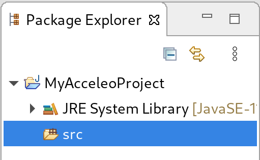
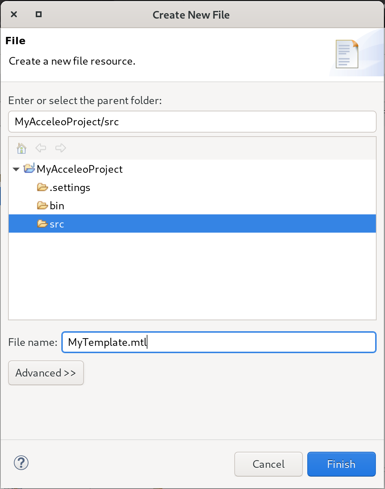
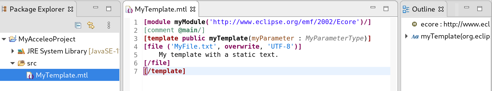
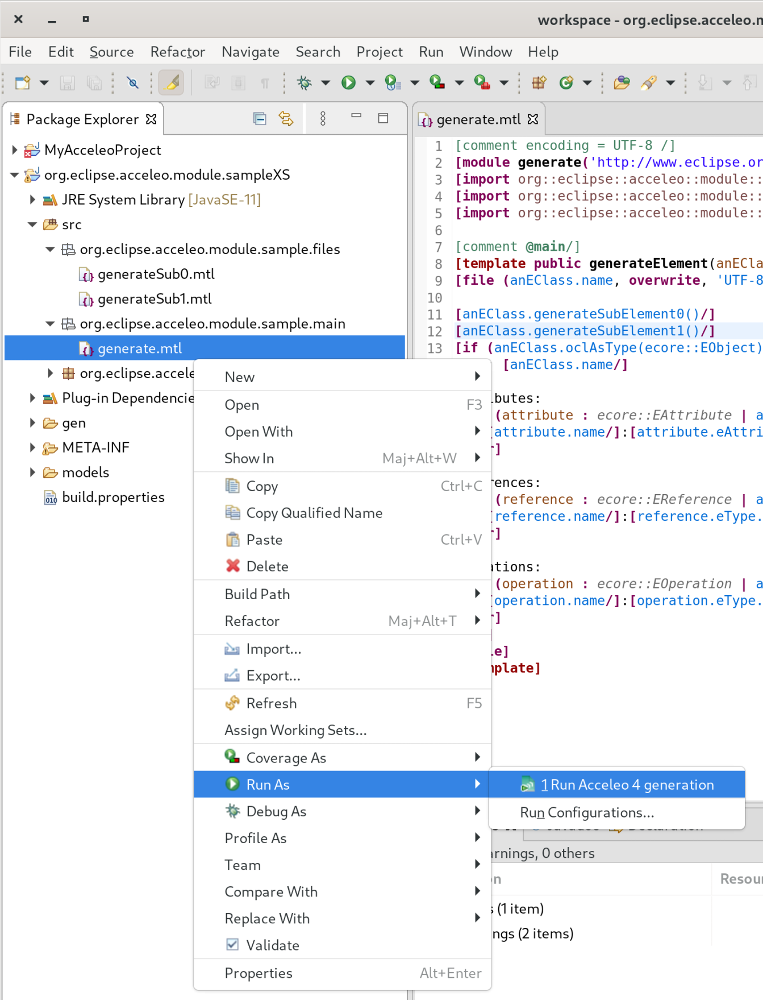
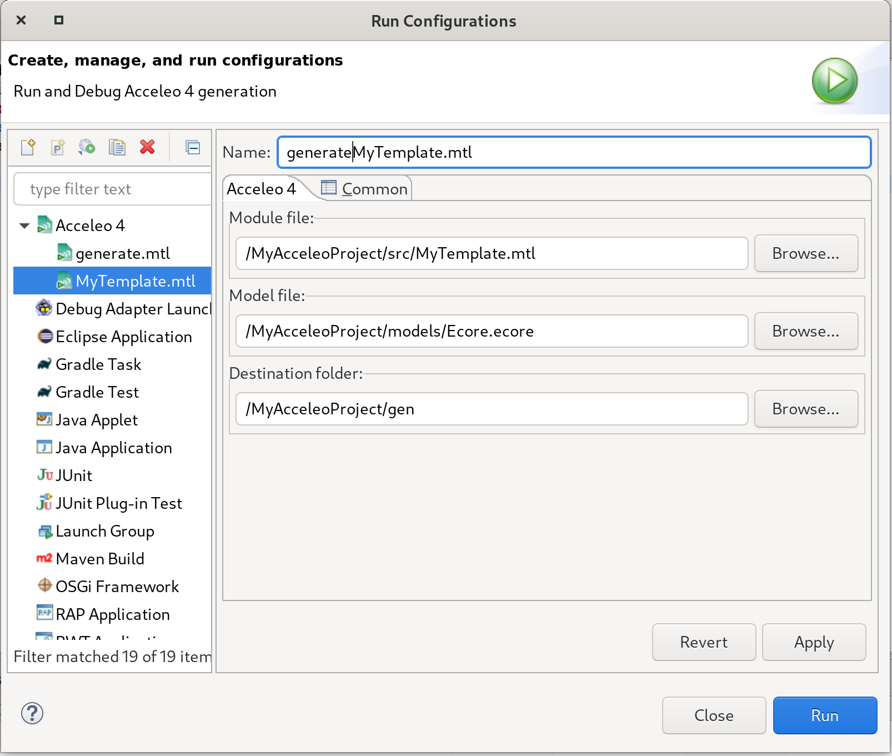

In this section, you will create a new project to work with Acceleo.

First you need to create a *Java project*:

1. Inside Eclipse select the menu item *File > New > Project...* to open the *New Project* wizard,
2. Select *Java Project* then click *Next* to  start the *New Java Project* wizard:

image::images/NewProjectWizard.png[] 

On this page:

1. Enter the Project name,
2. Select the Java Runtime Environment (JRE) or leave it at the default,
3. Then click *Finish*.

 

1. In the *Package Explorer*, expand the project and select the source folder *src*,
2. Select the menu item *File > New > File* to open the *New File* wizard,
3. Select the *src* folder as parent folder,
4. Enter the File name with the extension *.mtl*, for example: `MyTemplate.mtl`,
5. Then click *Finish*.

 

An empty editor opens, you can start writing your generation template.

 
In order to launch an Acceleo generator, you just have to right-click on your main module and use the *Run As* menu.

From there the *Launch Configuration* menu will open.
If you already have created a launch configuration you can access the launch configuration menu from the *Run > Run Configurations...* menu.
In this menu, you will have access to the Acceleo Launch configuration. 
You just have to select:

* your main *module file*, 
* your input *model file*,
* the *destination folder* of the generation.

.After launching the generation
[IMPORTANT]
====
Check that your generation is finished by opening the *Console* view.
You should see a message like this `<terminated> generate.mtl[Acceleo4]`.
====
 