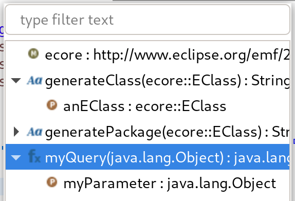
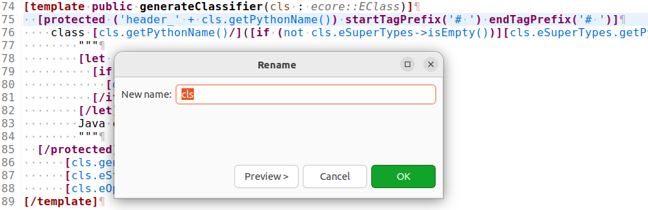
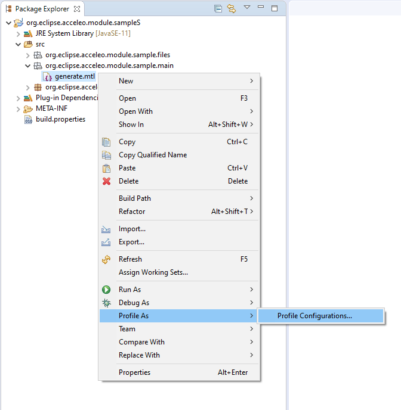
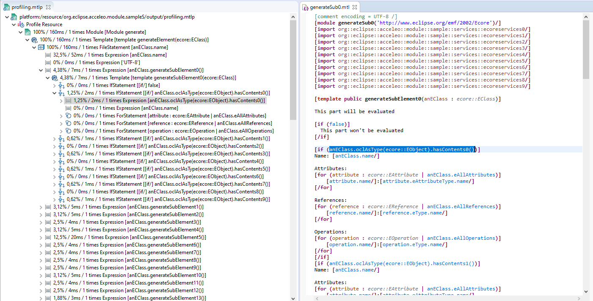

=== The Acceleo Editor

.Before you Start
[IMPORTANT] 
====
Use a *Java Project* and the classical *Java Perspective* for writing your Acceleo templates `.mtl` in the *src* folder.
====

The module editor provides the following features:

* Syntax highlighting;
* Content assistant (`Ctrl + Space`);
* Error detection;
* Quick fixes;
* Outlines;
* Quick outline (`Ctrl + O`);
* Open declaration (either with `Ctrl + Left Click` or `F3`);
* Show references (`Ctrl + Shift + G`);
* Refactoring:
** Rename (`Ctrl + Alt + R`);
** Extract template (`Alt + Shift + T`);
** Wrap in if (`Alt + Shift + I`);
** Wrap in for (`Alt + Shift + F`);
** Wrap in let (`Alt + Shift + L`);
** Wrap in protected (`Alt + Shift + P`);
* White spaces.

==== Syntax Highlighting
The editor uses specific colors for Acceleo templates:

* red is used for template tags;
* purple is used for other tags (queries, modules, imports, ...);
* blue is used for dynamic expressions in templates or other places;
* green is used for comments and String literals;
* black is used for static text or query bodies.

image::images/SyntaxHighlighting.png[Syntax Highlighting]

==== Content assist

The content assistant is traditionally invoked with `Ctrl + Space`.
It proposes a choice of all elements that make sense at the place of invocation. 
It is available everywhere, so don't hesitate to hit `Ctrl + Space` anywhere!
	
image::images/ContentAssistMetamodel.png[Content Assist]

==== Real Time Errors Detection

Obviously, Acceleo displays error markers when errors are detected. 
Acceleo displays error markers whenever a module file is not valid, whatever the reason.
Errors appear in the *Problems* view (generally displayed at the bottom of the perspective), and double-clicking on an error in this view directly takes you to the file where it is located.

image::images/ErrorInProblemsView.png[Errors in Problems view]

Files with errors also appear with an error decorator.

image::images/ErrorFile.png[Error at file level]

Just hover the marker in the editor margin with the mouse to get a tooltip to appear with an explanation of the problem.

image::images/ErrorTooltip.png[Error Tooltip]

==== Quick fixes

For some errors the Acceleo 4 editor can provide quick fixes to help you fix them. To access *Quick Fixes* you need to over the error with the mouse. If quick fixes are available you should see the following popup:

image::images/QuickFixes.png[Quick Fixes]

You can then select the quick fix you want to apply in the list.

==== Outlines
One of the great benefits of modern IDE tooling is the capacity to easily navigate in code from elements to their declarations and, vice-versa, from declarations to usages.

===== The dynamic outline
The traditional Eclipse *Outline* view is used by Acceleo to display the module's structure metamodels, templates, queries can be seen there, and double-clicking on any of them places the cursor at the corresponding position in the module (in the editor).

image::images/Outline.png[Outline]

===== The quick outline
The quick outline, which can be displayed using `Ctrl + O`, displays just the necessary information to access any element in the current module. 
So, hitting `Ctrl + O` displays a pop-up with a list of templates and queries.

A text field at the top allows you to quickly filter the content in order to easily find what you are looking for.

==== Open Declaration

The traditional shortcut `F3` is supported by Acceleo, along with `Ctrl + click`, which both take you to the declaration of the selected or clicked element. 
This is supported for all kinds of elements: templates, queries, metamodels, metamodel elements, EOperations, etc.

image::images/OpenDeclaration.png[Open Declaration]

==== Show references

You can show references to a service or a variable by either selecting its declaration or one of its reference an using the `Ctrl + Shift + G` shortcut. It will show all references in the search view.

image::images/ShowReferences.png[Show References]

You can then double click enties in the search view to navigate to a reference.

==== Refactoring

===== Rename

You can use the rename shortcut `Ctrl + Alt + R` to rename all references to a service or a variable in the workspace.

===== Extract template

You can use the extract template short cut `Alt + Shift + T` after selecting one or more lines in a template. The selection must start and end at the beginning of a line (first column). The selection must start and end in the same block of code.

The selection will be wrapped in a new template and the selected text will be replaced by a call to this template.

image::images/RefactorOrigin.png[Origin]

image::images/RefactorExtractTemplate.png[Extract Template]

===== Wrap in if

You can use the wrap in if short cut `Alt + Shift + I` after selecting one or more lines in a template. The selection must start and end at the beginning of a line (first column). The selection must start and end in the same block of code.

The selection will be wrapped in a new if statement.

image::images/RefactorOrigin.png[Origin]

image::images/RefactorWrapInIf.png[Wrap in If]

===== Wrap in for

You can use the wrap in for short cut `Alt + Shift + F` after selecting one or more lines in a template. The selection must start and end at the beginning of a line (first column). The selection must start and end in the same block of code.

The selection will be wrapped in a new for statement.

image::images/RefactorOrigin.png[Origin]

image::images/RefactorWrapInFor.png[Wrap in For]

===== Wrap in let

You can use the wrap in let short cut `Alt + Shift + L` after selecting one or more lines in a template. The selection must start and end at the beginning of a line (first column). The selection must start and end in the same block of code.

The selection will be wrapped in a new let statement.

image::images/RefactorOrigin.png[Origin]

image::images/RefactorWrapInLet.png[Wrap in Let]

===== Wrap in protected

You can use the wrap in protected short cut `Alt + Shift + P` after selecting one or more lines in a template. The selection must start and end at the beginning of a line (first column). The selection must start and end in the same block of code.

The selection will be wrapped in a new protected statement.

image::images/RefactorOrigin.png[Origin]

image::images/RefactorWrapInProtected.png[Wrap in Protected]

=== The Acceleo Debugger

==== Breakpoints

To add a breakpoint somewhere in a template, just double-click in the left margin on the line where you want to add the breakpoint. 
A nice bluish marker should appear, which should be very familiar to eclipse users.

NOTE: Conditional breakpoints are not supported.

==== Step by step execution

To debug an Acceleo generation:

* Right-click on your `.mtl` file, and select *Debug As > Debug Acceleo 4 generation*.

image::images/DebugAs.png[Debug As]

It is actually recommended to switch to the *Debug Perspective*, which is really more appropriate to debug executions.

The debug perspective should be quite familiar to people used to the eclipse IDE. 
The *Debug* view (on the top left) displays the stack of the current execution. 
Clicking on any element of the stack will simultaneously display the corresponding Acceleo code in the edition area.

The *Variables* view displays currently accessible variables. 
In the example below, the execution has met a breakpoint when computing `Attributes` for a class, so the current input is a class. 
The Variables view tells us that the current class is called `EAttribute`.

image::images/VariablesView.png[VariablesView]

NOTE: The debugger cannot step into AQL expressions only Acceleo elements are visible in the Variables view.

As usual, it is possible to:

* *Step into* a template (`F5`);
* *Step over* a template (`F6`);
* *Step Return* (`F7`), which means "go to the end of the current template";
* *Resume* execution (`F8`);
* *Stop* execution (`Ctrl + F2`).
The icons above the *Debug* view serve the same purpose.

Acceleo breakpoints can be temporarily deactivated, thanks to the *Breakpoints* view. 
Just uncheck the checkbox in front of a breakpoint to deactivate it. 
Here is an example of a deactivated breakpoint in this view:

image::images/UnactivBreakpoint.png[Unchecked Breakpoint]

=== Acceleo Profiler
 
The Acceleo 4 Profiler allows you to keep track of executions and see where time is consumed during a generation, thus making it easier to identify (and hopefully fix) bottlenecks.

==== Launching a generation with the profiler

The first thing to do to profile an Acceleo generation is to create a Profile Configuration, which is as we will see very similar to a Launch Configuration. To create a Profile Configuration, right-click on an Acceleo module file, and select Profile As > Profile Configurations....

A configuration page appears, which looks very much like the traditional launch configuration page.

There is just one additional information to enter, which is the path to the profiling result file where Acceleo will store the profiling information of subsequent executions. Profile files must have the file extension .mtlp. If you try another file extension, the configuration page displays an error message and the configuration cannot be saved.
You can simply select a folder in this dialog, in which the profile file will be created.

==== Acceleo Profile Files

Acceleo stores the result of a profiled execution in a file which extension is .mtlp. This file is actually just a serialized EMF model. Let's take a closer look at it.

The above image shows the content of an mtlp file, and correspondances between the profiled data and the Acceleo template elements.

For each generated file, there is one entry in the root node of the profile.

Inside of each generated file block, there is profiling information for each template instruction. The containment of profiled data follows the structure of executed templates. For example, a [for ... ] instruction contains other template calls, so the profiled data has a node for the for which contains a node for each template call executed inside this for.

==== Coverage informations

The profile editor also provides coverage informations based on the profiling result. For each used module it shows what percentage of it has been actually used.

You can double-click on the module in the profile editor (or on any module element in the profile model) to accurately see what has been used in a given module. It shows in green what has been covered by the execution and in red what has been ignored.

To get rid of the coverage highlighting you can simply close the editor and reopen the file from the explorer.

=== Java launchers

You can select a module file that contains a main template to generate the Java code that will launch your module. There are two menus:

* *Generate Generator Class* that will generate a Java class that can be used in standalone
** It creates a Java main class next to your module
** It can be integrated in other application outside or inside of Eclipse
* *Create Eclipse UI Generator Project* that will generate an Eclipse plugin
** It creates an Eclipse plugin projet next to your generator project
** It extends the standalone class (the standalone main class will be generated)
** It contribute a menu to objects that can be passed to your main template

All the code above is generated using Acceleo 4. You can extend and override the content of the generated files like you would with any Acceleo 4 generator. The source code is in this https://github.com/eclipse-acceleo/acceleo/tree/master/plugins/org.eclipse.acceleo.aql.ide.ui/src-module/[source folder].