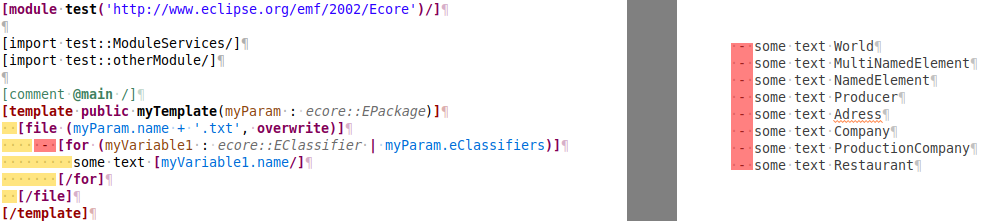
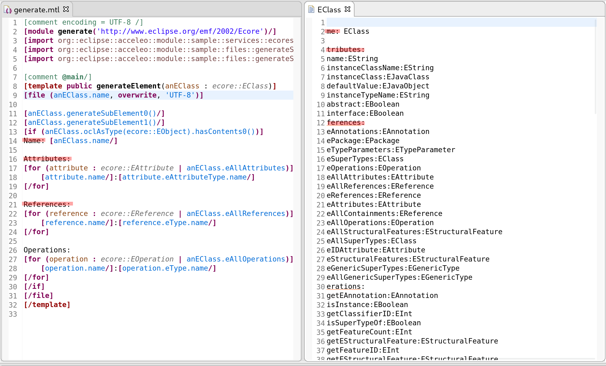

=== The Acceleo Editor

.Before you Start
[IMPORTANT] 
====
Use a *Java Project* and the classical *Java Perspective* for writing your Acceleo templates `.mtl` in the *src* folder.
====

The module editor provides the following features:

* Syntax highlighting;
* Content assistant (`Ctrl + Space`);
* Error detection;
* Outlines;
* Quick outline (`Ctrl + O`);
* Open declaration (either with `Ctrl + Left Click` or `F3`),
* White spaces.

==== Syntax Highlighting
The editor uses specific colors for Acceleo templates:

* red is used for template tags;
* purple is used for other tags (queries, modules, imports, ...);
* blue is used for dynamic expressions in templates or other places;
* green is used for comments and String literals;
* black is used for static text or query bodies.

image::images/SyntaxHighlighting.png[Syntax Highlighting]

==== Content assist

The content assistant is traditionally invoked with `Ctrl + Space`.
It proposes a choice of all elements that make sense at the place of invocation. 
It is available everywhere, so don't hesitate to hit `Ctrl + Space` anywhere!
	
image::images/ContentAssistMetamodel.png[Content Assist]

==== Real Time Errors Detection

Obviously, Acceleo displays error markers when errors are detected. 
Acceleo displays error markers whenever a module file is not valid, whatever the reason.
Errors appear in the *Problems* view (generally displayed at the bottom of the perspective), and double-clicking on an error in this view directly takes you to the file where it is located.

image::images/ErrorInProblemsView.png[Errors in Problems view]

Files with errors also appear with an error decorator.

image::images/ErrorFile.png[Error at file level]

Just hover the marker in the editor margin with the mouse to get a tooltip to appear with an explanation of the problem.

image::images/ErrorTooltip.png[Error Tooltip]

==== Outlines
One of the great benefits of modern IDE tooling is the capacity to easily navigate in code from elements to their declarations and, vice-versa, from declarations to usages.

===== The dynamic outline
The traditional Eclipse *Outline* view is used by Acceleo to display the module's structure metamodels, templates, queries can be seen there, and double-clicking on any of them places the cursor at the corresponding position in the module (in the editor).

image::images/Outline.png[Outline]

===== The quick outline
The quick outline, which can be displayed using `Ctrl + O`, displays just the necessary information to access any element in the current module. 
So, hitting `Ctrl + O` displays a pop-up with a list of templates and queries.

A text field at the top allows you to quickly filter the content in order to easily find what you are looking for.

image::images/QuickOutline.png[QuickOutline]

==== Open Declaration

The traditional shortcut `F3` is supported by Acceleo, along with `Ctrl + click`, which both take you to the declaration of the selected or clicked element. 
This is supported for all kinds of elements: templates, queries, metamodels, metamodel elements, EOperations, etc.

image::images/OpenDeclaration.png[Open Declaration]

==== White spaces

When generating text, and especially code, white spaces and indentation is an important point.
In order to keep template code indentation from interfering with the generated output, a few rules applies:

- each block has a *mandatory indentation* of *two characters* than will not be generated in the output (in yellow below)
- when generating a block if the last generated line is not empty, it is repeated at the beginning of each line generated by the block (in red below)

[WARNING]
====
In a template you have to *let 2 whitespaces at the beginning of each line*, else the generated content will be truncated by 2 characters.
====

=== The Acceleo Debugger

==== Breakpoints

To add a breakpoint somewhere in a template, just double-click in the left margin on the line where you want to add the breakpoint. 
A nice bluish marker should appear, which should be very familiar to eclipse users.

image::images/Breakpoint.png[Breakpoint]

NOTE: Conditional breakpoints are not supported.

==== Step by step execution

To debug an Acceleo generation:

* Right-click on your `.mtl` file, and select *Debug As > Debug Acceleo 4 generation*.

It is actually recommended to switch to the *Debug Perspective*, which is really more appropriate to debug executions.

image::images/DebugSession.png[Debug]

The debug perspective should be quite familiar to people used to the eclipse IDE. 
The *Debug* view (on the top left) displays the stack of the current execution. 
Clicking on any element of the stack will simultaneously display the corresponding Acceleo code in the edition area.

The *Variables* view displays currently accessible variables. 
In the example below, the execution has met a breakpoint when computing `Attributes` for a class, so the current input is a class. 
The Variables view tells us that the current class is called `EAttribute`.

NOTE: The debugger cannot step into AQL expressions only Acceleo elements are visible in the Variables view.

As usual, it is possible to:

* *Step into* a template (`F5`);
* *Step over* a template (`F6`);
* *Step Return* (`F7`), which means "go to the end of the current template";
* *Resume* execution (`F8`);
* *Stop* execution (`Ctrl + F2`).
The icons above the *Debug* view serve the same purpose.

Acceleo breakpoints can be temporarily deactivated, thanks to the *Breakpoints* view. 
Just uncheck the checkbox in front of a breakpoint to deactivate it. 
Here is an example of a deactivated breakpoint in this view:

