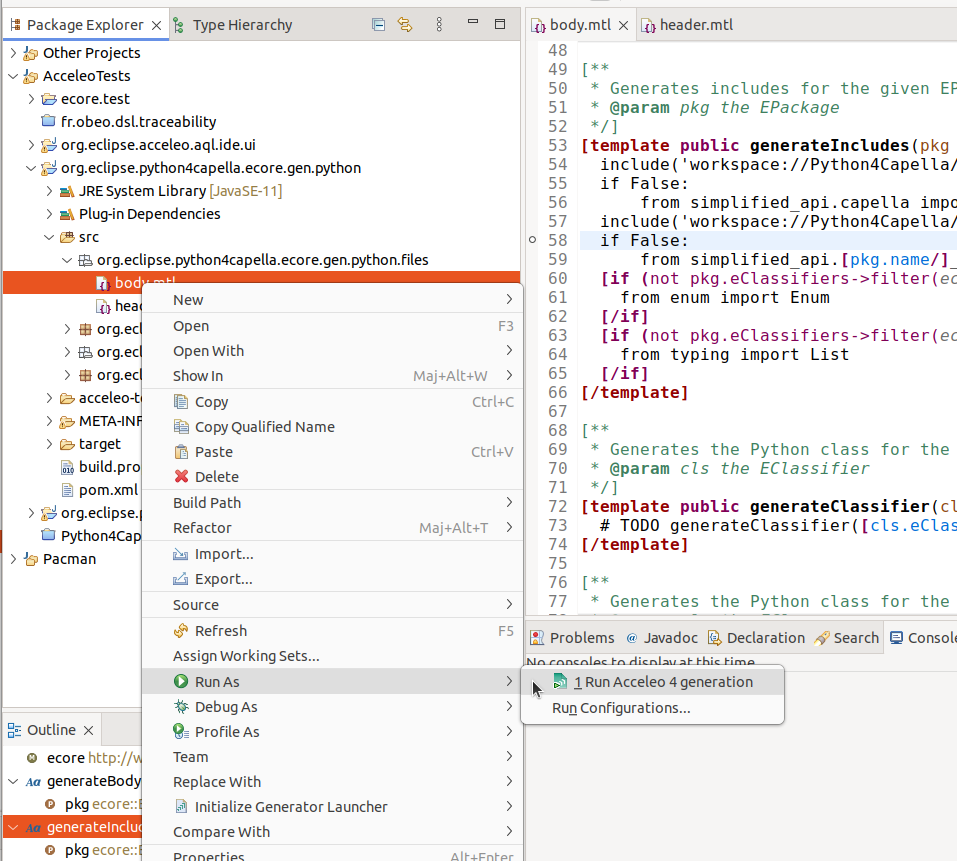
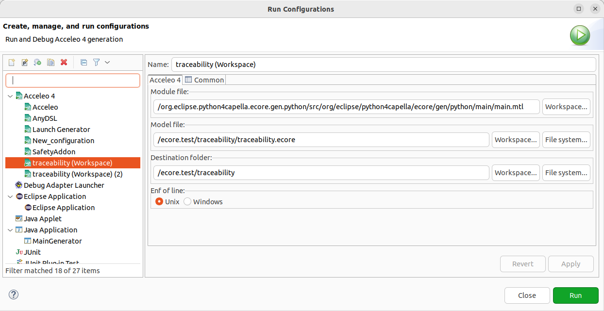

This section describe how to launch a generation from <<eclipse>> or <<_maventycho>>. 
Note that you can also use the <<_debugger>> to run a module or directly use Acceleo 4 programmatically, see <<_generation>>.

=== Eclipse

.Before you Start
[IMPORTANT] 
====
Use a *Java Project* and the classical *Java Perspective* for writing your Acceleo templates `.mtl` in the *src* folder.

You will also need to deploy your metamodels plugins in the running Eclipse and the metamodel projects should not be opened in the current workspace. If you are developing your metamodels or use a target platform, you will need to launch an https://help.eclipse.org/latest/index.jsp?topic=%2Forg.eclipse.pde.doc.user%2Fguide%2Ftools%2Flaunchers%2Feclipse_application_launcher.htm[Eclipse runtime].
====

In order to launch an Acceleo generator, you just have to right-click on your main module and use the *Run As* menu.

From there the *Launch Configuration* menu will open.
If you already have created a launch configuration you can access the launch configuration menu from the *Run > Run Configurations...* menu.
In this menu, you will have access to the Acceleo Launch configuration. 
You just have to select:

* your main *module file*, 
* your input *model file*,
* the *destination folder* of the generation.

.After launching the generation
[IMPORTANT]
====
Check that your generation is finished by opening the *Console* view.
You should see a message like this `<terminated> generate.mtl[Acceleo4]`.
====

=== Maven/Tycho

Acceleo provides a specific eclipse application that can be used from command line or tycho in order to start a generation.
In order to use the launcher, you will need to first package all of your generator projects into an update site, then use this update site as input of the application.

An example is available in the Acceleo repository and can be checked out at: https://git.eclipse.org/c/acceleo/org.eclipse.acceleo.git/tree/examples/MavenLauncher

This example includes:

* A generator project `org.eclipse.acceleo.aql.launcher.sample`,
* A feature including this project `org.eclipse.acceleo.aql.launcher.sample-feature`,
* An update site including this feature `org.eclipse.acceleo.aql.launcher.sample-site`,
* A `pom.xml` file that can be used to both package the generator and start the generation.

The packaging can be started through the command line `mvn clean verify`.
Once packaged, generation can be started through the command line `mvn clean verify -Pgenerate`.

The application takes a number of arguments that will have to be customized through the pom.xml file:

----
<applicationsArgs>
	<args>-application</args>
	<args>org.eclipse.acceleo.aql.launcher.AcceleoLauncher</args>
	<args>-data</args>
	<args>${project.build.directory}/wks</args>
	<args>-bundle</args>
	<args>org.eclipse.acceleo.aql.launcher.sample</args>
	<args>-module</args>
	<args>org::eclipse::acceleo::aql::launcher::sample::main</args>
	<args>-models</args>
	<args>platform:/plugin/org.eclipse.acceleo.aql.launcher.sample/model/sample.xmi</args>
	<args>-target</args>
	<args>file:/${project.build.directory}/generated/</args>
</applicationsArgs>
----

application::
Standard Eclipse argument, this tells Eclipse which application it needs to run. The specific launcher for Acceleo generations is `org.eclipse.acceleo.aql.launcher.AcceleoLauncher`.
data::
Standard Eclipse argument, this can be used to modify the workspace path.
bundle::
This needs to be the identifier of the bundle containing the main module for this generation.
module::
The starting point of the generation that is to be started. This needs to the qualified name of the module containing an "@main"-annotated template.
models::
The URI of the models that will be fed to the main module of the generation. This cannot be empty and needs to be an URI that eclipse is capable of resolving. In this example we're using a `platform:/plugin/...` URI since we've bundled the input model into our generator project.
target::
The destination URI for this generation. Generated files will use this folder as their root to resolve against. *Note* that this needs to end in a trailing `/`.
