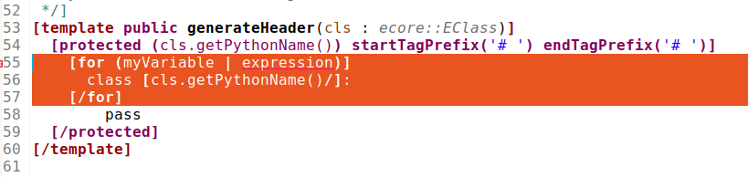
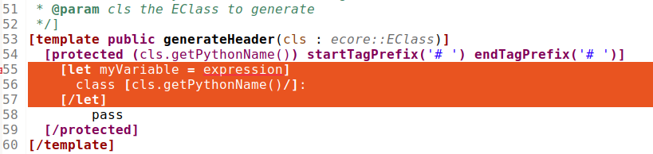

= Acceleo
Acceleo 4 User Guide
:toc:
:toclevels: 3
:toc-title: Table of Content
:sectnums:
:icons: font
:source-highlighter: highlightjs
:listing-caption: Listing
:idprefix: 
:idseparator: -

<<<

== Introduction

Acceleo 4 is a a text generator based on templates. 
It can be used to generate any kind of text file: code, configuration, documentation,...

The template consists of imperative statements like conditionals, loops, and navigation expression used to retrieve data from models. 

When generating, the engine use templates  statements and also replace navigation expressions by their values in order to produce the output text. 

== Installation

If you have an existing Eclipse installation and simply wish to install Acceleo in it, you can install it from one of the *Update Sites*, available here https://download.eclipse.org/acceleo/updates/releases/.

When installing the update site you must ensure that *"Contact all update sites during install to find required software"* is checked and that in the *"Manage..."* dialog, the *"Latest Eclipse Release"* update site is checked.

For a minimal installation you can select the `Acceleo` feature:

image:images/InstallFeaturesAndPlugins.png[Minimal features and plugins to install]

For those of you who need to retrieve the source code of Acceleo, it is available on Github: https://github.com/eclipse-acceleo/acceleo/.

== Getting Started

In this section, you will create a new project to work with Acceleo.

[NOTE]
====
You can use other kind of Java projects like https://help.eclipse.org/latest/index.jsp?topic=%2Forg.eclipse.pde.doc.user%2Fguide%2Ftools%2Fproject_wizards%2Fnew_plugin_project.htm&cp%3D4_3_9_0_0[Eclipse plug-in] or https://www.vogella.com/tutorials/EclipseMaven/article.html[Maven projects]. Here we use a simple Java project for simplicity.
====

First you need to create a *Java project*:

1. Inside Eclipse select the menu item *File > New > Project...* to open the *New Project* wizard,
2. Select *Java Project* then click *Next* to  start the *New Java Project* wizard:

image::images/NewProjectWizard.png[] 

On this page:

1. Enter the Project name,
2. Select the Java Runtime Environment (JRE) or leave it at the default,
3. Then click *Finish*.

image::images/NewProject.png[] 

1. In the *Package Explorer*, expand the project and select the source folder *src*,
2. Select the menu item *File > New > Other...*,

image::images/NewOtherMenu.png[New other... menu]

3. Select the *Acceleo 4 > Acceleo module file* wizard,

image::images/NewWizardDialog.png[Acceleo module file]

4. This will open the following wizard page where you can define the module parameters,

image::images/NewModuleWizard.png[Acceleo module file wizard page]

5. Then click *Finish*.

The will create the following module file.

image::images/NewModuleContents.png[New module contents]

For now it will generate a file with an empty line.

In order to launch an Acceleo generator, you just have to right-click on your main module and use the *Run As* menu.

image::images/RunAs.png[Run As]

From there the *Launch Configuration* menu will open.
If you already have created a launch configuration you can access the launch configuration menu from the *Run > Run Configurations...* menu.
In this menu, you will have access to the Acceleo Launch configuration. 
You just have to select:

* your main *module file*, 
* your input *model file*,
* the *destination folder* of the generation.

image::images/LaunchConfig.png[Launch Configuration]

.After launching the generation
[IMPORTANT]
====
Check that your generation is finished by opening the *Console* view.
The console title should change to `<terminated> generate.mtl[Acceleo4]`.
The last line in the console should be the generation summary `Files: 1, Lost Files: 0, Errors: 0, Warnings: 0, Infos: 0`.
====
 
== The Acceleo Tooling

=== The Acceleo Editor

.Before you Start
[IMPORTANT] 
====
Use a *Java Project* and the classical *Java Perspective* for writing your Acceleo templates `.mtl` in the *src* folder.
====

The module editor provides the following features:

* Syntax highlighting;
* Content assistant (`Ctrl + Space`);
* Error detection;
* Quick fixes;
* Outlines;
* Quick outline (`Ctrl + O`);
* Open declaration (either with `Ctrl + Left Click` or `F3`);
* Show references (`Ctrl + Shift + G`);
* Refactoring:
** Rename (`Ctrl + Alt + R`);
** Extract template (`Alt + Shift + T`);
** Wrap in if (`Alt + Shift + I`);
** Wrap in for (`Alt + Shift + F`);
** Wrap in let (`Alt + Shift + L`);
** Wrap in protected (`Alt + Shift + P`);
* White spaces.

==== Syntax Highlighting
The editor uses specific colors for Acceleo templates:

* red is used for template tags;
* purple is used for other tags (queries, modules, imports, ...);
* blue is used for dynamic expressions in templates or other places;
* green is used for comments and String literals;
* black is used for static text or query bodies.

image::images/SyntaxHighlighting.png[Syntax Highlighting]

==== Content assist

The content assistant is traditionally invoked with `Ctrl + Space`.
It proposes a choice of all elements that make sense at the place of invocation. 
It is available everywhere, so don't hesitate to hit `Ctrl + Space` anywhere!
	

==== Real Time Errors Detection

Obviously, Acceleo displays error markers when errors are detected. 
Acceleo displays error markers whenever a module file is not valid, whatever the reason.
Errors appear in the *Problems* view (generally displayed at the bottom of the perspective), and double-clicking on an error in this view directly takes you to the file where it is located.

image::images/ErrorInProblemsView.png[Errors in Problems view]

Files with errors also appear with an error decorator.

image::images/ErrorFile.png[Error at file level]

Just hover the marker in the editor margin with the mouse to get a tooltip to appear with an explanation of the problem.

==== Quick fixes

For some errors the Acceleo 4 editor can provide quick fixes to help you fix them. To access *Quick Fixes* you need to over the error with the mouse. If quick fixes are available you should see the following popup:

image::images/QuickFixes.png[Quick Fixes]

You can then select the quick fix you want to apply in the list.

==== Outlines
One of the great benefits of modern IDE tooling is the capacity to easily navigate in code from elements to their declarations and, vice-versa, from declarations to usages.

===== The dynamic outline
The traditional Eclipse *Outline* view is used by Acceleo to display the module's structure metamodels, templates, queries can be seen there, and double-clicking on any of them places the cursor at the corresponding position in the module (in the editor).

===== The quick outline
The quick outline, which can be displayed using `Ctrl + O`, displays just the necessary information to access any element in the current module. 
So, hitting `Ctrl + O` displays a pop-up with a list of templates and queries.

A text field at the top allows you to quickly filter the content in order to easily find what you are looking for.

image::images/QuickOutline.png[QuickOutline]

==== Open Declaration

The traditional shortcut `F3` is supported by Acceleo, along with `Ctrl + click`, which both take you to the declaration of the selected or clicked element. 
This is supported for all kinds of elements: templates, queries, metamodels, metamodel elements, EOperations, etc.

==== Show references

You can show references to a service or a variable by either selecting its declaration or one of its reference an using the `Ctrl + Shift + G` shortcut. It will show all references in the search view.

image::images/ShowReferences.png[Show References]

You can then double click enties in the search view to navigate to a reference.

==== Refactoring

===== Rename

You can use the rename shortcut `Ctrl + Alt + R` to rename all references to a service or a variable in the workspace.

image::images/RefactorRename.png[Refactor Rename]

===== Extract template

You can use the extract template short cut `Alt + Shift + T` after selecting one or more lines in a template. The selection must start and end at the beginning of a line (first column). The selection must start and end in the same block of code.

The selection will be wrapped in a new template and the selected text will be replaced by a call to this template.

image::images/RefactorOrigin.png[Origin]

image::images/RefactorExtractTemplate.png[Extract Template]

===== Wrap in if

You can use the wrap in if short cut `Alt + Shift + I` after selecting one or more lines in a template. The selection must start and end at the beginning of a line (first column). The selection must start and end in the same block of code.

The selection will be wrapped in a new if statement.

image::images/RefactorOrigin.png[Origin]

image::images/RefactorWrapInIf.png[Wrap in If]

===== Wrap in for

You can use the wrap in for short cut `Alt + Shift + F` after selecting one or more lines in a template. The selection must start and end at the beginning of a line (first column). The selection must start and end in the same block of code.

The selection will be wrapped in a new for statement.

image::images/RefactorOrigin.png[Origin]

===== Wrap in let

You can use the wrap in let short cut `Alt + Shift + L` after selecting one or more lines in a template. The selection must start and end at the beginning of a line (first column). The selection must start and end in the same block of code.

The selection will be wrapped in a new let statement.

image::images/RefactorOrigin.png[Origin]

===== Wrap in protected

You can use the wrap in protected short cut `Alt + Shift + P` after selecting one or more lines in a template. The selection must start and end at the beginning of a line (first column). The selection must start and end in the same block of code.

The selection will be wrapped in a new protected statement.

image::images/RefactorOrigin.png[Origin]

=== The Acceleo Debugger

==== Breakpoints

To add a breakpoint somewhere in a template, just double-click in the left margin on the line where you want to add the breakpoint. 
A nice bluish marker should appear, which should be very familiar to eclipse users.

NOTE: Conditional breakpoints are not supported.

==== Step by step execution

To debug an Acceleo generation:

* Right-click on your `.mtl` file, and select *Debug As > Debug Acceleo 4 generation*.

image::images/DebugAs.png[Debug As]

It is actually recommended to switch to the *Debug Perspective*, which is really more appropriate to debug executions.

image::images/DebugSession.png[Debug]

The debug perspective should be quite familiar to people used to the eclipse IDE. 
The *Debug* view (on the top left) displays the stack of the current execution. 
Clicking on any element of the stack will simultaneously display the corresponding Acceleo code in the edition area.

The *Variables* view displays currently accessible variables. 
In the example below, the execution has met a breakpoint on line 58. 
The Variables view tells us that the current package is an EPackage called traceability. We can also see the blockoutput that list text produced by each statement of the current block. We find each previous text statement and the expression retrieving the name of the pkg variable.

image::images/VariablesView.png[VariablesView]

NOTE: The debugger cannot step into AQL expressions only Acceleo elements are visible in the Variables view.

As usual, it is possible to:

* *Step into* a template (`F5`);
* *Step over* a template (`F6`);
* *Step Return* (`F7`), which means "go to the end of the current template";
* *Resume* execution (`F8`);
* *Stop* execution (`Ctrl + F2`).
The icons above the *Debug* view serve the same purpose.

Acceleo breakpoints can be temporarily deactivated, thanks to the *Breakpoints* view. 
Just uncheck the checkbox in front of a breakpoint to deactivate it. 
Here is an example of a deactivated breakpoint in this view:

image::images/UnactivBreakpoint.png[Unchecked Breakpoint]

=== Acceleo Profiler
 
The Acceleo 4 Profiler allows you to keep track of executions and see where time is consumed during a generation, thus making it easier to identify (and hopefully fix) bottlenecks.

==== Launching a generation with the profiler

The first thing to do to profile an Acceleo generation is to create a Profile Configuration, which is as we will see very similar to a Launch Configuration. To create a Profile Configuration, right-click on an Acceleo module file, and select Profile As > Profile Configurations....

image::images/ProfileAs.png[Profile As]

A configuration page appears, which looks very much like the traditional launch configuration page.

There is just two additional information to enter, which are the path to the profiling result file where Acceleo will store the profiling information of subsequent executions and the format it should be saved `TREE` or `FLAT`. Profile files must have the file extension .mtlp. If you try another file extension, the configuration page displays an error message and the configuration cannot be saved.
You can simply select a folder in this dialog, in which the profile file will be created.

The profile format will `TREE` will provide more details about the exectution tree but will also grow bigger than the `FLAT` format that contains less information on the execution tree.

==== Acceleo Profile Files

Acceleo stores the result of a profiled execution in a file which extension is .mtlp. This file is actually just a serialized EMF model. Let's take a closer look at it.

The above image shows the content of an mtlp file, and correspondances between the profiled data and the Acceleo template elements.

For each generated file, there is one entry in the root node of the profile.

Inside of each generated file block, there is profiling information for each template instruction. The containment of profiled data follows the structure of executed templates. For example, a `[for ... ]` instruction contains other template calls, so the profiled data has a node for the for which contains a node for each template call executed inside this for.

==== Coverage informations

The profile editor also provides coverage informations based on the profiling result. For each used module it shows what percentage of it has been actually used.

You can double-click on the module in the profile editor (or on any module element in the profile model) to accurately see what has been used in a given module. It shows in green what has been covered by the execution and in red what has been ignored.

image::images/Coverage.png[Coverage]

To get rid of the coverage highlighting you can simply close the editor and reopen the file from the explorer.

.Before launching the profiling for code coverage
[IMPORTANT]
====
Make sure you generate on an empty output folder for accurate results.
The content of existing <<protected-area,protected area>> won't be generated if its identifier exists in the output file.
====

=== Java launchers

You can select a module file that contains a main template to generate the Java code that will launch your module. There are three menus under *Initialize Generator Launcher*:

* *Java Main Class* that will generate a Java class that can be used in standalone
** It creates a Java main class next to your module
** It can be integrated in other application outside or inside of Eclipse
* *Eclipse UI Project* that will generate an Eclipse plugin
** only available if the project containing the main module file is a plug-in project
** It creates an Eclipse plugin projet next to your generator project
** It extends the standalone class (the standalone main class will be generated)
** It contribute a menu to objects that can be passed to your main template
* *Maven POM* that will generate a pom file to launch the generation in standalone using the Java main class
** only available if the project containing the main module file is a Maven project
** It creates a pom file that can launch a generation using the Java Main Class (the standalone main class will be generated)
** If the pom file already exists, it will add an execution to launch the generation

image::images/LauncherGenerators.png[Launcher Generators]

All the code above is generated using Acceleo 4. You can extend and override the content of the generated files like you would with any Acceleo 4 generator. The source code is in this https://github.com/eclipse-acceleo/acceleo/tree/master/plugins/org.eclipse.acceleo.aql.ide.ui/src-module/[source folder].

== The Acceleo Language

You can read to the <<language-documentation, language documentation>> to understand Acceleo 4 language specificity. If you are looking for the syntax quick reference you can check the <<syntax,syntax section>>.

=== Language Documentation

==== Intended Audience

This guide was written to describe the elements composing the Acceleo 4 templating language. This will not delve into the Acceleo Query Language (AQL) description.

==== Module

An Acceleo module is defined in its own file and is the main container for generation <<Template,templates>> (that will generate text) and <<Query,queries>> (which purpose is to extract information from the input models).

The name of the module will be qualified according to its location in the source folder of the project.

An Acceleo file must start with the module declaration in the following format:

----
[**
<module documentation>
@author <author name>
@version <version number>
@since <first version in which this module appeared>
/]
[module <module name>('http://metamodel/URI/1', 'http://metamodel/URI/1', <additional_URIs>) extends <other module qualified name>]
----

Module documentation::
The documentation of a module is optional, and can contain both the description of the module and optional metadata such as the author and version number.
Module name::
The module name can only contain alphanumeric (and underscore `_`) characters and cannot start with a number.
Metamodel URIs::
The metamodel(s) from which this module will take types. The list has to be exhaustive: if multiple connected metamodels are used, then all must be listed in the module declaration.
Extends::
The qualified name of another module. Acceleo allows you to override _protected_ and _public_ visibility templates from the extended module. Extending multiple modules is not allowed.
*Note* that the extended module's name has to be qualified, even when overriding modules located in the same package.

See also the <<module-2,Module syntax documentation>>.

===== Imports

An Acceleo module can import any number of other modules or Java service class. All _public_ visibility templates and queries from the imported module(s) can be called by the importer, for Java class all public methods can be used a service.

Importing modules can be done right after the module declaration line and requires the following format:

----
[import <other module or Java class qualified name>/]
----

*Note* that modules can only be referenced through their qualified name, even if they are located in the same package.

[NOTE]
====
Modules can only be referenced through their qualified name, even if they are located in the same package. To be able to import or extends modules from other projects, you will need to make sure dependencies are correctly set. For Eclipse projects you will need to https://help.eclipse.org/latest/index.jsp?topic=%2Forg.eclipse.pde.doc.user%2Fguide%2Ftools%2Feditors%2Fmanifest_editor%2Fruntime.htm[export the package] containing the referenced module and https://help.eclipse.org/latest/index.jsp?topic=%2Forg.eclipse.pde.doc.user%2Fguide%2Ftools%2Feditors%2Fmanifest_editor%2Fdependencies.htm[add a dependency] to the current project. For Maven project you need to https://www.vogella.com/tutorials/EclipseMaven/article.html#adding-dependencies-to-your-project[add a dependency] to the current project.
====

See also the <<import,Import>> as well as the <<module-reference,Module Reference>> syntax documentation.

Example:

----
[import org::eclipse::acceleo::aql::ide::ui::module::files::generationPom/]
----

===== Module Elements

Following the imports declaration, any number of module element can now be written as the body of our Module. Please refer to <<Template>> and <<Query>> sections below for more information.

==== Template

A Template is a set of Acceleo statements used to generate text. It is delimited by `[template ...][/template]` tags.

The template signature must include the visibility and the name, and can optionally define a post-treatment expression.

----
[**
<template documentation>
@param class <documentation of the parameter>
/]
[template public generate(class : ecore::EClass) post (self.trim())]
[/template]
----

visibility::
One of
+
* public : Public templates will be visible from all modules importing or extending the module declaring them. They can be overridden by extending modules.
* protected : Protected templates will only be visible from extending modules and can be overridden.
* private : Private templates are only visible by the defining module and cannot be overridden.
name::
The name of the template. Only alphanumeric (and underscore `_`) characters are allowed, and the name cannot start with a number.
arguments::
Arguments follow the <<variable,format for variables>>.
post::
The post-treatment expression will be called on the result of the template (stored in variable `self`) and needs to be applicable to a String.

*The result of a template is always a String.*

Templates can be overriden by extending a <<module,module>> and writing a template or query that have the same signature of a template or query that return a compatible type (String for template) in the extended module. Only `public` and `protected` templates and queries can be overriden.

It you want to call the super template or query you can prefix the call with `super:`:

----
self.super:overridenService()
----

See also the <<template-2,Template syntax documentation>>.

===== Main template

Acceleo defines a special metadata tag on templates to specify the main entry point(s) of a generation, the template(s) that will be called first during the workflow. This metadata tag, `@main`, needs to be in the comments preceding the template, or within the template documentation

Such templates do not necessarily contain a <<file-block,File>> block themselves.

Example:

----
[**
<template documentation>
@param class <param documentation>
@main
/]
[template public generate(class : ecore::EClass)]
  [file (class.name + '.txt', overwrite)]
    Class [class.name/] structural features:
    [for (feature | class.eStructuralFeatures)]
      [feature.name/]
    [/for]
  [/file]
[/template]
----

===== File Block

File blocks are used to tell the Acceleo engine it must generate the body of the `[file ...]` block in an actual file.

----
[file (<uri>, <open mode>, <charset>)][/file]
----

uri::
An AQL expression denoting the output file name. Must evaluate to a String.
open mode::
The open mode for the file. This can be one of:
+
* append : Append to the end of the file if it already exists, creates it otherwise.
* overwrite : Overwrite the whole file if it already exists, creates it otherwise.
* create : Do not change the file if it already exists, creates it otherwise.
charset::
This can be used to tell Acceleo which charset to use for the generated file. This is optional and will default to UTF-8

Example:

----
[template public generate(class : ecore::EClass)]
  [file (class.name + '.java', append, 'UTF-8')]
  [/file]
[/template]
----

*Note* that the file will only be generated if the engine actually evaluates the file block. For example, if the template containing that block is never called, or if the file block is included in an `If` block which condition evalutes to `false`, then no file will be created.

See also the <<file-statement,File Statement syntax documentation>>.

===== For loops

For loops in Acceleo need to be expressed using the following syntax:

----
[for (<variable> | <iteration expression>) separator(<separator expression>)]...[/for]
----

variable::
The variable follows the <<variable,format for variables>>. The variable type must match the result of the iteration expression. If the expression returns a collection of Strings, then the variable will be of type String. Because of this, typing the variable is optional.
A variable with the same name and suffixed with `Index` will also be created. Its value is the current loop index starting at `1`.
iteration expression::
An AQL expression returning a collection of elements on which to iterate. If the expression doesn't return a collection but a single element, it will be used to iterate only once.
separator::
The separator expression will be evaluated to insert content in-between the content generated for each iteration of the for body. It will not be generated if the for loop doesn't generate text or only generates one iteration worth of content.

Example:

----
[template public generate(class : ecore::EClass)]
  [for (feature | class.eStructuralFeatures)]
  [/for]
[/template]
----

In this example you can also use the `featureIndex` variable to keep track of the loop index.
See also the <<for-statement,For Statement syntax documentation>>.

===== If conditions

The `If` statement in Acceleo uses the following syntax:

----
[if (condition)]
[elseif (condition)]
[else]
[/if]
----

`elseif` and `else` are both optional. If one of the `condition` expressions does not evaluate to a boolean an error will be logged and nothing will be generated for that `if` block.

See also the <<if-statement,If Statement syntax documentation>>.

===== Let block

Acceleo `Let` blocks use the following syntax:

----
[let <variable1> = <init expression>, <variable2> = <init expression>]
[/let]
----

`Let` blocks allow template writers to define temporary variables that will be visible within the scope of the block.

The variables follow the <<variable,format for variables>>. All of their typing is optional since they must match the return type of their initialization expression.

*Note* that all variables are immutable. Nested `Let` blocks can override the value of a variable within their own scope, but the variable will go back to its former value once outside of the nested `Let`. This will produce a warning during validation.

See also the <<let-statement,Let Statement syntax documentation>>.

===== Protected Area

The purpose of protected areas is incremental generation. Protected areas can only be used in <<file-block,File Block>> since the output URI is needed to load existing protected contents. It doesn't mean the statement itself needs to be in a <<file-block,File Block>> but the execution path when the proteted area is called must contains a <<file-block,File Block>>.

A protected area defines a set of statements that should only be generated if the generated file doesn't exist on disk or it does not contain an area with the specified protected area's identifier.

Protected areas allow module writers to create a "safe" part of the generated file that can be modified directly in the generated file, without fear of these manual modifications to be lost during subsequent generations.

----
[comment @main/]
[template public generate(class : ecore::EClass)]
  [file (class.name + '.java', overwrite, 'UTF-8')/]
    [protected (class.name + ' imports') startTagPrefix('// ') endTagPrefix('// ')]
      imports java.util.List;
    [/protected]

    public class [class.name.toUpperFirst()/] {

    }
  [/file]
[/template]
----

The expression within the protected block's signature serves as the protected area's identifier and *must be unique* in the generated file's scope.

*There must be nothing present on the line after the protected area's signature.* Otherwise, everything following said signature will be considered to be part of the area's identifier by the engine and the code will not be properly protected.

Please also note that the protected area's first and last line are marked as comments in the generated code (`'// '`) using the start and end tag prefixes. This is to avoid generating invalid Java code as the markers will be present in the generated file's contents.

===== Variable

Acceleo 4 variables use the AQL syntax and inference logic for their typing.

----
<name> : <type>
----

name::
Name of the variable. Only alphanumeric (and underscore`_`) characters are allowed, and the name cannot start with a number.
type::
Type of the variable. Four different kind of types are accepted

* primitive : Integer, Double, String, Boolean
* collection : Sequence, OrderedSet. Collection types have to be further specified with their content types, such as Sequence(String) for a list of String elements.
* eclassifier : in the form <epackage_name>::<classifier_name> such as ecore::EClass.
* union type : in the form {<epackage_name>::<classifier_name> | <epackage_name>::<classifier_name> | ...}. This kind of typing describes a variable that can be either one of the _n_ specified classifiers. e.g. {ecore::EAttribute | ecore::EReference }.

==== White spaces

When generating text, and especially code, white spaces and indentation is an important point.
In order to keep template code indentation from interfering with the generated output, a few rules applies:

* for inlined blocks (no line break after the block header):
** the content of the block is generated as is
* for indented blocks (with a line break after the block header):
** each block has a *mandatory indentation* of *two characters* that will not be generated in the output (in yellow below)
** when generating a block if the last generated line is not empty, it is repeated at the beginning of each line generated by the block (in red below)

image::images/Indentation.png[Indentation]

[WARNING]
====
In a template you have to *let 2 whitespaces at the beginning of each line*, else the generated content will be truncated by 2 characters.
====

image::images/IndentationIssue.png[Truncated generation due to indentation]

Their is one exception to this rule, an empty line in the module will generate an empty line in the output. This allows to either generate an empty line that use indentation or an empty line regardless of current indentation:

This set of rules allows the caller of a template to define the position line and column where the text will be inserted while the called template focus only on the text it has to produce. This allows to generate the same text with the same template even if it needs to be inserted in different parts of the output document with different indentations.

==== Query

A query is a re-useable AQL expression that can return any type of Object. They are commonly used to extract information from the input models. A query is enclosed in a `[query ...]` tag.

The query signature must include the visibility and its name.

----
[**
<query documentation>
@param class <documentation of the parameter>
/]
[query public getPublicProperties(class : uml::Class) : Set(uml::Property) =
	class.attribute->select(property : uml::Property | property.visibility = uml::VisbilityKind::public)
/]
----

visibility::
One of
+
* public : Public templates will be visible from all modules importing or extending the module declaring them. They can be overridden by extending modules.
* protected : Protected templates will only be visible from extending modules and can be overridden.
* private : Private templates are only visible by the defining module and cannot be overridden.
name::
The name of the query. Only alphanumeric (and underscore `_`) characters are allowed, and the name cannot start with a number.
arguments::
Arguments follow the <<variable,format for variables>>.
return type::
The return type describes the kind of object this query is expected to return. If the expression does not return an object of the accurate type, the evaluation will fail at runtime.

Queries can be overriden by extending a <<module,module>> and writing a template or a query that have the same signature of a template or query that return a String in the extended module.

Templates can be overriden by extending a <<module,module>> and writing a template or query that have the same signature of a template or query that return a compatible type (String for template) in the extended module.  Only `public` and `protected` templates and queries can be overriden.

It you want to call the super template or query you can prefix the call with `super:`:

----
self.super:overridenService()
----

See also the <<query-2,Query syntax documentation>>.

=== Syntax

==== Comment

A comment can be used to document any part of the <<module-2,Module>>. It generates nothing if placed directly or indirectly in a <<file-statement,File Statement>>. For simplification comments will not be present in the BNF representation of the grammar.

[source,ebnf,subs=+macros]
----
<<comment,Comment>> = '[comment ' ... '/]'
----

==== CommentBlock

[source,ebnf,subs=+macros]
----
<<commentblock,CommentBlock>> = '[comment] ' ... '[/comment]'
----

==== Module

The module is the top level element of a `.mtl` file. It represent a namespace declaring <<template-2,Template>> and <<query-2,Query>>. The name of the module is qualified by the location of the file in the source folder.

[source,ebnf,subs=+macros]
----
<<module-2,Module>> =

(<<module-documentation,Module Documentation>>)* '[module ' <<identifier,Identifier>> '(' <<metamodel,Metamodel>> ',' (<<metamodel,Metamodel>>)* ')' ('extends ' <<module-reference,Module Reference>>)? '/]'

<<import,Import>>*

<<module-element,Module Element>>*
----

==== Identifier

An identifier is used to name elements that need to be identified, or reference element that can be identified.

[source,ebnf,subs=+macros]
----
<<identifier,Identifier>> = [a-zA-Z_][a-zA-Z_0-9]*
----

==== Module Documentation

The module documentation should contains a description of the <<Module>>.

It can also contain metadata such as the author, version, and since (the version since this <<Module>> exists).

[source,ebnf,subs=+macros]
----
<<module-documentation,Module Documentation>> =

'[**'

...

('@author' ...)?

('@version' ...)?

('@since' ...)?

...

'/]'
----

==== Metamodel

This is the declaration of metamodels used by the module. Metamodels are referenced using their EPackage nsURI between simple quote.

[source,ebnf,subs=+macros]
----
<<metamodel,Metamodel>> = '\'' ... '\''
----

==== Import

This allows a module to import other <<Module>> or service classes.

[source,ebnf,subs=+macros]
----
<<import,Import>> = '[import ' <<module-reference,Module Reference>> '/]'
----

==== Module Reference

The module reference is a qualified reference to a <<Module>>

[source,ebnf,subs=+macros]
----
<<module-reference,Module Reference>> = <<module-qualified-name,Module Qualified Name>>
----

==== Module Qualified Name

A module's name is qualified according to its location in the source folder of a project.

[source,ebnf,subs=+macros]
----
<<module-qualified-name,Module Qualified Name>> = <<identifier,Identifier>> ('::' <<identifier,Identifier>>)*
----

==== Module Element

A module element is either a <<Template>> or a <<Query>>.

[source,ebnf,subs=+macros]
----
<<module-element,Module Element>> = <<template-2,Template>> | <<query-2,Query>>
----

==== Template

A template returns a String produced using its contained <<statement,Statement>>, it can be called as a service. It can be preceded by a <<module-element-documentation,Module Element Documentation>>.

Also a <<module-2,Module>> can contain a template used as entry point of the generation. This template will be identified with a <<comment,Comment>> preceding the template and containing the tag '@main'.

[source,ebnf,subs=+macros]
----
<<template-2,Template>> =

'[template ' <<visibility,Visibility>> <<identifier,Identifier>> '(' <<parameter,Parameter>>(',' <<parameter,Parameter>>)* ')' ('post (' <<aql-expression,AQL Expression>> ')')? ']'

(<<statement,Statement>>)*

'[/template]'
----

==== Visibility

The visibility defines the scope in which a <<module-element,Module Element>> can be called as a service.

[source,ebnf,subs=+macros]
----
<<visibility,Visibility>> = 'private' | 'protected' | 'public'
----

==== Parameter

A parameter is used to pass a value from the caller to a callee. This value can be later referenced using its identifier.

[source,ebnf,subs=+macros]
----
<<parameter,Parameter>> = <<identifier,Identifier>> ':' <<aql-type-literal,AQL Type Literal>>
----

==== Statement

A statement is a directive used to produce an output or control the execution flow.

[source,ebnf,subs=+macros]
----
<<statement,Statement>> =

<<file-statement,File Statement>> | <<for-statement,For Statement>> | <<if-statement,If Statement>> | <<let-statement,Let Statement>> | <<protected-area-statement,Protected Area Statement>> | <<expression-statement,Expression Statement>> | <<text-statement,Text Statement>>
----

===== File Statement

This statement is used to start the generation of a new file. Strings returned by a statement contained directly or indirectly in the execution flow, will be generated into that file.

The file statement itself returns an empty String.

[source,ebnf,subs=+macros]
----
<<file-statement,File Statement>> =

'[file ' '(' <<aql-expression,AQL Expression>> ',' <<open-mode-kind,Open Mode Kind>> (',' <<aql-expression,AQL Expression>>)? ')' ']'

(<<statement,Statement>>)*

'[/file]' 
----

===== For Statement

This statement loops over a list of values and return the concatenation of all returned String.

[source,ebnf,subs=+macros]
----
<<for-statement,For Statement>> =

'[for ' '(' <<identifier,Identifier>> (':' <<aql-type-literal,AQL Type Literal>>)? '|' <<aql-expression,AQL Expression>> ')' ('separator(' <<aql-expression,AQL Expression>> ')')? ']'

(<<statement,Statement>>)*

'[/for]'
----

===== If Statement

This statement create a branch in the execution flow and return the String of one of its branch according to the <<aql-expression,AQL Expression>> evaluated to true. If a condition doesn't evaluate to a boolean an empty String is generated and an error is logged.

[source,ebnf,subs=+macros]
----
<<if-statement,If Statement>> =

'[if ' '(' <<aql-expression,AQL Expression>> ')' ']'

(<<Statement>>)*

('[elseif ' '(' <<aql-expression,AQL Expression>> ')' ']'

(<<statement,Statement>>)*)*

('[else]'

(<<statement,Statement>>)*)?

'[/if]'
----

===== Let Statement

This statement allows to compute one or more <<aql-expression,AQL Expression>> and reference their value using an identifier. It can be used to improve readability of the template or increase performance when using the same <<aql-expression,AQL Expression>> many times in a block of <<statement,Statement>>.

[source,ebnf,subs=+macros]
----
<<let-statement,Let Statement>> =

'[let ' <<identifier,Identifier>> (':' <<aql-type-literal,AQL Type Literal>>)? '=' <<aql-expression,AQL Expression>> (',' <<identifier,Identifier>> (':' <<aql-type-literal,AQL Type Literal>>)? '=' <<aql-expression,AQL Expression>>)* ']'

(<<statement,Statement>>)*)?

'[/let]'
----

===== Protected Area Statement

This statement declares an identified area in the generated file. If the generated file exists and a protected area with the same identifier exists in its contents, then the existing content of this area is directly returned. If it doesn't exist, then the concatenation of the body's statements results is returned.

[source,ebnf,subs=+macros]
----
<<protected-area-statement,Protected Area Statement>> =

'[protected ' '(' <<aql-expression,AQL Expression>> ')'  ('startTagPrefix(' <<aql-expression,AQL Expression>> ')')?  ('endTagPrefix(' <<aql-expression,AQL Expression>> ')')? ']'

(<<statement,Statement>>)*)?

'[/protected]'
----

The start tag prefix and end tag prefix expressions allows to add a prefix to the inserted start and end tag to delimit the protected area in the generated document.
If an unknown protected area id is encountered in a pre-existing generated document, a lost file is created to save its content.

===== Expression Statement

This statement returns the String representation of the evaluation of its <<aql-expression,AQL Expression>>.

[source,ebnf,subs=+macros]
----
<<expression-statement,Expression Statement>> = '[' <<aql-expression,AQL Expression>> '/]'
----

===== Text Statement

This is any other text outside of '[' and ']'. Please see the <<white_spaces,White Spaces>> section for generation rule and template indentation.

==== AQL Expression

This is an Acceleo Query Language expression. It is used to navigate through models and call services. In the context of Acceleo, <<template-2,Template>> and <<query-2,Query>> can be called as services.

See the https://github.com/eclipse-acceleo/acceleo/blob/master/query/plugins/org.eclipse.acceleo.query.doc/pages/index.adoc[AQL documentation] for more details about the language itself, the full list of standard services, and the differences with Acceleo/MTL.

==== AQL Type Literal

This is a type literal as defined in the https://github.com/eclipse-acceleo/acceleo/blob/master/query/plugins/org.eclipse.acceleo.query.doc/pages/index.adoc#type-literals[Acceleo Query Language].

==== Query

A query references an <<aql-expression,AQL Expression>> with parameters and can be called as a service. It can be preceded by a <<module-element-documentation,Module Element Documentation>>.

[source,ebnf,subs=+macros]
----
<<query-2,Query>> =

'[query ' <<visibility,Visibility>> <<identifier,Identifier>> '(' <<parameter,Parameter>>(',' <<parameter,Parameter>>)* ')' ':' <<aql-type-literal,AQL Type Literal>> '=' <<aql-expression,AQL Expression>> '/]'
----

==== Module Element Documentation

The documentation of a <<template-2,Template>> or a <<query-2,Query>>.

[source,ebnf,subs=+macros]
----
<<module-element-documentation,Module Element Documentation>> =

'[**'

...

'@param ' ...

...

'/]'
----

== Launching an Acceleo generation

This section describe how to launch a generation from <<eclipse>> or <<maventycho>>. 
Note that you can also use <<the-acceleo-debugger>> to run a module or directly use Acceleo 4 programmatically, see <<generation>>.

=== Eclipse

.Before you Start
[IMPORTANT] 
====
Use a *Java Project* and the classical *Java Perspective* for writing your Acceleo templates `.mtl` in the *src* folder.

You will also need to deploy your metamodels plugins in the running Eclipse and the metamodel projects should not be opened in the current workspace. If you are developing your metamodels or use a target platform, you will need to launch an https://help.eclipse.org/latest/index.jsp?topic=%2Forg.eclipse.pde.doc.user%2Fguide%2Ftools%2Flaunchers%2Feclipse_application_launcher.htm[Eclipse runtime].
====

In order to launch an Acceleo generator, you just have to right-click on your main module and use the *Run As* menu.

image::images/RunAs.png[Run As]

From there the *Launch Configuration* menu will open.
If you already have created a launch configuration you can access the launch configuration menu from the *Run > Run Configurations...* menu.
In this menu, you will have access to the Acceleo Launch configuration. 
You just have to select:

* your main *module file*,
* your input *model file*,
* the *destination folder* of the generation
* the *end of line* you want in your generated document.

image::images/LaunchConfig.png[Launch Configuration]

.After launching the generation
[IMPORTANT]
====
Check that your generation is finished by opening the *Console* view.
The console title should change to `<terminated> traceability (Workspace)[Acceleo4]`.
The last line in the console should be the generation summary `Files: 2, Lost Files: 0, Errors: 0, Warnings: 0, Infos: 0`.
====

=== Maven/Tycho

A sample project is provided to illustrate how an Acceleo generator can be used inside of Eclipse and also in standalone (outside of Eclipse). Note that you can also use Acceleo in a pure standalone environment and without the need of a plug-in project. The source code can be found https://github.com/eclipse-acceleo/acceleo/tree/master/examples/MavenLauncher[here]. All build and generation steps are in different Maven profile in the parent pom file for the purpose of the demonstration, but you can split them in different pom files and build projects if needed.

This example includes:

* A generator project `org.eclipse.acceleo.aql.launcher.sample`,
* A generator project Eclipse UI menu contributions `org.eclipse.acceleo.aql.launcher.sample.ide.ui`,
* A feature including above plug-ins `org.eclipse.acceleo.aql.launcher.sample-feature`,
* An update site including this feature `org.eclipse.acceleo.aql.launcher.sample-site`,
* A `pom.xml` file that can be used to both package the generator and start the generation.

==== Compilation

The first step is to compile our generator plug-in. We will use Maven and Tycho. Tycho is used to build Eclipse plug-ins and manage dependencies form P2 repositories. In this step we will create a P2 repository to install our generator inside of Eclipse and also a Maven repository to launch the generation from Maven. The Maven repository is optional, it's needed to launch the generator in standalone from Maven.

You can run the `compile` profile with the following command:

----
mvn clean deploy -Pcompile
----

It will create a P2 repository that you can install inside of Eclipse `org.eclipse.acceleo.aql.launcher.sample-site/target/repository/`. It also produce a Maven repository that will be used to start the generator main class from Maven `releng/maven/repository-p2/`.

==== Eclipse application

Acceleo provides a specific eclipse application that can be used from command line or Tycho in order to start a generation. To launch the application on our generator, we will need to reference the P2 repository we built in the previous step and add a dependency to our sample generator. If you choose to run your generator in this mode, all Eclipse mechanisms will work, access to the platform, extension points...

The application takes a number of arguments that will have to be customized through the pom.xml file:

----
<applicationsArgs>
	<args>-application</args>
	<args>org.eclipse.acceleo.aql.launcher.AcceleoLauncher</args>
	<args>-data</args>
	<args>${project.build.directory}/wks</args>
	<args>-bundle</args>
	<args>org.eclipse.acceleo.aql.launcher.sample</args>
	<args>-module</args>
	<args>org::eclipse::acceleo::aql::launcher::sample::main</args>
	<args>-models</args>
	<args>platform:/plugin/org.eclipse.acceleo.aql.launcher.sample/model/sample.xmi</args>
	<args>-target</args>
	<args>file:/${project.build.directory}/generated/</args>
</applicationsArgs>
----

application::
Standard Eclipse argument, this tells Eclipse which application it needs to run. The specific launcher for Acceleo generations is `org.eclipse.acceleo.aql.launcher.AcceleoLauncher`.
data::
Standard Eclipse argument, this can be used to modify the workspace path.
bundle::
This needs to be the identifier of the bundle containing the main module for this generation.
module::
The starting point of the generation that is to be started. This needs to the qualified name of the module containing an "@main"-annotated template.
models::
The URI of the models that will be fed to the main module of the generation. This cannot be empty and needs to be an URI that eclipse is capable of resolving. In this example we're using a `platform:/plugin/...` URI since we've bundled the input model into our generator project.
target::
The destination URI for this generation. Generated files will use this folder as their root to resolve against. *Note* that this needs to end in a trailing `/`.

You can run the `generate-eclipse-launcher` profile with the following command:

----
mvn clean verify -Pgenerate-eclipse-launcher
----

==== Standalone main class

This allows you to run your generator in a standalone fashion. If you have Eclipse specific code in your generator or services, you won't be able to run the generator in standalone. You will need to <<java-launchers,generated the main class>> to use it in your Maven configuration:

In this profile we need to reference the Maven repository built in the first step and add a dependency to the generator.

----
<plugin>
  <groupId>org.codehaus.mojo</groupId>
  <artifactId>exec-maven-plugin</artifactId>
  <version>3.5.0</version>
  <executions>
    <execution>
      <goals>
        <goal>java</goal>
      </goals>
    </execution>
  </executions>
  <configuration>
    <mainClass>org.eclipse.acceleo.aql.launcher.sample.MainGenerator</mainClass>
    <arguments>
      <argument>org.eclipse.acceleo.aql.launcher.sample/model/sample.xmi</argument>
      <argument>${project.build.directory}/generated/</argument>
    </arguments>
  </configuration>
</plugin>
----

You can run the `generate-maven-main-class` profile with the following command:

----
mvn clean exec:java -Pgenerate-maven-main-class
----

== Using Acceleo 4 programmatically

Acceleo 4 can be used programmatically and for instance integrated in other products. 

If you run in standalone (outside of Eclipse) you will need to initialize your metamodel (EPagkages), for instance for Ecore:

[source,java]
---------
EcorePackage.eINSTANCE.getName();
---------

You will also need to register needed resource factories, for instance for XMI:

[source,java]
---------
resourceSetForModels.getResourceFactoryRegistry().getExtensionToFactoryMap().put(Resource.Factory.Registry.DEFAULT_EXTENSION, new XMIResourceFactoryImpl());
---------

=== Parsing

[source,java]
---------
final IQualifiedNameResolver resolver = new ClassLoaderQualifiedNameResolver(getClass()
		.getClassLoader(), AcceleoParser.QUALIFIER_SEPARATOR);
final Map<String, String> options = new HashMap<>();
final ArrayList<Exception> exceptions = new ArrayList<>();
final ResourceSet resourceSetForModels = AQLUtils.createResourceSetForModels(exceptions, resolver, new ResourceSetImpl(), options);

resourceSetForModels.getResourceFactoryRegistry().getExtensionToFactoryMap().put(Resource.Factory.Registry.DEFAULT_EXTENSION, new XMIResourceFactoryImpl());

final IQualifiedNameQueryEnvironment queryEnvironment = AcceleoUtil.newAcceleoQueryEnvironment(
		options, resolver, resourceSetForModels, false);
AcceleoEvaluator evaluator = new AcceleoEvaluator(queryEnvironment.getLookupEngine(), "\n");

resolver.addLoader(new ModuleLoader(new AcceleoParser(), evaluator));
resolver.addLoader(new JavaLoader(AcceleoParser.QUALIFIER_SEPARATOR, false));

final Object resolved = resolver.resolve(moduleQualifiedName);
final Module mainModule;
if (resolved instanceof Module) {
	mainModule = (Module)resolved;
} else {
	mainModule = null;
}
---------

=== Validation

[source,java]
----
final AcceleoValidator acceleoValidator = new AcceleoValidator(queryEnvironment);
final IAcceleoValidationResult acceleoValidationResult = acceleoValidator.validate(mainModule.getAst(), moduleQualifiedName);
----

=== Completion

[source,java]
----
final AcceleoCompletor acceleoCompletor = new AcceleoCompletor();
String source = ...;
int position = ...;
List<AcceleoCompletionProposal> completionProposals = acceleoCompletor.getProposals(acceleoEnvironment, moduleQualifiedNameForCompletion, source, position);
----

=== Generation

[source,java]
----
final Resource resource = resourceSetForModels.getResource(uri, true);
final IAcceleoGenerationStrategy strategy = new DefaultGenerationStrategy(resourceSetForModels.getURIConverter(), new DefaultWriterFactory());
final URI logURI = AcceleoUtil.getlogURI(targetURI, options.get(AcceleoUtil.LOG_URI_OPTION));

AcceleoUtil.generate(evaluator, queryEnvironment, mainModule, resource, strategy, targetURI, logURI, new BasicMonitor());
----

=== Unit test module

You can unit test your modules using the same JUnit test suite we are using for the development of Acceleo 4. You will simply need to create a class extending the class org.eclipse.acceleo.tests.utils.AbstractEvaluationTestSuite and create a folder with you test folders. Those folders need to respect a naming convention. You can find a working example with the class https://github.com/eclipse-acceleo/acceleo/blob/master/tests/org.eclipse.acceleo.aql.tests/src/org/eclipse/acceleo/tests/evaluation/FileStatementTests.java[FileStatementTests] and the corresponding https://github.com/eclipse-acceleo/acceleo/tree/master/tests/org.eclipse.acceleo.aql.tests/resources/evaluation/fileStatement[folder].

=== Maven

You can use Acceleo 4 in your maven project with the following repository and dependency:

[source,xml]
----
<repositories>
  <repository>
    <id>Acceleo Repository</id>
    <url>https://download.eclipse.org/acceleo/updates/releases/4.1/...</url>
  </repository>
</repositories>
<dependencies>
  <dependency>
    <groupId>org.eclipse.acceleo</groupId>
    <artifactId>acceleo</artifactId>
    <version>4.1.0</version>
  </dependency>
</dependencies>
----

If you use the source folder for your template make sure you include them as resources:

[source,xml]
----
<build>
  <resources>
    <resource>
      <directory>${project.basedir}/src/main/java</directory>
        <includes>
          <include>**/*.mtl</include>
        </includes>
      </resource>
    </resources>
  </build>
</project>
----

The following https://github.com/eclipse-acceleo/acceleo/tree/master/tests/maven/org.eclipse.acceleo.aql.maven.tests[test project] can be used as a simple example. For a more complete example with a custom metamodel you can check the [textual game tutorial](https://github.com/eclipse-acceleo/acceleo/blob/master/examples/maven-textual-game/tutorial.adoc).

== Migrate Acceleo 3 templates to Acceleo 4

This section was written to describe the behavior changes between the two versions of Acceleo, for the purpose of migrating from one to the next.

=== How to migrate Acceleo 3 templates to Acceleo 4

There are two ways to launch the migration of your Acceleo 4 project. The first one is by installing the migration feature in your Acceleo 3 environment, the second one by using the migration tool in command line.

==== The migration from your Acceleo 3 environment

First make a copy of your Acceleo 3 environment or create a new Acceleo 3 environment for the migration.
Then you need to <<installation,install>> the `Acceleo 3 to Acceleo 4 migrator` feature in the `Acceleo (extra)` category.
Before launching the migration you need to make sure your Acceleo 3 projects are built properly. One way to do this can be to check the output folder of your plugin (usually the bin folder) to check the presence of *.emtl files.
Then you can use the following menu on your Acceleo 3 projects:

This will ask you to select an output folder for migrated projects.

==== The migration tool in command line

The migration tool consists of a java standalone utility deployed as a jar file, "migrator.jar". There is a library folder aside containing all of the required jars (Acceleo 3, Acceleo 4) to perform a migration. 

==== Launching a migration

The migration tool requires a fully built Acceleo 3 project as input: the project folder must contain a bin/ folder with all of the compiled (.emtl) versions of the .mtl source files.

The migration jar can be run in command line with the following arguments. We assume we are in the folder containing the migration jar, and that the Acceleo project is at the same level. There is also an empty "output" folder to receive the result of the migration:
----
java -jar migrator.jar <myproject>/<sourcefolder> <output_folder>
----
For instance, for an Acceleo 3 project in which the source templates are in the src/ folder (anywhere in the sub-folders of src/):
----
java -jar migrator.jar myProject/src output
----
The converted .mtl files will be created in the output folder, accordingly to the folder structure in the source project.

=== Language Changes

==== Modules

===== module name

Acceleo 3 allowed users to set the fully qualified name of the module in its declaration, such as

----
[module qualified::module::name(...)]
----

Acceleo 4 forbids anything other than the actual module name and this will thus become.

----
[module name(...)]
----

Both versions require the module name to be equal to the name of the containing file minus the extension.

===== multiple inheritance

The Acceleo 3 module declaration allowed users to declare multiple "extends" modules:

----
[module qualified::module::name(...) extends another::module, and::a:second::module]
----

Acceleo 4 modules can only define a single extended module.

*Only the first extended module was taken into account* in Acceleo 3 so the migration just strips all but the first extended module names.

===== module imports

Acceleo 3 allowed imports of modules through unqualified names. This is forbidden in Acceleo 4 and the fully qualified names of the imports are required.

==== Templates

*Important notes:* Every template which had duplicated signatures (same name, same argument list, different pre-condition) needs to be manually checked after migration.

* Acceleo 4 does not allow duplicated signatures and has no pre-condition, so duplicated templates might have to be combined into a single one with their pre-condition as an `If-Else` block inside.
* Initialization blocks could be different on duplicated templates, depending on the pre-condition. The migrated `Let` block thus needs to be different per branch of the above `If-Else`.

Acceleo 4 templates will automatically override their super-module templates if the signature matches. This was not the case in Acceleo 3 and matching templates thus need verified manually.

===== Overriding

Acceleo 3 templates allowed users to override an arbitrary template through the "overrides" keyword:

----
[template public aTemplateName(...) overrides anotherTemplateName]
----

Acceleo 4 only allows a template of name "xyz" to override a template from the extended module with the same "xyz" name.

Furthermore, Acceleo 4 templates will automatically override their super-module's public or protected templates if they have the same signature.

===== Pre-conditions

Acceleo 4 does not allow pre-conditions on templates.

===== Post-treatment

Acceleo 3 used an implicit String-typed variable so the post expression could be a simple call without a variable:

----
[template public aTemplateName(...) post (trim())]
----

Acceleo 4 doesn't allow implicit variables. The result of the template call will be stored in the `self` variable and the migration will thus transform this expression into:

----
[template public aTemplateName(...) post (self.trim())]
----

===== Init block

Acceleo 3 allowed variable initialization blocks on the template:

----
[template public aTemplateName(...) {var1 = 'string'; var2 = param1.feature;}]
----

Acceleo 4 removes the initialization blocks altogether, so the variable declarations must be manually transformed into a `let` block at the start of the template (this is not supported by the migration tool).

===== Namesakes

Acceleo 3 allowed multiple templates with the same name and same argument list to co-exist within the same module, as long as their pre-condition differed.

Though Acceleo 4 will allow multiple templates with the same signature to exist in a module, only the last one will ever be resolved for a call or override, all subsequent being ignored.

==== Query

===== Java services

The best practice for Acceleo 3 was to wrap java services inside of a query. The special `invoke` service was used to this end.

----
[query public hasStereotype(element : uml::Element, stereotypeName : String) : Boolean =
	invoke('org.eclipse.acceleo.module.sample.services.UMLServices', 'hasStereotype(org.eclipse.uml2.uml.Element, java.lang.String)', Sequence{element, stereotypeName})
/]
----

Acceleo 4 allows users to directly import java services.

==== File Block

The second argument for the file block in Acceleo 3 was a boolean (false = overwrite the file, true = append at the end of the file).

Acceleo 4 uses an enumeration, which allows the keyword "overwrite", "append" or "create" instead.

==== For Block

===== Simplified Syntax

Acceleo 3 allowed for loops in two formats:

----
[for (i : E | expr)]...[/for]
----

----
[for (expr)]...[/for]
----

In the second case, the loop variable was `self`.

Acceleo 4 only allows for the first of these two formats. Note that typing the iteration variable is optional in Acceleo 4.

===== Iteration count

Acceleo 3 defined an implicit variable, `i`, that held the current iteration count.

----
[for (feature : ecore::EStructuralFeature | class.eStructuralFeatures)]
iteration number [i/]
[/for]
----

Acceleo 4 does not define any similar variable.

===== before, separator, after

Acceleo 3 allowed users to specify a `before` expression that would be inserted right before the content generated by the loop body _if the loop had any iteration_. An `after` that would similarly inserted after the loop body if it generated any content, and finally a `separator` which content would be inserted in-between each iteration result.

----
[for (number : Integer | Sequence{1, 2, 3}) before ('int[] array = new int[') separator (', ') after ('];')][number/][/for]
----

Acceleo 4 only supports `separator`. This is not supported by the migration tool. To translate that in Acceleo 4 you could convert `before` and `after` into a `Let` holding the content of the iteration expression, then a `If` only generating before and after if the collection is not empty.

===== Pre-condition

Acceleo 3 allowed users to specify a pre-condition that would be evaluated every iteration and that would prevent all generation for that iteration if `false`.

----
[for (number : Integer | Sequence{1, 2, 3}) ? (isEven(number))]
[number/]
[/for]
----

Acceleo 4 does not have pre-conditions. This could be manually converted to an `If` at the start of the for body (this is not supported by the migration tool).

===== Init block

Acceleo 3 allowed variable initialization blocks on the for:

----
[for (feature : ecore::EStructuralFeature | class.eStructuralFeatures) {var : String = 'string'; className : String = class.name;}]
[number/]
[/for]
----

Acceleo 4 removes the initialization blocks altogether, so the variable declarations must be manually transformed into a `let` block before the `For` block (this is not supported by the migration tool).

*Note* the initialization block was evaluated before the for itself, and not for every loop.

===== Ranges

Acceleo 4 does not support ranges, e.g.:
----
[for (item : Integer | Sequence{1..5})]
[item/]
[/for]
----
Such for blocks are ignored by the migration tool.

==== Let Statement

Acceleo 3 only allowed a single variable per `Let`, forcing users to have multiple nested `Let` blocks to define more. The migration could aggregate multiple nested blocks into one with multiple variables if the nested blocks don't use one of the outer `Let`'s variable.

==== ElseLet Blocks

Acceleo 4 does not support elselet blocks, they are ignored by the migration tool.

==== Invocation

Acceleo 3 made use of implicit variables allowing module writers to avoid always specifying the target of an expression or call:

----
[template public generate(class : ecore::EClass)]
[name/] is equivalent to [class.name/] or [self.name/]
[eAllContents()/] is equivalent to [class.eAllContents()/] or [self.eAllContents()/]
[/template]
----

The implicit variable is always `self`, but the value of `self` may not be intuitive in all cases.

The migration replaces the implicit variable with the correct variable for Acceleo 4.

===== Template

Acceleo 3 : `self` is the first argument of the template.

Acceleo 4 : The migration tool makes the variable explicit, using the first argument of the template

===== Query

Acceleo 3 : `self` is the first argument of the query.

Acceleo 4 : The migration tool makes the variable explicit, using the first argument of the query

===== For

Acceleo 3 : `self` has the same value as the iteration variable.

Acceleo 4 : The migration tool makes the variable explicit, using the iteration variable

===== If

Acceleo 3 : The value of `self` is not changed within the `if` scope and remains the value of `self` outside of the `if`.

Acceleo 4 : The migration tool makes the variable explicit, using the parent context

===== let

Acceleo 3 : The value of `self` is not changed within the `let` scope and remains the value of `self` outside of the `let`.

Acceleo 4 : The migration tool makes the variable explicit, using the parent context

===== Expression

Acceleo 3/OCL : The value of `self` is defined by the current Acceleo scope and will not be altered by OCL.

Acceleo 4/AQL : The migration tool makes the variable explicit, using the parent context

You can have a look at the MTL to AQL https://github.com/eclipse-acceleo/acceleo/blob/master/query/plugins/org.eclipse.acceleo.query.doc/pages/index.adoc#migrating-from-mtl-queries[migration guide].

==== Module Element Call

===== Template invocation

Acceleo 3 allowed special template calls such as the following:

----
[template public aTemplate()]
	[anotherTemplate() before ('inserted before generated body') separator ('in-between') after ('inserted after generated body')/]
[/template]

[template protected anotherTemplate()]
	generated body
[/template]
----

Both `before` and `after` expression are handled by Acceleo 3 and will respectively generate their content before and after the callee's generated text. This is true even if the callee does not generate any text.

`separator` is not implemented by the engine so the migration strips it entirely.

===== Query invocation

Similar to template invocations, query invocations support `before`, `separator` and `after` expressions. None of which is implemented in the Acceleo 3 generation engine so they are stripped entirely.

==== Variable

Acceleo 3 supported unqualified type names for the variables.

----
[let var : EPackage = anotherVar.eContainer()]
	output text for EPackage named [var.name/]
[/let]
----

Acceleo 4 only accepts qualified types for the classifiers and the above becomes:

----
[let var : ecore::EPackage = anotherVar.eContainer()]
	output text for EPackage named [var.name/]
[/let]
----

==== Expressions

Acceleo 3 was using OCL as the underlying expression language, while Acceleo 4 is using AQL. Please look at the https://github.com/eclipse-acceleo/acceleo/blob/master/query/plugins/org.eclipse.acceleo.query.doc/pages/index.adoc#migrating-from-mtl-queries[AQL Documentation] for more information on migrating OCL expressions to AQL.

==== Set and Bags

The OCL collection types Set and Bag are not anymore available in AQL, which supports only two types: Sequence and OrderedSet. All collections are ordered.
Thus the migration tool translates each Set into an OrderedSet and each Bag into a Sequence.

=== Behavior Changes

==== Modules

===== inheritance behavior

In Acceleo 3, once an overriding module (child) called a public or protected template of its extended module (parent), the execution flow would never come down to the child again until we `returned` out of the callee. This is contrary to other Object-oriented languages in which a `super` template could call down an `overriden` other template from the child when necessary.

If you consider the following simplified modules:

----
[module parentModule()/]

[template public aTemplate()]
	[anotherTemplate()/]
[/template]

[template protected anotherTemplate()]
	parent behavior
[/template]
----

----
[module childModule() extends parentModule/]

[template public main()]
	[aTemplate()/]
[/template]

[template protected anotherTemplate()]
	child behavior
[/template]
----

==== Query

===== Validation

In Acceleo 3, the return type of a query was not validated at compile time, so it was very easy for ClassCastExceptions to occur at runtime or for invalid templates to be written with the error only detected at runtime.

For example, the following will fail when we try to generate, but is valid for the compiler:

----
[template public generate(c : ecore::EClass)]
	[file (c.name.concat('.java'), false, 'UTF-8')]
	[for (attribute : ecore::EAttribute | getFeatures(c))]
		attribute name : [attribute.name/] [if (attribute.iD)]is id attribute[/if]
	[/for]
	[/file]
[/template]

[query private getFeatures(c : ecore::EClass) : Set(ecore::EAttribute) = c.eStructuralFeatures/]
----

The template expected "getFeatures" to return a Set of Attributes, but the actual type is a set of EStructuralFeature. This will fail as soon as we try to generate for a class containing both attributes and references.

Acceleo 4 validates the return type of the query's body expression.

===== Cache

The MTL specification enforces that "A query is required to produce the same result each time it is invoked with the same arguments.". The result of a query call was thus cached in Acceleo 3, and never reevaluated. (This behavior could be disabled through a preference for Acceleo 3.)

Acceleo 4 will always reevaluate the query's body even if the same argument list is passed twice.

==== Let Statement

The Acceleo 3 let statement was equivalent to an "instance of" condition check to enter a block.

If we consider the following let block:

----
[let var : EPackage = anotherVar.eContainer()]
	output text for EPackage named [var.name/]
[/let]
----

In Acceleo 3, if the result of evaluating `anotherVar.eContainer()` is of type `EPackage` (the declared type of variable `var`), then this block will output the result of evaluating its body. In any other event, this would output no text and cause no failure as the block would be simply ignored if the types do not match.

In Acceleo 4, this same let block will cause validation errors if the type of `anotherVar.eContainer()` cannot be an `EPackage`.

=== Limitations

==== Comments

Comments are mostly ignored by the migration tool, except for module / template / queries documentation.
