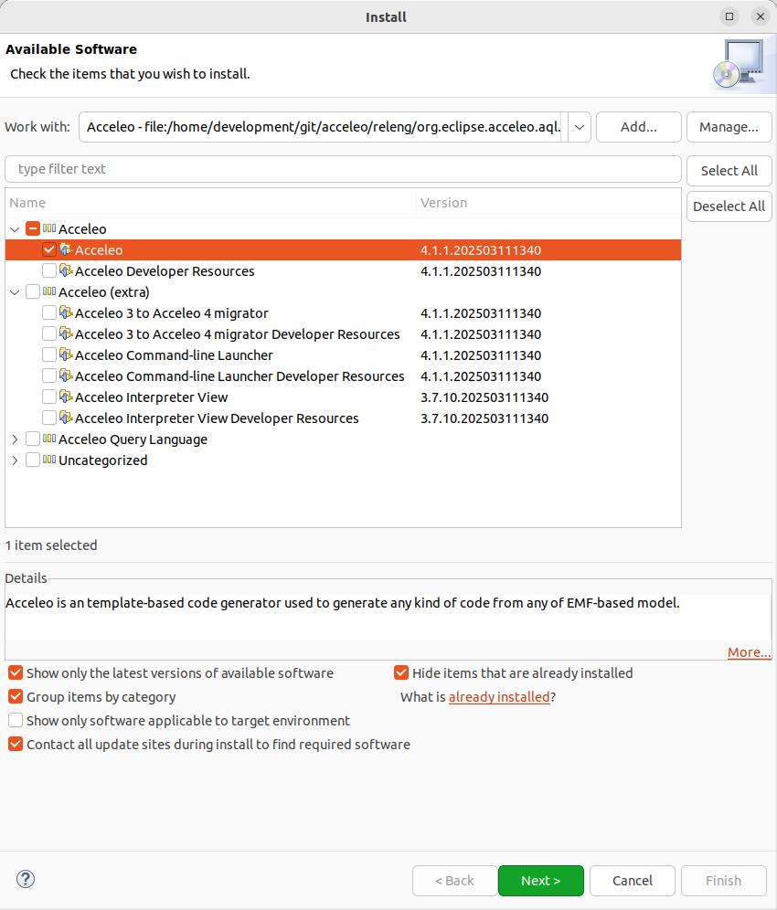

If you have an existing Eclipse installation and simply wish to install Acceleo in it, you can install it from one of the *Update Sites*, available here https://download.eclipse.org/acceleo/updates/releases/.

When installing the update site you must ensure that *"Contact all update sites during install to find required software"* is checked and that in the *"Manage..."* dialog, the *"Latest Eclipse Release"* update site is checked.

image:images/InstallDependencies.png[Install Acceleo]

For a minimal installation you can select the `Acceleo` feature:

For those of you who need to retrieve the source code of Acceleo, it is available on Github: https://github.com/eclipse-acceleo/acceleo/.
