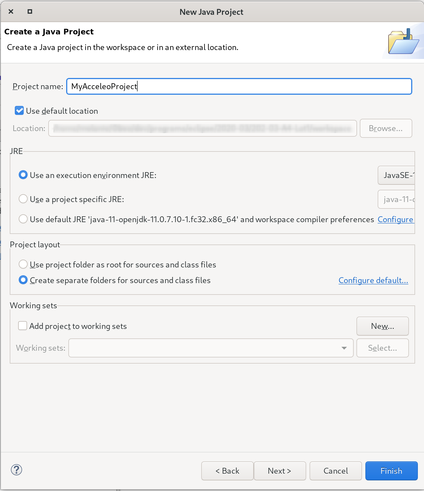
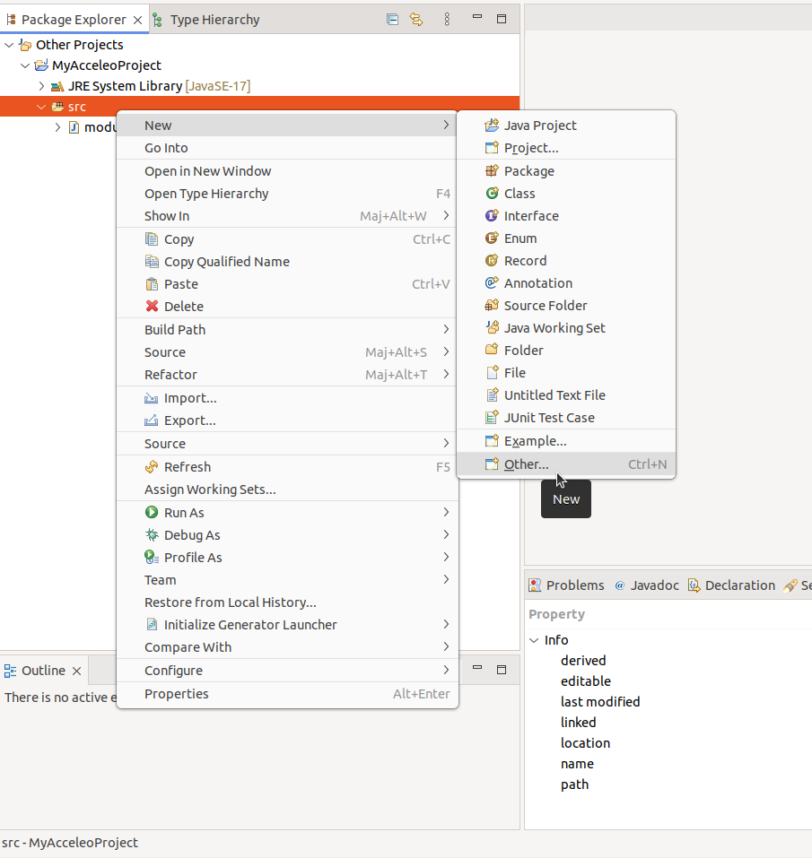
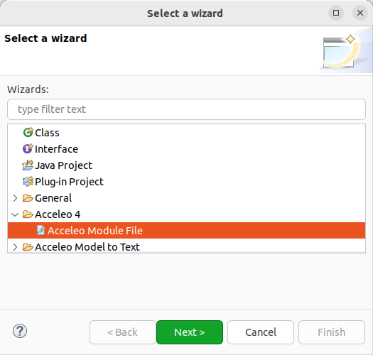

In this section, you will create a new project to work with Acceleo.

First you need to create a *Java project*:

1. Inside Eclipse select the menu item *File > New > Project...* to open the *New Project* wizard,
2. Select *Java Project* then click *Next* to  start the *New Java Project* wizard:

 

On this page:

1. Enter the Project name,
2. Select the Java Runtime Environment (JRE) or leave it at the default,
3. Then click *Finish*.

image::images/NewProject.png[] 

1. In the *Package Explorer*, expand the project and select the source folder *src*,
2. Select the menu item *File > New > Other...*,

3. Select the *Acceleo 4 > Acceleo module file* wizard,

4. This will open the following wizard page where you can define the module parameters,

image::images/NewModuleWizard.png[Acceleo module file wizard page]

5. Then click *Finish*.

The will create the following module file.

image::images/NewModuleContents.png[New module contents]

For now it will generate a file with an empty line.

In order to launch an Acceleo generator, you just have to right-click on your main module and use the *Run As* menu.

image::images/RunAs.png[Run As]

From there the *Launch Configuration* menu will open.
If you already have created a launch configuration you can access the launch configuration menu from the *Run > Run Configurations...* menu.
In this menu, you will have access to the Acceleo Launch configuration. 
You just have to select:

* your main *module file*, 
* your input *model file*,
* the *destination folder* of the generation.

image::images/LaunchConfig.png[Launch Configuration]

.After launching the generation
[IMPORTANT]
====
Check that your generation is finished by opening the *Console* view.
The console title should change to `<terminated> generate.mtl[Acceleo4]`.
The last line in the console should be the generation summary `Files: 1, Lost Files: 0, Errors: 0, Warnings: 0, Infos: 0`.
====
 