= Acceleo Query Language
Query and navigate in EMF models
:toc:
:toclevels: 2
:toc-title: Table of Content
:sectnums:
:icons: font
:source-highlighter: highlightjs
:listing-caption: Listing

<<<

== Overview

The Acceleo Query Language (AQL) is a language used to navigate and query an EMF model. In this document, you will find the description of all the services of the standard library of AQL.

== Introduction

The Acceleo Query Language (AQL) is a language used to navigate and query an EMF model. In this document, you will find the description of the syntax, all the services and the standard library of AQL.
AQL as a query engine is small, simple, fast, extensible and it brings a richer validation than the MTL interpreter.

For those looking for a simple and fast interpreters for your EMF models, AQL can provide you with a lot of features, including:

* Support for static and dynamic Ecore models, no query compilation phase required.
* The least possible overhead at evaluation time. During this phase, the evaluation goes forward and will not even try to validate or compile your expressions. Errors are tracked and captured along the way.
* Strong validation: types are checked at validation time and the metamodels used are analyzed to do some basic type inference and avoid false positive errors.
* Union types: In some context, a variable in a given query can have N potential types with N being often greater than one. AQL can embrace this fact without having to fall back to EObject as soon as there is more than one type.
* A simple and straightforward implementation easily extensible with Java classes providing extension methods.
* A very narrow dependency surface: AQL uses the very central parts of EMF, Guava and Antlr so that we could easily deploy AQL outside of Eclipse in a server or a standalone scenario.

The AQL interpreter is used in Sirius with the prefix 'aql:'.

== Syntax

=== Basics

The syntax is very similar to the OCL syntax. An expression always starts with a variable
`aVariable`

The variable named *self* represent the current object (think of it as the `this` in Java).

Let's consider the following metamodel : 

image:images/family_ecore.png[] 

From a variable one can access field or reference values using the `.` separator.
With `self` being an instance of *Person*, `self.name` returns the value of the attribute *name* and `self.father` return the father of the person.

If the attribute or the reference is multi-valued, then `self.parents` will return a collection.

Calls can be chained, as such `self.parents.name` will return a collection containing the names of the parents.

If one want to access the collection itself, then the separator `->` must be used, as such `self.parents.name->size()` will return the number of elements in the collection whereas `self.parents.name.size()` will return a collection containing 
the sizes of each name.  

AQL can also call methods modeled as EOperations or defined through Java services. The syntax denoting such a call is `.` for instance `self.someCall()` will call the *someCall* method and return the result.

=== Working with collections

Filtering a collection is generaly done using either `->filter(..)` to keep elements of a given type or `->select(..)` to keep elements which are validating a given condition.

With `self` being an instance of *Family*, `self.members->filter(family::Man)`  will return all the members of the family which are mens and `self.members->select( p | p.name.startsWith('A'))` will return all the members of the family which have a name starting by the letter 'A'.

To access an element at a particular index you can use the operation `->at(..)`; `self.members->at(1)` will return the first person which is a member of the family (in that specific case it is probably better to use `self.members->first()`

AQL has two kinds of collections, a `Sequence` which is a list, or an `OrderedSet` which does not allow doubles. You can convert a `Sequence` to an `OrderedSet` by as such : `self.members->asSet()`

You can also define a collection by extension using the following syntax: 

* `OrderedSet{self}` which returns a set containing the current EObject.
* `Sequence{self, self.eContainer()}` returns a sequence containing the current EObject and its parent.

=== Navigation axes

AQL provides operations out of the box to browse the model. Most notably :

* `self.eContainer()` returns the parent of the current object if there is one.
* `self.eAllContents(some::Type)` returns all direct and indirect children matching the given type.
* `self.eContents()` return all the direct children.
* `self.eInverse('father')` returns the cross reference of the reference named 'father'. In this case it will return all the persons which have the current object (self) as a father.

=== Conditions

AQL provides an *If* but it has to be an expression and not a statement. As such one *has to define the else*. Here is the syntax

*if* `self.name.startsWith('a')` *then* `self` *else* `self.eContainer()` *endif* 

=== Walkthrough using an UML example

Let's move to a slightly more complex example to learn how to navigate through a model. We will work with a model instance from the following metamodel: a simplified view of the UML2 metamodel with *Package*, *UseCase*, *Model* or *Component* instances. 

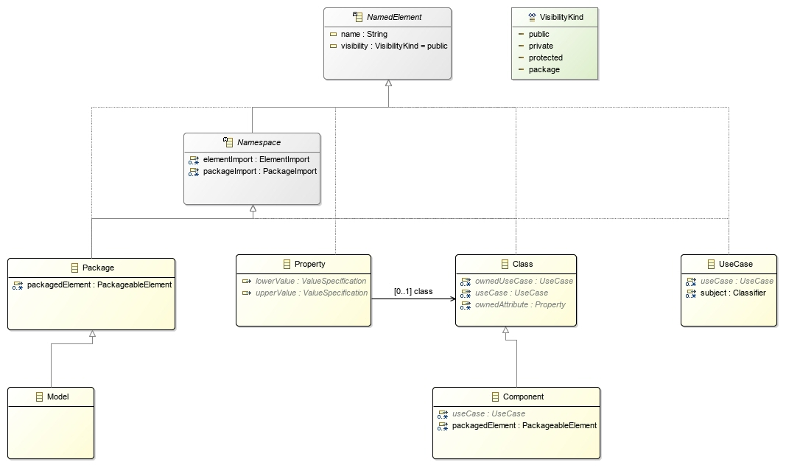 

The following illustration demonstrate the result of the just typing `self` as a query. At the bottom every instance of the UML model is represented by a node with containment relationships from top to bottom and displaying the non-contained references in between those nodes through horizontal edges. The result of the query is highlighted in *blue*. 

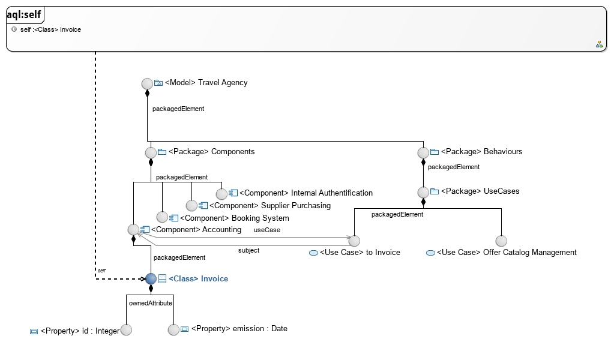  

The variable *self* here is the *Class* named 'Invoice' in the model, as such the query `self` hightlight this instance.

==== eContainer()

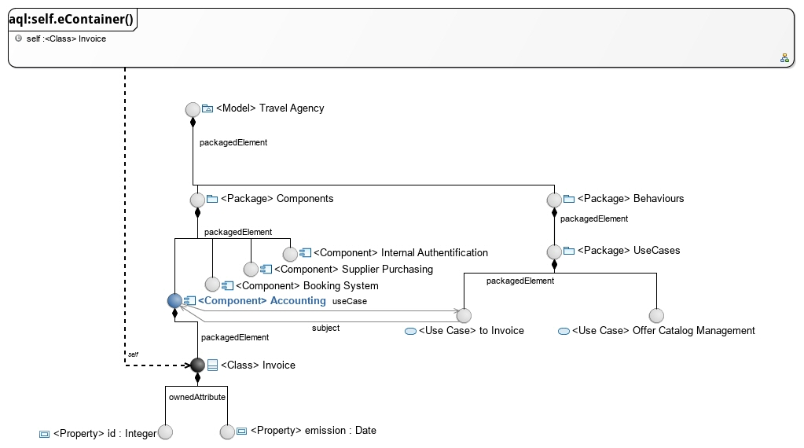

When using the query `self.eContainer()` the cursor move from the `self` variable to its most direct parent, here the *Component* instance named 'Accounting'.

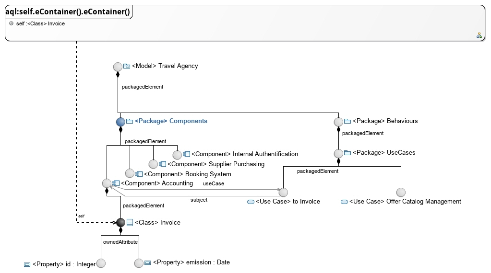

Such calls can be chained and as such `self.eContainer().eContainer()` return the *Component* parents: the *Package* named 'Components'.

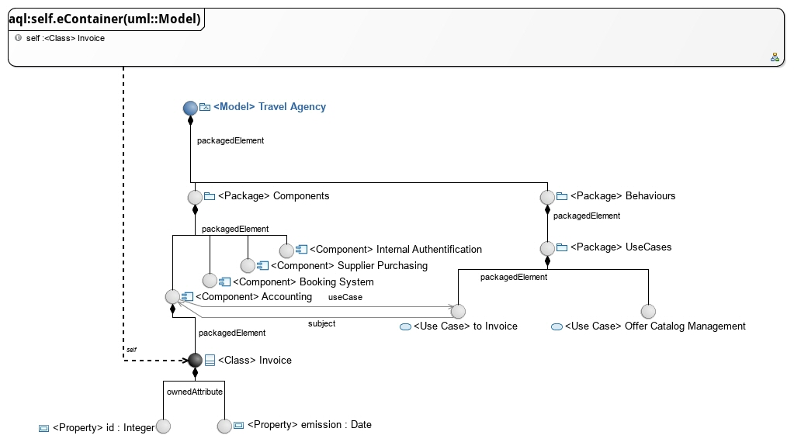

The `eContainer()` call can also be used with a type parameter, in that case it will be transitively executed up to the point where an instance of the given type is found.

In this case then `self.eContainer(uml::Model)` goes up to the root of the graph. If no instance of the given type is found in the parents then the query returns an empty result.  

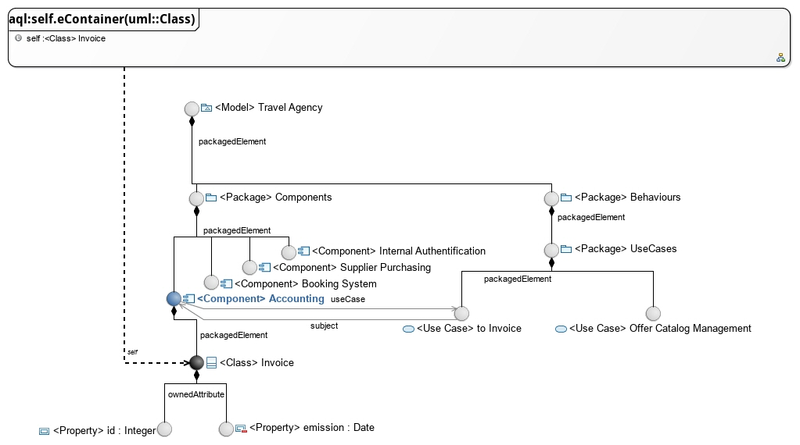

`eContainer()` or any other service using types as parameters will match both the given types or its subtypes. The only exception to this rule is the `oclIsTypeOf(..)` service which is intended to check only for the given type and not its subtypes.  

When using the query `self.eContainer(uml::Class)` the result is an instance of *Component* as the *Component* type extends *Class* in the metamodel.

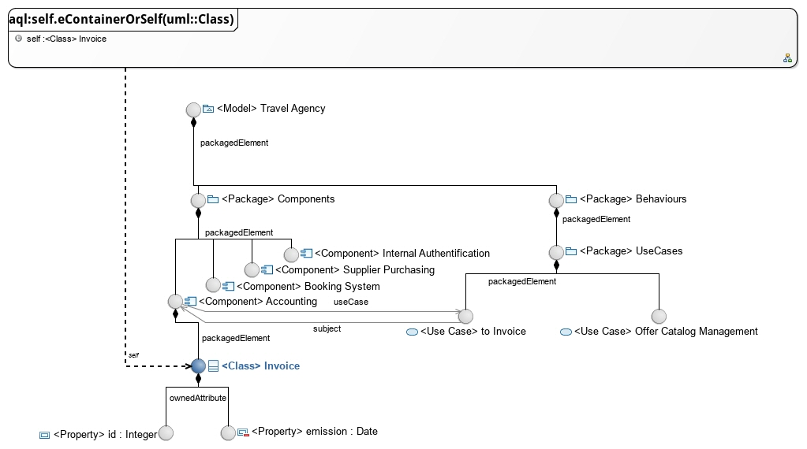

A variant of `eContainer(..)` named `eContainerOrSelf(..)` is provided it will first check the type of the current instance. As such the query `self.eContainerOrSelf(uml::Class)` when *self* is the 'Invoice' class returns this instance. 

==== eContents()

image:images/self-econtents.jpg[]

One use `eContainer()` to go up in the parent. The `eContents()` axes is its counterpart and returns the direct children of the element.

==== select()

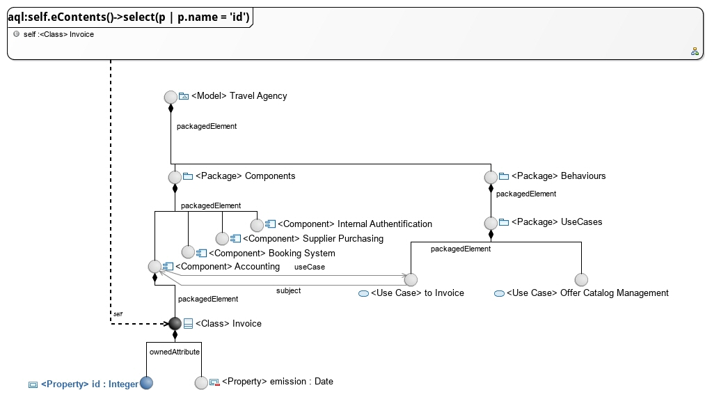

The `select(...)` service can be used to filter elements from a list by veryfing a predicate. In the query `self.eContents()->select(p | p.name = 'id')` the query only returns the elements which have a name equal to *"id"*, in this case a single element.

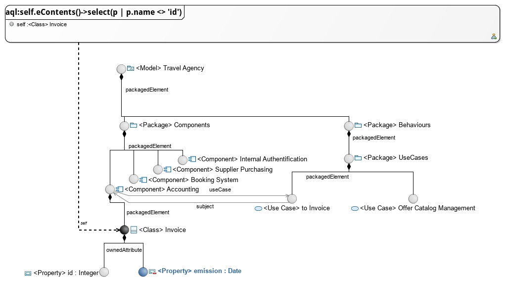

Equality is checked with a single `=`, inequality is expressed with the operator `<>`.

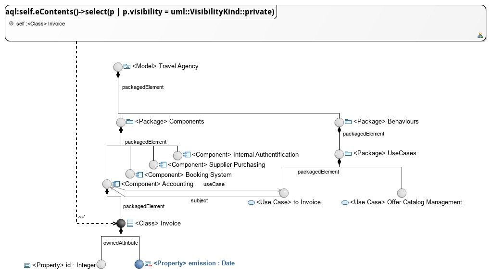

Comparing values with an enumeration is slightly different as the enumeration value should be explicitely qualified. In the `self.eContents()->select(p | p.visibility =  uml::VisibilityKind::private )` query the expression `uml::VisibilityKind::private` denotes the enumeration literal named *private* which is contained in the *VisibilityKind* enumeration of the *uml* metamodel.

==== eAllContents()

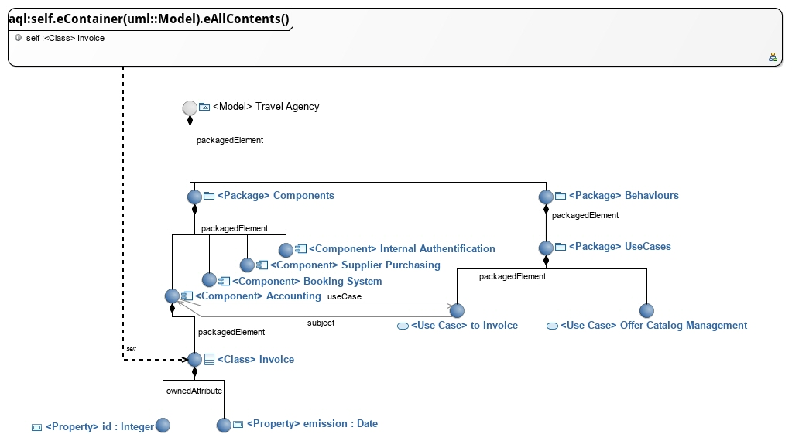

The `eAllContents()` axe is used to browse direct and indirect children. It goes from the starting point to the leafs of the model. Here the expression starts with `self.eContainer(uml::Model)` which has we've seen before goes up until an instance of *Model* is found. From here `eAllContents` is executed returning all the direct and indirect childrens of the 'Travel Agency'  *model* instance.

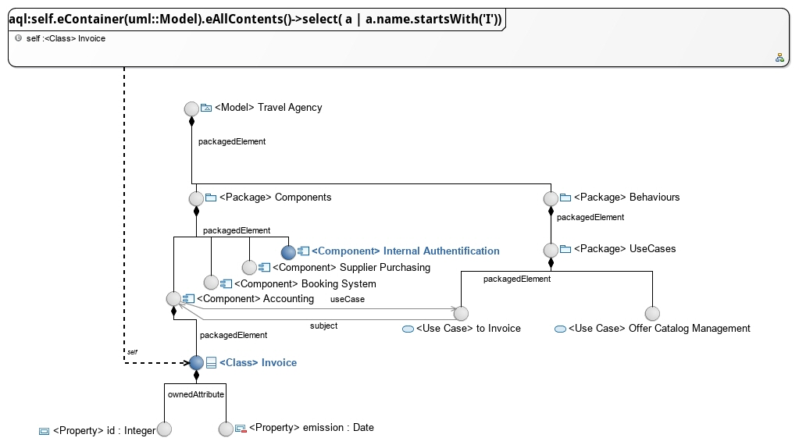

Just like any other collection it can be filtered to retrieve, for instace, the elements whose name is starting by the letter 'I'.

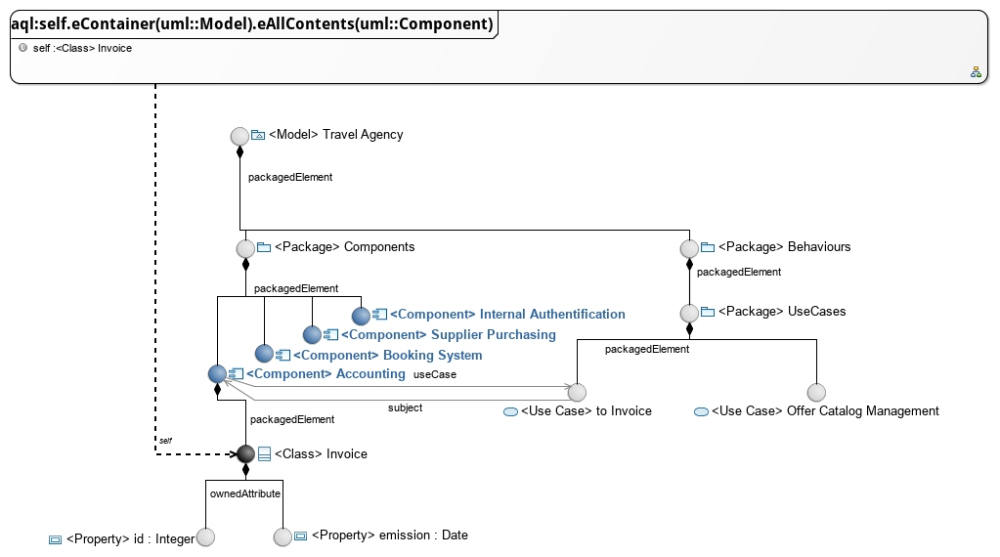

A type parameter can be used to retrieve the direct or indirect children of a specific type: here *components*.

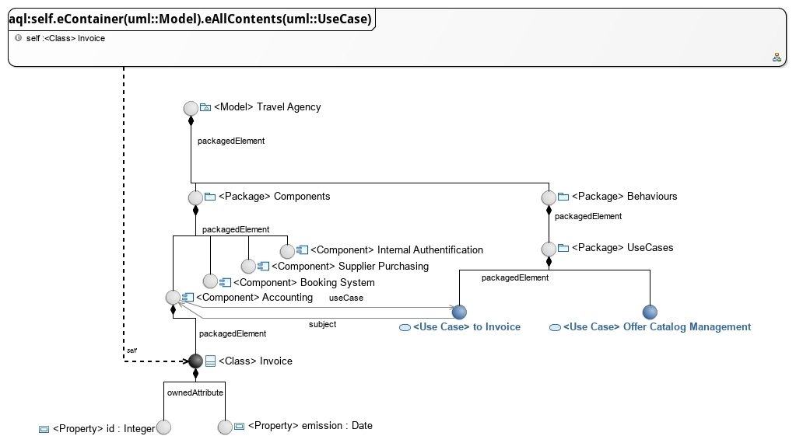

Or *use case* instances.

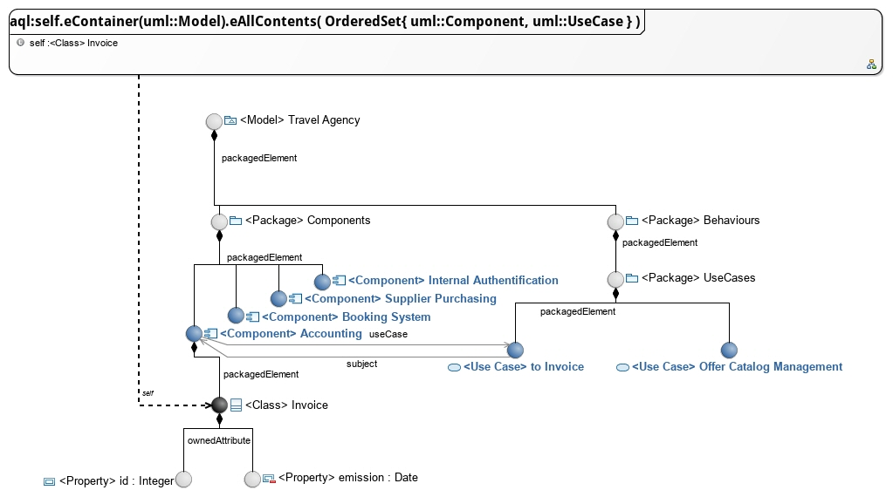

It is interesting to note that the parameter can also be a collection of types, enabling the retrieval of many elements through a single pass.  

==== eInverse()

Queries using `eAllContents` must be designed with care as they tend to lead to an intense browsing of the model. In many cases they can be replaced with `eInverse()` calls to retrieve elements of interests.

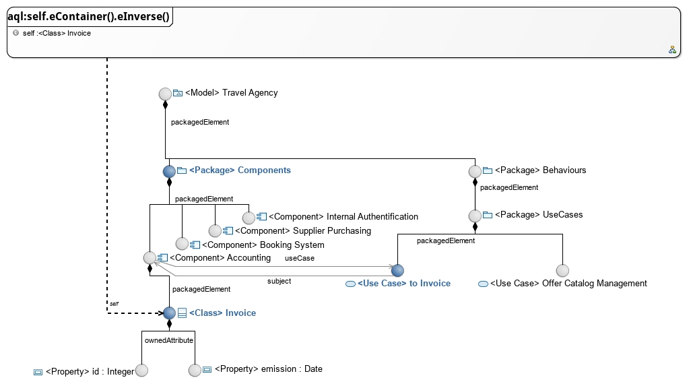

`eInverse()` returns any element which as a relationship with the current one. This relationship can be indifferently a containment one or not.

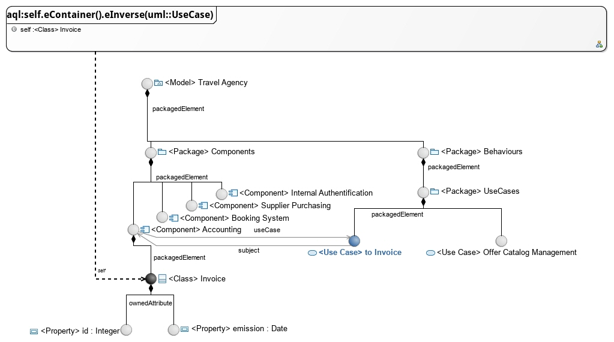

It is often of interest to restrict the type of elements we expect out of the `eInverse()` call. With the query `self.eContainer().eInverse(uml::UseCase)` only use cases instances will be returned, here the *UseCase* named 'to Invoice' which refers to the 'Accounting' *Component* through the reference named *subject*

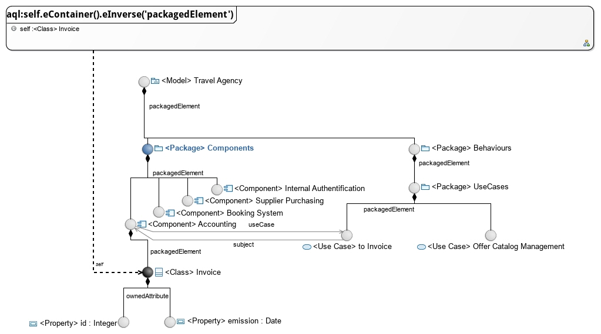

One can also be even more explicit and query for a specific reference name, here `packagedElement` : only the *Package* named 'Components' refers to the 'Accounting' *Component* through the reference named 'packagedElement'.

== Language Reference

These sections are listing all the services of the standard library of AQL.

// SERVICES START

=== Services available for all types

==== Object + String : String

Returns the concatenation of self (as a String) and the given string "s".

Parameters:

* *self*: The current object at the end of which to append "s".
* *s*: The string we want to append at the end of the current object's string representation.

|===
| *Expression* | *Result*
| `42 + ' times'` | `'42 times'`
|===

==== String + Object : String

Returns the concatenation of the current string and the given object "any" (as a String).

Parameters:

* *self*: The current string.
* *any*: The object we want to append, as a string, at the end of the current string.

|===
| *Expression* | *Result*
| `'times ' + 42` | `'times 42'`
|===

==== Object <> Object : Boolean

Indicates whether the object "o1" is a different object from the object "o2".

Parameters:

* *o1*: The object to compare
* *o2*: The reference object with which to compare

|===
| *Expression* | *Result*
| `'Hello' <> 'World'` | `true`
| `'Hello' <> 'Hello'` | `false`
|===

==== Object = Object : Boolean

Indicates whether the object "o1" is the same as the object "o2". For more information refer to the Object#equals(Object) method.

Parameters:

* *o1*: The object to compare for equality
* *o2*: The reference object with which to compare

|===
| *Expression* | *Result*
| `'Hello' = 'World'` | `false`
| `'Hello' = 'Hello'` | `true`
|===

==== Object.oclAsType(Object) : Object

Casts the current object to the given type.

Parameters:

* *object*: The object to cast
* *type*: The type to cast the object to

|===
| *Expression* | *Result*
| `anEPackage.oclAsType(ecore::EPackage)` | `anEPackage`
| `anEPackage.oclAsType(ecore::EClass)` | `anEPackage`
| `null.oclAsType(ecore::EPackage)` | `null`
| `anEPackage.oclAsType(ecore::EClass)` | `throws an exception`
| `anything.oclAsType(null)` | `throws an exception`
|===

*In other languages*

|===
| *Language* | *Expression* | *Result* |
| `Acceleo 3 (MTL)` | `anEPackage.oclAsType(ecore::EPackage)` | `anEPackage`
| `Acceleo 3 (MTL)` | `anEPackage.oclAsType(ecore::EClass)` | `oclInvalid`
|===

==== Object.oclIsKindOf(Object) : Boolean

Evaluates to "true" if the type of the object o1 conforms to the type "classifier". That is, o1 is of type "classifier" or a subtype of "classifier".

Parameters:

* *object*: The reference Object we seek to test.
* *type*: The expected supertype classifier.

|===
| *Expression* | *Result*
| `anEPackage.oclIsKindOf(ecore::EPackage)` | `true`
| `anEPackage.oclIsKindOf(ecore::ENamedElement)` | `true`
|===

==== Object.oclIsTypeOf(Object) : Boolean

Evaluates to "true" if the object o1 if of the type "classifier" but not a subtype of the "classifier".

Parameters:

* *object*: The reference Object we seek to test.
* *type*: The expected type classifier.

|===
| *Expression* | *Result*
| `anEPackage.oclIsTypeOf(ecore::EPackage)` | `true`
| `anEPackage.oclIsTypeOf(ecore::ENamedElement)` | `false`
|===

==== Object.toString() : String

Returns a string representation of the current object.

Parameters:

* *self*: The current object

|===
| *Expression* | *Result*
| `42.toString()` | `'42'`
|===

==== Object.trace() : String

Returns a string representation of the current environment.

Parameters:

* *self*: The current object

|===
| *Expression* | *Result*
| `42.trace()` | `'Metamodels:
	http://www.eclipse.org/emf/2002/Ecore
Services:
	org.eclipse.acceleo.query.services.AnyServices
		public java.lang.String org.eclipse.acceleo.query.services.AnyServices.add(java.lang.Object,java.lang.String)
		...
receiver: 42
'`
|===

=== Services available for Booleans

==== Boolean.and(Boolean) : Boolean

Logical and.

Parameters:

* *op1*: The first operand
* *op2*: The second operand

|===
| *Expression* | *Result*
| `true and false` | `false`
| `false and true` | `false`
| `true and true` | `true`
| `false and false` | `false`
|===

==== Boolean.implies(Boolean) : Boolean

Logical implies.

Parameters:

* *op1*: The first operand
* *op2*: The second operand

|===
| *Expression* | *Result*
| `true implies true` | `true`
| `true implies false` | `false`
| `false implies true` | `true`
| `false implies false` | `true`
|===

==== Boolean.not() : Boolean

Logical negation.

Parameters:

* *op1*: The operand

|===
| *Expression* | *Result*
| `not true` | `false`
| `not false` | `true`
|===

==== Boolean.or(Boolean) : Boolean

Logical or.

Parameters:

* *op1*: The first operand
* *op2*: The second operand

|===
| *Expression* | *Result*
| `true or false` | `true`
| `false or true` | `true`
| `true or true` | `true`
| `false or false` | `false`
|===

==== Boolean.xor(Boolean) : Boolean

Logical xor.

Parameters:

* *op1*: The first operand
* *op2*: The second operand

|===
| *Expression* | *Result*
| `true xor true` | `false`
| `true xor false` | `true`
| `false xor true` | `true`
| `false xor false` | `false`
|===

=== Services available for Collections

==== Sequence + Collection : Sequence

Returns the concatenation of the given collection into the given sequence.

Parameters:

* *sequence*: The first operand
* *collection*: The second operand

|===
| *Expression* | *Result*
| `Sequence{'a', 'b', 'c'}.add(Sequence{'d', 'e'})` | `Sequence{'a', 'b', 'c', 'd', 'e'}`
| `Sequence{'a', 'b', 'c'} + OrderedSet{'c', 'e'}` | `Sequence{'a', 'b', 'c', 'c', 'e'}`
|===

*In other languages*

|===
| *Language* | *Expression* | *Result* |
| `Acceleo 3 (MTL)` | `Sequence{'a', 'b', 'c'} + Sequence{'d', 'e'}` | `Sequence{'a', 'b', 'c', 'd', 'e'}`
| `Acceleo 3 (MTL)` | `Sequence{'a', 'b', 'c'}.addAll(OrderedSet{'c', 'e'})` | `Sequence{'a', 'b', 'c', 'c', 'e'}`
|===

==== OrderedSet + Collection : OrderedSet

Returns the concatenation of the given collection into the current set.

Parameters:

* *set*: The first operand
* *collection*: The second operand

|===
| *Expression* | *Result*
| `OrderedSet{'a', 'b', 'c'} + OrderedSet{'c', 'b', 'f'}` | `OrderedSet{'a', 'b', 'c', 'f'}`
|===

*In other languages*

|===
| *Language* | *Expression* | *Result* |
| `Acceleo 3 (MTL)` | `OrderedSet{'a', 'b', 'c'}.addAll(OrderedSet{'c', 'b', 'f'})` | `OrderedSet{'a', 'b', 'c', 'f'}`
|===

==== Collection->any( x | ... ) : Object

Gets the first element in the current collection for which the value returned by the lambda evaluates to "true".

Parameters:

* *collection*: The input collection
* *lambda*: The lamba

|===
| *Expression* | *Result*
| `Sequence{'a', 'b', 'c'}->any(str \| str.size() = 1)` | `'a'`
|===

==== Sequence->append(Object) : Sequence

Inserts the given object in a copy of the given sequence at the last position.

Parameters:

* *sequence*: The sequence
* *object*: The object

|===
| *Expression* | *Result*
| `Sequence{'a', 'b', 'c'}->append('f')` | `Sequence{'a', 'b', 'c', 'f'}`
|===

==== OrderedSet->append(Object) : OrderedSet

Inserts the given object in a copy of the given set at the last position. If the set already contained the given object, it is moved to the last position.

Parameters:

* *set*: The sequence
* *object*: The object

|===
| *Expression* | *Result*
| `OrderedSet{'a', 'b', 'c'}->append('f')` | `OrderedSet{'a', 'b', 'c', 'f'}`
| `OrderedSet{'a', 'b', 'c'}->append('b')` | `OrderedSet{'a', 'c', 'b'}`
|===

==== Collection->asOrderedSet() : OrderedSet

Returns a set representation of the specified collection. Returns the same object if it is a set already. This operation has the same behavior as "asSet()"

Parameters:

* *collection*: The input collection

|===
| *Expression* | *Result*
| `OrderedSet{'a', 'b', 'c'}->asOrderedSet()` | `OrderedSet{'a', 'b', 'c'}`
| `Sequence{'a', 'b', 'c'}->asOrderedSet()` | `OrderedSet{'a', 'b', 'c'}`
|===

==== Collection->asSequence() : Sequence

Returns a sequence representation of the specified collection. Returns the same object if it is already a sequence.

Parameters:

* *collection*: The input collection

|===
| *Expression* | *Result*
| `OrderedSet{'a', 'b', 'c'}->asSequence()` | `Sequence{'a', 'b', 'c'}`
| `Sequence{'a', 'b', 'c'}->asSequence()` | `Sequence{'a', 'b', 'c'}`
|===

==== Collection->asSet() : OrderedSet

Returns a set representation of the specified collection. Returns the same object if it is already a set.

Parameters:

* *collection*: The input collection

|===
| *Expression* | *Result*
| `OrderedSet{'a', 'b', 'c'}->asSet()` | `OrderedSet{'a', 'b', 'c'}`
| `Sequence{'a', 'b', 'c', 'c', 'a'}->asSet()` | `OrderedSet{'a', 'b', 'c'}`
|===

==== Sequence->at(Integer) : Object

Returns the element at the specified position in the sequence.

Parameters:

* *sequence*: The input sequence
* *position*: The position of the element to return ([1..size])

|===
| *Expression* | *Result*
| `Sequence{'a', 'b', 'c'}->at(1)` | `'a'`
| `Sequence{'a', 'b', 'c'}->at(2)` | `'b'`
|===

==== OrderedSet->at(Integer) : Object

Returns the element at the specified position in the set.

Parameters:

* *set*: The input set
* *position*: The position of the element to return ([1..size])

|===
| *Expression* | *Result*
| `OrderedSet{'a', 'b', 'c'}->at(1)` | `'a'`
| `OrderedSet{'a', 'b', 'c'}->at(2)` | `'b'`
|===

==== Collection->closure( x | ... ) : OrderedSet{Object}

Returns a set containing the result of applying "lambda" recursivly.

Parameters:

* *collection*: The original collection
* *lambda*: The lambda expression

|===
| *Expression* | *Result*
| `Sequence{eCls}->closure(e \| e.eContainer())` | `Sequence{subEPkg, ePkg, rootEPkg}`
|===

==== Sequence->collect( x | ... ) : Sequence{Object}

Returns a sequence containing the result of applying "lambda" on all elements contained in the current sequence, maintaining order.

Parameters:

* *sequence*: The original sequence
* *lambda*: The lambda expression

|===
| *Expression* | *Result*
| `Sequence{'a', 'b', 'c'}->collect(str \| str.toUpper())` | `Sequence{'A', 'B', 'C'}`
|===

==== OrderedSet->collect( x | ... ) : OrderedSet{Object}

Returns a set containing the result of applying "lambda" on all elements contained in the current set, maintaining order.

Parameters:

* *set*: The original set
* *lambda*: The lambda expression

|===
| *Expression* | *Result*
| `OrderedSet{'a', 'b', 'c'}->collect(str \| str.toUpper())` | `OrderedSet{'A', 'B', 'C'}`
|===

==== Sequence->concat(Collection) : Sequence

Returns the concatenation of the current sequence with the given collection.

Parameters:

* *sequence*: The first operand
* *collection*: The second operand

|===
| *Expression* | *Result*
| `Sequence{'a', 'b', 'c'}.concat(Sequence{'d', 'e'})` | `Sequence{'a', 'b', 'c', 'd', 'e'}`
|===

*In other languages*

|===
| *Language* | *Expression* | *Result* |
| `Acceleo 3 (MTL)` | `Sequence{'a', 'b', 'c'}.addAll(Sequence{'d', 'e'})` | `Sequence{'a', 'b', 'c', 'd', 'e'}`
|===

==== OrderedSet->concat(Collection) : OrderedSet

Returns the concatenation of the current set with the given collection.

Parameters:

* *set*: The first operand
* *collection*: The second operand

|===
| *Expression* | *Result*
| `OrderedSet{'a', 'b', 'c'}.concat(Sequence{'d', 'e'})` | `OrderedSet{'a', 'b', 'c', 'd', 'e'}`
|===

*In other languages*

|===
| *Language* | *Expression* | *Result* |
| `Acceleo 3 (MTL)` | `OrderedSet{'a', 'b', 'c'}.addAll(Sequence{'d', 'e'})` | `OrderedSet{'a', 'b', 'c', 'd', 'e'}`
|===

==== Sequence{Object}->count(Object) : Integer

Counts the number of occurrences of the given object in the given sequence

Parameters:

* *sequence*: The sequence
* *object*: The object

|===
| *Expression* | *Result*
| `Sequence{'a', 'b', 'c'}->count('d')` | `0`
| `Sequence{'a', 'b', 'c'}->count('a')` | `1`
|===

==== OrderedSet->count(Object) : Integer

Returns "1" if the current set contains the given object, "0" otherwise.

Parameters:

* *set*: The set
* *object*: The object

|===
| *Expression* | *Result*
| `OrderedSet{'a', 'b', 'c'}->count('d')` | `0`
| `OrderedSet{'a', 'b', 'c'}->count('a')` | `1`
|===

==== Sequence->dropRight(Integer) : Sequence

Returns a sequence of elements before the given index in the given sequence

Parameters:

* *sequence*: The sequence
* *index*: The high end point (exclusive) of the subsequence

|===
| *Expression* | *Result*
| `Sequence{'a', 'b', 'c'}->dropRight(2)` | `Sequence{'a'}`
|===

==== OrderedSet->dropRight(Integer) : OrderedSet

Returns a set of elements before the given index in the given set

Parameters:

* *set*: The set
* *index*: The high end point (exclusive) of the subsequence

|===
| *Expression* | *Result*
| `OrderedSet{'a', 'b', 'c'}->dropRight(2)` | `OrderedSet{'a'}`
|===

==== Sequence->drop(Integer) : Sequence

Returns a sequence of elements after the given index in the given sequence

Parameters:

* *sequence*: The sequence
* *index*: The low start point (exclusive) of the subsequence

|===
| *Expression* | *Result*
| `Sequence{'a', 'b', 'c'}->drop(2)` | `Sequence{'c'}`
|===

==== OrderedSet->drop(Integer) : OrderedSet

Returns a set of elements after the given index in the given set

Parameters:

* *set*: The set
* *index*: The low start point (exclusive) of the subsequence

|===
| *Expression* | *Result*
| `OrderedSet{'a', 'b', 'c'}->drop(2)` | `OrderedSet{'c'}`
|===

==== Collection->endsWith(Collection) : Boolean

Returns "true" if the sequence ends with other, "false" otherwise

Parameters:

* *sequence*: The Sequence or OrderedSet
* *other*: The other Sequence or OrderedSet

|===
| *Expression* | *Result*
| `Sequence{'a', 'b', 'c'}->endsWith(Sequence{'b', 'c'})` | `true`
|===

==== Collection->excludesAll(Collection) : Boolean

Indicates if no elements from the second collection are contained in the first collection

Parameters:

* *collection1*: The first collection
* *collection2*: The second collection

|===
| *Expression* | *Result*
| `Sequence{'a', 'b'}->excludesAll(OrderedSet{'f'})` | `true`
| `Sequence{'a', 'b'}->excludesAll(OrderedSet{'a', 'f'})` | `false`
|===

==== Collection->excludes(Object) : Boolean

Indicates if the given collection doesn't contain the given object.

Parameters:

* *collection*: The input collection
* *object*: The object

|===
| *Expression* | *Result*
| `Sequence{'a', 'b', 'c'}->excludes('a')` | `false`
| `Sequence{'a', 'b', 'c'}->excludes('d')` | `true`
|===

==== Sequence->excluding(Object) : Sequence

Removes the given object from the current sequence.

Parameters:

* *sequence*: The source sequence
* *object*: The object to remove

|===
| *Expression* | *Result*
| `Sequence{'a', 'b', 'c'}->excluding('c')` | `Sequence{'a', 'b'}`
|===

==== OrderedSet->excluding(Object) : OrderedSet

Removes the given object from the current set.

Parameters:

* *set*: The source set
* *object*: The object to remove

|===
| *Expression* | *Result*
| `OrderedSet{'a', 'b', 'c'}->excluding('c')` | `OrderedSet{'a', 'b'}`
|===

==== Collection->exists( x | ... ) : Boolean

Indicates if it exists an object from the given collection for which the given lambda evaluates to "true"

Parameters:

* *collection*: The collection
* *lambda*: The lambda

|===
| *Expression* | *Result*
| `Sequence{'a', 'b', 'c'}->exists(str \| str.size() > 5)` | `false`
|===

==== Sequence->filter(Class) : Sequence

Keeps only instances of the given primitive type (String, Integer, Real, Boolean) from the given sequence.

Parameters:

* *sequence*: The input sequence to filter
* *cls*: The type used to filters element in the sequence

|===
| *Expression* | *Result*
| `Sequence{'a', 1, 3.14}->filter(String)` | `Sequence{'a'}`
|===

==== Sequence->filter(EClassifier) : Sequence

Keeps only instances of the given EClassifier in the given sequence.

Parameters:

* *sequence*: The input sequence to filter
* *eClassifier*: The type used to filters element in the sequence

|===
| *Expression* | *Result*
| `Sequence{anEClass, anEAttribute, anEReference}->filter(ecore::EClass)` | `Sequence{anEClass}`
| `Sequence{anEClass, anEAttribute}->filter(ecore::EStructuralFeature)` | `Sequence{anEAttribute}`
|===

==== Sequence->filter(OrderedSet{EClassifier}) : Sequence

Keeps only instances of the given EClassifier in the given sequence.

Parameters:

* *sequence*: The input sequence to filter
* *eClassifiers*: The set of types used to filters element in the sequence

|===
| *Expression* | *Result*
| `Sequence{anEClass, anEAttribute, anEReference}->filter({ecore::EClass \| ecore::EReference})` | `Sequence{anEClass, anEReference}`
| `Sequence{anEClass, anEAttribute, anEPackage}->filter({ecore::EStructuralFeature \| ecore::EPacakge})` | `Sequence{anEAttribute, anEPackage}`
|===

==== OrderedSet->filter(Class) : OrderedSet

Keeps only instances of the given primitive type (String, Integer, Real, Boolean) from the given set.

Parameters:

* *set*: The input set to filter
* *cls*: The type used to filters element in the set

|===
| *Expression* | *Result*
| `OrderedSet{'a', 1, 3.14}->filter(String)` | `OrederedSet{'a'}`
|===

==== OrderedSet->filter(EClassifier) : OrderedSet

Keeps only instances of the given EClassifier from the given set.

Parameters:

* *set*: The input set to filter
* *eClassifier*: The type used to filters element in the set

|===
| *Expression* | *Result*
| `OrderedSet{anEClass, anEAttribute, anEReference}->filter(ecore::EClass)` | `OrederedSet{anEClass}`
| `OrderedSet{anEClass, anEAttribute}->filter(ecore::EStructuralFeature)` | `OrederedSet{anEAttribute}`
|===

==== OrderedSet->filter(OrderedSet{EClassifier}) : OrderedSet

Keeps only instances of the given set of EClassifier from the given set.

Parameters:

* *set*: The input set to filter
* *eClassifiers*: The set of type used to filters element in the set

|===
| *Expression* | *Result*
| `OrderedSet{anEClass, anEAttribute, anEReference}->filter({ecore::EClass \| ecore::EReference})` | `OrderedSet{anEClass, anEReference}`
| `OrderedSet{anEClass, anEAttribute, anEPackage}->filter({ecore::EStructuralFeature \| ecore::EPacakge})` | `OrderedSet{anEAttribute, anEPackage}`
|===

==== Collection->first() : Object

Returns the first element of the specified Collection.

Parameters:

* *collection*: The input collection

|===
| *Expression* | *Result*
| `Sequence{'a', 'b', 'c'}->first()` | `'a'`
|===

==== Collection->forAll( x | ... ) : Boolean

Indicates if all the objects from the given collection validate the given lamba

Parameters:

* *collection*: The collection
* *lambda*: The lambda

|===
| *Expression* | *Result*
| `Sequence{'a', 'b', 'ccc'}->forAll(str \| str.size() = 1)` | `false`
| `Sequence{'a', 'b', 'c'}->forAll(str \| str.size() = 1)` | `false`
|===

==== Collection->includesAll(Collection) : Boolean

Indicates if all elements from the second collection are contained in the first collection

Parameters:

* *collection1*: The first collection
* *collection2*: The second collection

|===
| *Expression* | *Result*
| `Sequence{'a', 'b', 'c'}->includesAll(OrderedSet{'a'})` | `true`
| `Sequence{'a', 'b', 'c'}->includesAll(OrderedSet{'a', 'f'})` | `false`
|===

==== Collection->includes(Object) : Boolean

Indicates if the given collection contains the given object.

Parameters:

* *collection*: The input collection
* *object*: The object

|===
| *Expression* | *Result*
| `Sequence{'a', 'b', 'c'}->includes('a')` | `true`
| `Sequence{'a', 'b', 'c'}->includes('d')` | `false`
|===

==== Sequence->including(Object) : Sequence

Adds the given object to the current sequence.

Parameters:

* *sequence*: The source sequence
* *object*: The object to add

|===
| *Expression* | *Result*
| `Sequence{'a', 'b', 'c'}->including('d')` | `Sequence{'a', 'b', 'c', 'd'}`
|===

==== OrderedSet->including(Object) : OrderedSet

Adds the given object to the current set.

Parameters:

* *set*: The source set
* *object*: The object to add

|===
| *Expression* | *Result*
| `OrderedSet{'a', 'b', 'c'}->including('d')` | `OrderedSet{'a', 'b', 'c', 'd'}`
|===

==== Collection->indexOfSlice(Collection) : Integer

Returns the index of the other collection in the given collection

Parameters:

* *sequence*: The Sequence or OrderedSet
* *other*: The other Sequence or OrderedSet

|===
| *Expression* | *Result*
| `Sequence{'a', 'b', 'c'}->indexOfSlice(Sequence{'b', 'c'})` | `2`
|===

==== Sequence->indexOf(Object) : Integer

Returns the index of the given object in the given sequence ([1..size]).

Parameters:

* *sequence*: The sequence
* *object*: The object

|===
| *Expression* | *Result*
| `Sequence{1, 2, 3, 4}->indexOf(3)` | `3`
|===

==== OrderedSet->indexOf(Object) : Integer

Returns the index of the given object in the given set ([1..size]).

Parameters:

* *set*: The set
* *object*: The object

|===
| *Expression* | *Result*
| `OrderedSet{1, 2, 3, 4}->indexOf(3)` | `3`
|===

==== Sequence->insertAt(Integer, Object) : Sequence

Inserts the given object in a copy of the given sequence at the given position ([1..size]).

Parameters:

* *sequence*: The sequence
* *position*: The position
* *object*: The object

|===
| *Expression* | *Result*
| `Sequence{'a', 'b', 'c'}->insertAt(2, 'f')` | `Sequence{'a', 'f', 'b', 'c'}`
|===

==== OrderedSet->insertAt(Integer, Object) : OrderedSet

Inserts the given object in a copy of the given set at the given position ([1..size]). If the given set already contains this object, it will be moved to the accurate position.

Parameters:

* *set*: The set
* *position*: The position
* *object*: The object

|===
| *Expression* | *Result*
| `OrderedSet{'a', 'b', 'c'}->insertAt(2, 'f')` | `Sequence{'a', 'f', 'b', 'c'}`
|===

==== Sequence->intersection(Collection) : Sequence

Creates a sequence with elements from the given sequence that are present in both the current sequence and the given other {@code Collection}. Iteration order will match that of the current sequence. Duplicates from the first list will all be kept in the result if they also are in the second one, but duplicates from the second list will be dumped even if they are present in the first.

Parameters:

* *sequence*: The sequence
* *collection*: The collection

|===
| *Expression* | *Result*
| `Sequence{'a', 'b', 'c'}->intersection(OrderedSet{'a', 'f'})` | `Sequence{'a'}`
|===

==== OrderedSet->intersection(Collection) : OrderedSet

Creates a set with the elements from the given set that are also present in the given collection.

Parameters:

* *set*: The set
* *collection*: The collection

|===
| *Expression* | *Result*
| `OrderedSet{'a', 'b', 'c'}->intersection(OrderedSet{'a', 'f'})` | `OrderedSet{'a'}`
|===

==== Collection->isEmpty() : Boolean

Returns "true" when the input collection is empty.

Parameters:

* *collection*: The input collection

|===
| *Expression* | *Result*
| `OrderedSet{'a', 'b', 'c'}->isEmpty()` | `false`
| `Sequence{}->isEmpty()` | `true`
|===

==== Collection->isUnique( x | ... ) : Boolean

Indicates if the evaluation of the given lambda gives a different value for all elements of the given collection.

Parameters:

* *collection*: The collection
* *lambda*: The lambda

|===
| *Expression* | *Result*
| `Sequence{'a', 'b', 'c'}->isUnique(str \| str.size())` | `false`
| `Sequence{'a', 'bb', 'ccc'}->isUnique(str \| str.size())` | `true`
|===

==== Collection->lastIndexOfSlice(Collection) : Integer

Returns the last index of the other collection in the given collection

Parameters:

* *sequence*: The Sequence or OrderedSet
* *other*: The other Sequence or OrderedSet

|===
| *Expression* | *Result*
| `Sequence{'a', 'b', 'c', 'a', 'b', 'c'}->lastIndexOfSlice(Sequence{'b', 'c'})` | `5`
|===

==== Sequence->lastIndexOf(Object) : Integer

Returns the last index of the given object in the given sequence ([1..size]).

Parameters:

* *sequence*: The sequence
* *object*: The object

|===
| *Expression* | *Result*
| `Sequence{1, 2, 3, 4, 3}->lastIndexOf(3)` | `5`
|===

==== OrderedSet->lastIndexOf(Object) : Integer

Returns the last index of the given object in the given set ([1..size]).

Parameters:

* *set*: The set
* *object*: The object

|===
| *Expression* | *Result*
| `OrderedSet{1, 2, 3, 4}->lastIndexOf(3)` | `3`
|===

==== Sequence->last() : Object

Returns the last element of the given sequence.

Parameters:

* *sequence*: The sequence

|===
| *Expression* | *Result*
| `Sequence{'a', 'b', 'c'}->last()` | `'c'`
|===

==== OrderedSet->last() : Object

Returns the last element of the given set.

Parameters:

* *set*: The set

|===
| *Expression* | *Result*
| `OrderedSet{'a', 'b', 'c'}->last()` | `'c'`
|===

==== Collection->max() : Number

Max element of the given collection if possible.

Parameters:

* *collection*: The collection

|===
| *Expression* | *Result*
| `Sequence{1, 2, 3, 4}->max()` | `4`
| `Sequence{1, 2, 3.14, 4}->max()` | `4`
|===

==== Collection->min() : Number

Min element of the given collection if possible.

Parameters:

* *collection*: The collection

|===
| *Expression* | *Result*
| `Sequence{1, 2, 3, 4}->min()` | `1`
| `Sequence{1, 2, 3.14, 4}->min()` | `1.0`
|===

==== Collection->notEmpty() : Boolean

Returns "true" when the input collection is not empty.

Parameters:

* *collection*: The input collection

|===
| *Expression* | *Result*
| `OrderedSet{'a', 'b', 'c'}->notEmpty()` | `true`
| `Sequence{}->notEmpty()` | `false`
|===

==== Collection->one( x | ... ) : Boolean

Indicates if one and only one element of the given collection validates the given lambda.

Parameters:

* *collection*: The collection
* *lambda*: The lambda

|===
| *Expression* | *Result*
| `Sequence{'a', 'b', 'c'}->one(str \| str.equals('a'))` | `true`
| `Sequence{'a', 'a', 'c'}->one(str \| str.equals('a'))` | `false`
|===

==== Sequence->prepend(Object) : Sequence

Inserts the given object in a copy of the given sequence at the first position.

Parameters:

* *sequence*: The sequence
* *object*: The object

|===
| *Expression* | *Result*
| `Sequence{'a', 'b', 'c'}->prepend('f')` | `Sequence{'f', 'a', 'b', 'c'}`
|===

==== OrderedSet->prepend(Object) : OrderedSet

Inserts the given object in a copy of the given set at the first position. If the set already contained the given object, it is moved to the first position.

Parameters:

* *set*: The sequence
* *object*: The object

|===
| *Expression* | *Result*
| `OrderedSet{'a', 'b', 'c'}->prepend('f')` | `OrderedSet{'f', 'a', 'b', 'c'}`
|===

==== Sequence->reject( x | ... ) : Sequence

Reject returns a filtered version of the specified sequence. Only elements for which the given "lambda" evaluates to false will be present in the returned sequence

Parameters:

* *sequence*: The original sequence
* *lambda*: The filtering expression

|===
| *Expression* | *Result*
| `Sequence{'a', 'b', 'c'}->reject(str \| str.equals('a'))` | `Sequence{'b', 'c'}`
|===

==== OrderedSet->reject( x | ... ) : OrderedSet

Reject returns a filtered version of the specified set. Only elements for which the given "lambda" evaluates to false will be present in the returned set

Parameters:

* *set*: The original set
* *lambda*: The filtering expression

|===
| *Expression* | *Result*
| `OrderedSet{'a', 'b', 'c'}->reject(str \| str.equals('a'))` | `OrderedSet{'b', 'c'}`
|===

==== Sequence->reverse() : Sequence

Returns the given sequence in reversed order.

Parameters:

* *sequence*: The input sequence

|===
| *Expression* | *Result*
| `Sequence{'a', 'b', 'c'}->reverse()` | `Sequence{'c', 'b', 'a'}`
|===

==== OrderedSet->reverse() : OrderedSet

Returns the given set in reversed order.

Parameters:

* *set*: The input set

|===
| *Expression* | *Result*
| `OrderedSet{'a', 'b', 'c'}->reverse()` | `OrderedSet{'c', 'b', 'a'}`
|===

==== Sequence->select( x | ... ) : Sequence

Select returns a filtered version of the specified sequence. Only elements for which the given "lambda" evaluates to true will be present in the returned sequence.

Parameters:

* *sequence*: The original sequence
* *lambda*: The filtering expression

|===
| *Expression* | *Result*
| `Sequence{'a', 'b', 'c'}->select(str \| str.equals('a'))` | `Sequence{'a'}`
|===

==== OrderedSet->select( x | ... ) : OrderedSet

Select returns a filtered version of the specified set. Only elements for which the given "lambda" evaluates to true will be present in the returned set.

Parameters:

* *set*: The original set
* *lambda*: The filtering expression

|===
| *Expression* | *Result*
| `OrderedSet{'a', 'b', 'c'}->select(str \| str.equals('a'))` | `OrderedSet{'a'}`
|===

==== Collection->sep(Object) : Sequence{Object}

Inserts the given separator between each elements of the given collection.

Parameters:

* *collection*: The input collection
* *separator*: The separator to insert

|===
| *Expression* | *Result*
| `Sequence{'a', 'b', 'c'}->sep('-')` | `Sequence{'a', '-', 'b', '-', 'c'}`
| `OrderedSet{'a', 'b', 'c'}->sep('-')` | `Sequence{'a', '-', 'b', '-', 'c'}`
|===

==== Collection->sep(Object, Object, Object) : Sequence{Object}

Inserts the given separator between each elements of the given collection, the given prefix before the first element, and the given suffix after the last element.

Parameters:

* *collection*: The input collection
* *prefix*: The prefix
* *separator*: The separator to insert
* *suffix*: The suffix

|===
| *Expression* | *Result*
| `Sequence{'a', 'b', 'c'}->sep('[', '-', ']')` | `Sequence{'[', 'a', '-', 'b', '-', 'c', ']'}`
| `Sequence{}->sep('[', '-', ']')` | `Sequence{'[', ']'}`
|===

==== Collection->sep(Object, Object, Object, boolean) : Sequence{Object}

Inserts the given separator between each elements of the given collection, the given prefix before the first element, and the given suffix after the last element.

Parameters:

* *collection*: The input collection
* *prefix*: The prefix
* *separator*: The separator to insert
* *suffix*: The suffix
* *ifEmpty*: true to generate the prefix and suffit when the collection is empty, false otherwise

|===
| *Expression* | *Result*
| `Sequence{'a', 'b', 'c'}->sep('[', '-', ']', true)` | `Sequence{'[', 'a', '-', 'b', '-', 'c', ']'}`
| `Sequence{}->sep('[', '-', ']', true)` | `Sequence{'[', ']'}`
| `Sequence{}->sep('[', '-', ']', false)` | `Sequence{}`
|===

==== Collection->size() : Integer

Returns the size of the specified collection

Parameters:

* *collection*: The input collection

|===
| *Expression* | *Result*
| `Sequence{'a', 'b', 'c'}->size()` | `3`
| `OrderedSet{'a', 'b', 'c', 'd'}->size()` | `4`
|===

==== Sequence->sortedBy( x | ... ) : Sequence

Returns a sequence containing the elements of the original sequence ordered by the result of the given lamba

Parameters:

* *sequence*: The original sequence
* *lambda*: The lambda expression

|===
| *Expression* | *Result*
| `Sequence{'aa', 'bbb', 'c'}->sortedBy(str \| str.size())` | `Sequence{'c', 'aa', 'bbb'}`
|===

==== OrderedSet->sortedBy( x | ... ) : OrderedSet

Returns a set containing the elements of the original set ordered by the result of the given lamba

Parameters:

* *set*: The original set
* *lambda*: The lambda expression

|===
| *Expression* | *Result*
| `OrderedSet{'aa', 'bbb', 'c'}->sortedBy(str \| str.size())` | `OrderedSet{'c', 'aa', 'bbb'}`
|===

==== Collection->startsWith(Collection) : Boolean

Returns "true" if the sequence starts with other, "false" otherwise

Parameters:

* *sequence*: The Sequence or OrderedSet
* *other*: The other Sequence or OrderedSet

|===
| *Expression* | *Result*
| `Sequence{'a', 'b', 'c'}->startsWith(Sequence{'a', 'b'})` | `true`
|===

==== OrderedSet->subOrderedSet(Integer, Integer) : OrderedSet

Returns a subset of the given set

Parameters:

* *set*: The set
* *startIndex*: The low end point (inclusive) of the subset. Must not be less than 1.
* *startIndex*: The high end point (inclusive) of the subset. Must not be greater than the current set's size.

|===
| *Expression* | *Result*
| `OrderedSet{'a', 'b', 'c'}->subOrderedSet(1, 2)` | `OrderedSet{'a', 'b'}`
|===

==== Sequence->subSequence(Integer, Integer) : Sequence

Returns a subset of the given sequence

Parameters:

* *sequence*: The sequence
* *startIndex*: The low end point (inclusive) of the subsequence
* *startIndex*: The high end point (inclusive) of the subsequence

|===
| *Expression* | *Result*
| `Sequence{'a', 'b', 'c'}->subSequence(1, 2)` | `Sequence{'a', 'b'}`
|===

==== Sequence - Collection : Sequence

Returns the difference of the current sequence and the given collection.

Parameters:

* *sequence*: The first operand
* *collection*: The second operand

|===
| *Expression* | *Result*
| `Sequence{'a', 'b', 'c'} - Sequence{'c', 'b', 'f'}` | `Sequence{'a'}`
| `Sequence{'a', 'b', 'c'} - OrderedSet{'c', 'b', 'f'}` | `Sequence{'a'}`
|===

*In other languages*

|===
| *Language* | *Expression* | *Result* |
| `Acceleo 3 (MTL)` | `Sequence{'a', 'b', 'c'}.removeAll(Sequence{'c', 'b', 'f'})` | `Sequence{'a'}`
| `Acceleo 3 (MTL)` | `Sequence{'a', 'b', 'c'}.removeAll(OrderedSet{'c', 'b', 'f'})` | `Sequence{'a'}`
|===

==== OrderedSet - Collection : OrderedSet

Returns the difference of the current set and the given collection.

Parameters:

* *set*: The first operand
* *collection*: The second operand

|===
| *Expression* | *Result*
| `OrderedSet{'a', 'b', 'c'} - OrderedSet{'c', 'b', 'f'}` | `OrderedSet{'a'}`
|===

*In other languages*

|===
| *Language* | *Expression* | *Result* |
| `Acceleo 3 (MTL)` | `OrderedSet{'a', 'b', 'c'}.removeAll(OrderedSet{'c', 'b', 'f'})` | `OrderedSet{'a'}`
|===

==== Collection->sum() : Number

Sums elements of the given collection if possible.

Parameters:

* *collection*: The collection

|===
| *Expression* | *Result*
| `Sequence{1, 2, 3, 4}->sum()` | `10`
|===

==== Sequence->union(Sequence) : Sequence

Returns a sequence containing all the elements of the first and second sequences

Parameters:

* *sequence1*: The first sequence
* *sequence2*: The second sequence

|===
| *Expression* | *Result*
| `Sequence{'a', 'b', 'c'}->union(Sequence{'d', 'c'})` | `Sequence{'a', 'b', 'c', 'd'}`
|===

==== OrderedSet->union(OrderedSet) : OrderedSet

Returns a set containing all the elements of the first and second sets

Parameters:

* *set1*: The first set
* *set2*: The second set

|===
| *Expression* | *Result*
| `OrderedSet{'a', 'b', 'c'}->union(OrderedSet{'d', 'c'})` | `OrderedSet{'a', 'b', 'c', 'd'}`
|===

=== Services available for Comparables

==== Comparable >= Comparable : Boolean

Compares "a" to "b" and return "true" if "a" is greater than or equal to "b".

Parameters:

* *a*: The first comparable (can be null)
* *b*: The second comparable (can be null)

|===
| *Expression* | *Result*
| `'Hello' >= 'Abc'` | `true`
| `'Hello' >= 'Hello'` | `true`
|===

==== Comparable > Comparable : Boolean

Compares "a" to "b" and return "true" if "a" is greater than "b".

Parameters:

* *a*: The first comparable (can be null)
* *b*: The second comparable (can be null)

|===
| *Expression* | *Result*
| `'Hello' > 'Abc'` | `true`
| `'Hello' > 'Hello'` | `false`
|===

==== Comparable <= Comparable : Boolean

Compares "a" to "b" and return "true" if "a" is less than or equal to "b".

Parameters:

* *a*: The first comparable (can be null)
* *b*: The second comparable (can be null)

|===
| *Expression* | *Result*
| `'Hello' <='Hello'` | `true`
| `'Hello' <='World'` | `true`
|===

==== Comparable < Comparable : Boolean

Compares "a" to "b" and return "true" if "a" is less than "b".

Parameters:

* *a*: The first comparable (can be null)
* *b*: The second comparable (can be null)

|===
| *Expression* | *Result*
| `'Hello' < 'Hello'` | `false`
| `'Hello' < 'World'` | `true`
|===

=== Services available for EObjects

==== EClass.allInstances() : Sequence{EObject}

Returns all instances of the EClass

Parameters:

* *type*: The EClass

|===
| *Expression* | *Result*
| `anEClass.allInstances()` | `Sequence{firstEObject,secondEObject...}`
|===

==== OrderedSet{EClass}->allInstances() : Sequence{EObject}

Returns all instances of each EClass from the OrderedSet

Parameters:

* *types*: The OrderedSet of EClass

|===
| *Expression* | *Result*
| `{ecore::EPackage \| ecore::EClass}->allInstances()` | `Sequence{ePackage, eClass, ...}`
|===

==== EObject.eAllContents() : Sequence{EObject}

Returns a sequence of the EObjects recursively contained in the specified root eObject.

Parameters:

* *eObject*: The root of the content tree

|===
| *Expression* | *Result*
| `anEPackage.eAllContents()` | `Sequence{firstEClass, firstEAttribute, secondEClass, firstDataType}`
|===

==== EObject.eAllContents(EClass) : Sequence{EObject}

Returns a sequence of the EObjects recursively contained in the specified root eObject and that are instances of the specified EClass

Parameters:

* *eObject*: The root of the content tree
* *type*: The type used to select elements

|===
| *Expression* | *Result*
| `anEPackage.eAllContents(ecore::EClass)` | `Sequence{firstEClass, secondEClass}`
|===

==== EObject.eAllContents(OrderedSet{EClass}) : Sequence{EObject}

Returns a sequence of the EObjects recursively contained in the specified root eObject and that are instances of the specified EClass

Parameters:

* *eObject*: The root of the content tree
* *types*: The set of types used to select elements

|===
| *Expression* | *Result*
| `anEPackage.eAllContents({ecore::EPackage \| ecore::EClass})` | `Sequence{ePackage, eClass, ...}`
|===

==== EObject.eClass() : EClass

Returns the EClass of the specified EObject

Parameters:

* *eObject*: The eObject which EClass is requested.

|===
| *Expression* | *Result*
| `anEObject.eClass()` | `anEClass`
|===

==== EObject.eContainerOrSelf(EClass) : EObject

Returns self or the first container of the specified EObject that matches the given type

Parameters:

* *eObject*: The eObject which container is requested.
* *type*: The type filter.

|===
| *Expression* | *Result*
| `firstEAttribute.eContainerOrSelf(ecore::EAttribute)` | `firstEAttribute`
|===

==== EObject.eContainer() : EObject

Returns the container of the specified EObject

Parameters:

* *eObject*: The eObject which container is requested.

|===
| *Expression* | *Result*
| `firstEAttribute.eContainer()` | `firstEClass`
|===

==== EObject.eContainer(EClass) : EObject

Returns the first container of the specified EObject that matches the given type

Parameters:

* *eObject*: The eObject which container is requested.
* *type*: The type filter.

|===
| *Expression* | *Result*
| `firstEAttribute.eContainer(ecore::EPackage)` | `anEPackage`
|===

==== EObject.eContainingFeature() : EStructuralFeature

Returns the containing feature of the specified EObject

Parameters:

* *eObject*: The eObject which containing feature is requested.

|===
| *Expression* | *Result*
| `anEObject.eContainingFeature()` | `anEStructuralFeature`
|===

==== EObject.eContainmentFeature() : EReference

Returns the containment feature of the specified EObject

Parameters:

* *eObject*: The eObject which containment feature is requested.

|===
| *Expression* | *Result*
| `anEObject.eContainmentFeature()` | `anEReference`
|===

==== EObject.eContents() : Sequence{EObject}

Returns the contents of the specified EObject instance.

Parameters:

* *eObject*: The eObject which content is requested.

|===
| *Expression* | *Result*
| `anEPackage.eContents()` | `Sequence{firstEClass, secondEClass, firstDataType}`
|===

==== EObject.eContents(EClass) : Sequence{EObject}

Returns a sequence made of the instances of the specified type in the contents of the specified eObject.

Parameters:

* *eObject*: The eObject which content is requested.
* *type*: The type filter.

|===
| *Expression* | *Result*
| `anEPackage.eContents(ecore::EDataType)` | `Sequence{firstDataType}`
|===

==== EObject.eContents(OrderedSet{EClass}) : Sequence{EObject}

Returns a sequence made of the instances of the specified types in the contents of the specified eObject.

Parameters:

* *eObject*: The eObject which content is requested.
* *types*: The Set of types filter.

|===
| *Expression* | *Result*
| `anEPackage.eContents({ecore::EPackage \| ecore::EClass})` | `Sequence{SubEPackage, eClass, ... }`
|===

==== EObject.eCrossReferences() : Object

Returns the list of all EObjects cross-referenced from the receiver.

Parameters:

* *eObject*: The eObject of which we need the cross-references.

|===
| *Expression* | *Result*
| `anEObject.eCrossReferences()` | `Sequence{firstReferencedEObject, secondReferencedEObject...}`
|===

==== EObject.eGet(EStructuralFeature) : Object

Handles calls to the operation "eGet". This will fetch the value of the given feature on "source"

Parameters:

* *eObject*: The eObject we seek to retrieve a feature value of.
* *feature*: The feature which value we need to retrieve.

|===
| *Expression* | *Result*
| `anEObject.eGet(aFeature)` | `aValue`
|===

==== EObject.eGet(EStructuralFeature, boolean) : Object

Handles calls to the operation "eGet". This will fetch the value of the given feature on "source"; the value is optionally resolved before it is returned.

Parameters:

* *eObject*: The eObject we seek to retrieve a feature value of.
* *feature*: The feature which value we need to retrieve.
* *resolve*: whether to resolve the value or not.

|===
| *Expression* | *Result*
| `anEObject.eGet(aFeature, true)` | `aValue`
|===

==== EObject.eGet(String) : Object

Handles calls to the operation "eGet". This will fetch the value of the feature named "featureName" on "source"

Parameters:

* *eObject*: The eObject we seek to retrieve a feature value of.
* *featureName*: The name of the feature which value we need to retrieve.

|===
| *Expression* | *Result*
| `anEObject.eGet(aFeatureName)` | `aValue`
|===

==== EObject.eInverse() : OrderedSet{EObject}

Returns the set containing the inverse references.

Parameters:

* *eObject*: The eObject which inverse references are requested.

|===
| *Expression* | *Result*
| `anEObject.eInverse()` | `OrderedSet{firstReferencingEObject, secondReferencingEObject...}`
|===

==== EObject.eInverse(EClassifier) : OrderedSet{EObject}

Returns the elements of the given type from the set of the inverse references of the receiver.

Parameters:

* *eObject*: The eObject which inverse references are requested.
* *type*: The type filter.

|===
| *Expression* | *Result*
| `anEObject.eInverse(anEClass)` | `OrderedSet{firstReferencingEObject, secondReferencingEObject...}`
|===

==== EObject.eInverse(String) : OrderedSet{EObject}

Returns the elements from the set of the inverse references of the receiver that are referencing the receiver using a feature with the given name.

Parameters:

* *eObject*: The eObject which inverse references are requested.
* *featureName*: The feature name.

|===
| *Expression* | *Result*
| `anEObject.eInverse(aFeatureName)` | `OrderedSet{firstReferencingEObject, secondReferencingEObject...}`
|===

=== Property services

==== String.getProperty() : String

Get the property value for the given key.

Parameters:

* *key*: The property key

|===
| *Expression* | *Result*
| `'property1'.getProperty()` | `a message`
|===

==== String.getProperty(Sequence{Object}) : String

Get the property value for the given key.

Parameters:

* *key*: The property key

|===
| *Expression* | *Result*
| `'property1'.getProperty()` | `a message`
|===

=== Services available for Resources and URIs

==== EObject.eResource() : Resource

Returns the Resource containing the given EObject. This service is equivalent to a direct call to EObject#eResource().

Parameters:

* *eObject*: The EObject

==== URI.fileExtension() : String

Returns the extension of the file referred to by the given URI. This service is equivalent to a direct call to URI#fileExtension()

Parameters:

* *uri*: The URI

==== Resource.getContents() : Sequence{EObject}

Returns the direct content of the given Resource. This service is equivalent to a direct call to Resource#getContents()

Parameters:

* *resource*: The Resource which contents we seek

==== Resource.getContents(EClass) : Sequence{EObject}

Returns the EObjects of the given type from the direct content of the given Resource.

Parameters:

* *resource*: The Resource which filtered contents we seek
* *type*: The type that the returned EObjects must match

==== Resource.getEObject(String) : EObject

Returns the EObjects from the given Resource with the given URI fragment.

Parameters:

* *resource*: The Resource where to look for the EObject
* *uriFragment*: The URI fragment of the EObject in the Resource (can be an ID)

==== EObject.getURIFragment() : String

Returns the URI fragment from the given EObject in its Resource.

Parameters:

* *eObject*: The EObject

==== Resource.getURI() : URI

Returns the URI of the given Resource. This service is equivalent to a direct call to Resource#getURI()

Parameters:

* *resource*: The Resource which URI we seek

==== URI.isPlatformPlugin() : Boolean

Returns "true" if the given URI is a platform plugin URI. This service is equivalent to a direct call to URI#isPlatformPlugin()

Parameters:

* *uri*: The URI

==== URI.isPlatformResource() : Boolean

Returns "true" if the given URI is a platform resource URI. This service is equivalent to a direct call to URI#isPlatformResource()

Parameters:

* *uri*: The URI

==== URI.lastSegment() : String

Returns the last segment of the given URI. This service is equivalent to a direct call to URI#lastSegment()

Parameters:

* *uri*: The URI

=== Services available for Strings

==== String + String : String

Returns a string that is the result of the concatenation of the current string and the string "b".

Parameters:

* *self*: The current String.
* *b*: The String that will be appended at the end of the current String.

|===
| *Expression* | *Result*
| `'Hello' + 'World'` | `HelloWorld`
|===

==== String.at(Integer) : String

Gets the character at the given index of the given String.

Parameters:

* *self*: The current String
* *index*: The index

|===
| *Expression* | *Result*
| `'cat'.at(2)` | `'a'`
|===

==== String.characters() : Sequence{String}

Converts the given String in a Sequence of Strings representing each caracter.

Parameters:

* *self*: The current String

|===
| *Expression* | *Result*
| `'cat'.characters()` | `Sequence{'c', 'a', 't'}`
|===

==== String.concat(String) : String

Returns a string that is the result of the concatenation of the current string and the string "b".

Parameters:

* *self*: The current String.
* *b*: The String that will be appended at the end of the current String.

|===
| *Expression* | *Result*
| `'Hello'.concat('World')` | `HelloWorld`
|===

==== String.contains(String) : Boolean

Returns "true" if the current String contains the String "b"

Parameters:

* *self*: The current String
* *b*: The String that we will look for in the current String

|===
| *Expression* | *Result*
| `'Hello'.contains('llo')` | `true`
|===

==== String.endsWith(String) : Boolean

Returns true if the current String ends with the string "b".

Parameters:

* *self*: The current String
* *b*: The String that may be at the end of the current String

|===
| *Expression* | *Result*
| `'Hello'.endsWidth('llo')` | `true`
|===

==== String.equalsIgnoreCase(String) : Boolean

Returns true if the current String is equals to the String "b" without considering case in the comparison.

Parameters:

* *self*: The current String
* *b*: The String to compare with the current String

|===
| *Expression* | *Result*
| `'Hello'.equalsIgnoreCase('hello')` | `true`
|===

==== String.first(Integer) : String

Returns the "n" first characters of the current String, or the current String itself if its size is less than "n".

Parameters:

* *self*: The current String
* *n*: The number of characters that must be retrieved from the beginning of the current String.

|===
| *Expression* | *Result*
| `'HelloWorld'.first(5)` | `'Hello'`
|===

==== String.index(String) : Integer

Returns the index of the first occurrence "subString" in the current String, or -1 if "subString" is not in the current String. The index referential is 1 as in OCL and not 0.

Parameters:

* *self*: The current String
* *subString*: The substring that we want to find in the current String

|===
| *Expression* | *Result*
| `'HelloHello'.index('Hello')` | `1`
|===

==== String.index(String, Integer) : Integer

Returns the index of the first occurrence "subString" in the current String from the given index, or -1 if "subString" is not in the current String. The index referential is 1 as in OCL and not 0.

Parameters:

* *self*: The current String
* *subString*: The substring that we want to find in the current String
* *indexString*: The starting index from which the substring will be searched

|===
| *Expression* | *Result*
| `'HelloHello'.index('Hello', 2)` | `6`
|===

==== String.isAlphaNum() : Boolean

Returns "true" if self consists only of alphanumeric characters, "false" otherwise.

Parameters:

* *self*: The string we want to ensure it consists only of alphanumeric characters.

|===
| *Expression* | *Result*
| `'abc123'.isAlphaNum()` | `true`
| `'abcdef'.isAlphaNum()` | `true`
|===

==== String.isAlpha() : Boolean

Returns "true" if self consists only of alphabetical characters, "false" otherwise.

Parameters:

* *self*: The string we want to ensure it consists only of alphabetical characters.

|===
| *Expression* | *Result*
| `'abc123'.isAlpha()` | `false`
| `'abcdef'.isAlpha()` | `true`
|===

==== String.lastIndex(String) : Integer

Returns the index of the last occurrence of "subString" in the current String, "-1" if the current String doesn't contain this particular substring. The index referential is 1 as in OCL and not 0.

Parameters:

* *self*: The current String
* *subString*: The substring that we want to find in the current String

|===
| *Expression* | *Result*
| `'HelloHello'.lastIndex('World')` | `6`
|===

==== String.lastIndex(String, Integer) : Integer

Returns the index of the last occurrence "subString" in the current String searching backward from the given index, or -1 if "subString" is not in the current String. The index referential is 1 as in OCL and not 0.

Parameters:

* *self*: The current String
* *subString*: The substring that we want to find in the current String
* *indexString*: The starting index from which the substring will be searched

|===
| *Expression* | *Result*
| `'HelloHello'.lastIndex('Hello', 7)` | `1`
|===

==== String.last(Integer) : String

Returns the "n" last characters of the current String, or the current String if its size is less than "n".

Parameters:

* *self*: The current String
* *n*: The number of characters that must be retrieved from the end of the current String

|===
| *Expression* | *Result*
| `'HelloWorld'.last(5)` | `'World'`
|===

==== Object.lineSeparator() : String

Gets the platform line separator.

Parameters:

* *obj*: Any object

|===
| *Expression* | *Result*
| `obj.lineSeparator()` | `'\n'`
|===

==== String.matches(String) : Boolean

Returns "true" if the current String matches the given "regex".

Parameters:

* *self*: The current String
* *regex*: The regex used for the match

|===
| *Expression* | *Result*
| `'Hello'.matches('*llo')` | `true`
|===

==== String.prefix(String) : String

Returns the current String prefixed with the given "prefix".

Parameters:

* *self*: The current String that will be prefixed
* *prefix*: The String that will be prepended before the current String

|===
| *Expression* | *Result*
| `'World'.prefix('Hello')` | `'HelloWorld'`
|===

==== String.removeEmptyLines() : String

Removes all empty lines.

Parameters:

* *self*: The String to trim

|===
| *Expression* | *Result*
| `'Hello\n\nWorld'.removeEmptyLines()` | `'HelloWorld'`
| `'Hello\r\n\r\nWorld'.removeEmptyLines()` | `'HelloWorld'`
| `'Hello\n\r\nWorld'.removeEmptyLines()` | `'HelloWorld'`
| `'Hello\r\n\nWorld'.removeEmptyLines()` | `'HelloWorld'`
|===

==== String.removeLineSeparators() : String

Removes all line separators.

Parameters:

* *self*: The String to trim

|===
| *Expression* | *Result*
| `'Hello\nWorld'.removeLineSeparators()` | `'HelloWorld'`
| `'Hello\r\nWorld'.removeLineSeparators()` | `'HelloWorld'`
|===

==== String.replaceAll(String, String) : String

Replaces each substring of the current String that matches the given regular expression "regex" with the String "replacement".

Parameters:

* *self*: The current String.
* *regex*: The regular expression used to find all the substrings to replace in the current String.
* *replacement*: The replacement String.

|===
| *Expression* | *Result*
| `'TestTest'.replace('.st', 'erminated')` | `'TerminatedTerminated'`
|===

==== String.replaceFirst(String, String) : String

Replaces the first substring of the current String that matches the regular expression "regex" with the String "replacement".

Parameters:

* *self*: The current String.
* *regex*: The regular expression used to find the substring to replace in the current String.
* *replacement*: The replacement String.

|===
| *Expression* | *Result*
| `'Hello'.replace('(.*)ll', 'Wh')` | `'Who'`
|===

==== String.replace(String, String) : String

Replaces the first substring of the current String that matches the regular expression "regex" with the String "replacement".

Parameters:

* *self*: The current String.
* *regex*: The regular expression used to find the substring to replace in the current String.
* *replacement*: The replacement String.

|===
| *Expression* | *Result*
| `'Hello'.replace('(.*)ll', 'Wh')` | `'Who'`
|===

==== String.size() : Integer

Return the length of the current String.

Parameters:

* *self*: The current String

|===
| *Expression* | *Result*
| `'HelloWorld'.size()` | `10`
|===

==== String.startsWith(String) : Boolean

Returns true if the current String starts with the string "b".

Parameters:

* *self*: The current String
* *b*: The String that may be at the beginning of the current String

|===
| *Expression* | *Result*
| `'Hello'.startsWith('Hell')` | `true`
|===

==== String.strcmp(String) : Integer

Returns an integer that is either negative, zero or positive depending on whether s1 is alphabetically less than, equal to or greater than self. Note that upper case letters come before lower case ones, so that 'AA' is closer to 'AC' than it is to 'Ab'.

Parameters:

* *self*: The current String
* *s1*: The other String

|===
| *Expression* | *Result*
| `'strcmp operation'.strcmp('strcmp')` | `10`
| `'strcmp operation'.strcmp('strcmp operation')` | `0`
| `'strcmp operation'.strcmp('strtok')` | `-17`
|===

==== String.strstr(String) : Boolean

Searches r in self.

Parameters:

* *self*: The current String
* *r*: The String to search

|===
| *Expression* | *Result*
| `'HelloWorld'.strstr('World')` | `true`
|===

==== String.substituteAll(String, String) : String

Substitutes all occurences of the substring "r" in self by "t" and returns the resulting string. Will return self if it contains no occurrence of the substring r.

Parameters:

* *self*: The current String
* *r*: The String to replace
* *t*: The replacement String

|===
| *Expression* | *Result*
| `'WorldWorld'.substituteAll('World', 'Hello')` | `'HelloHello'`
|===

==== String.substituteFirst(String, String) : String

Substitutes the first occurrence of the substring "r" in self by "t" and returns the resulting string. Will return self if it contains no occurrence of the substring r.

Parameters:

* *self*: The current String
* *r*: The String to replace
* *t*: The replacement String

|===
| *Expression* | *Result*
| `'WorldWorld'.substitute('World', 'Hello')` | `'HelloWorld'`
|===

==== String.substitute(String, String) : String

Substitutes the first occurrence of the substring "r" in self by "t" and returns the resulting string. Will return self if it contains no occurrence of the substring r.

Parameters:

* *self*: The current String
* *r*: The String to replace
* *t*: The replacement String

|===
| *Expression* | *Result*
| `'WorldWorld'.substitute('World', 'Hello')` | `'HelloWorld'`
|===

==== String.substring(Integer) : String

Returns a string containing all characters from self starting from index lower up to the end of the string included. The lower parameter should be contained between 1 and self.size() included. Lower cannot be greater than the size of the String.

Parameters:

* *self*: The current String
* *lower*: The lower bound

|===
| *Expression* | *Result*
| `'HelloWorld'.substring(5)` | `'World'`
| `'HelloWorld'.substring(1)` | `'HelloWorld'`
|===

==== String.substring(Integer, Integer) : String

Returns a string containing all characters from self starting from index lower up to index upper included. Both lower and upper parameters should be contained between 1 and self.size() included. Lower cannot be greater than upper.

Parameters:

* *self*: The current String
* *lower*: The lower bound
* *upper*: The upper bound

|===
| *Expression* | *Result*
| `'HelloWorld'.substring(1, 5)` | `'Hello'`
|===

==== String.toBoolean() : Boolean

Gets the boolean value of the given String.

Parameters:

* *value*: The current String

|===
| *Expression* | *Result*
| `'true'.toBoolean()` | `true`
| `'True'.toBoolean()` | `true`
| `'Some String'.toBoolean()` | `false`
|===

==== String.toInteger() : Integer

Returns an integer of value equal to self

Parameters:

* *self*: The current String

|===
| *Expression* | *Result*
| `'42'.toInteger()` | `42`
|===

==== String.toLowerFirst() : String

Returns the self string with the first characters transformed to lower case.

Parameters:

* *self*: The current String from which we want to convert the first character to lower case.

|===
| *Expression* | *Result*
| `'HelloWorld'.toLowerFirst()` | `'helloWorld'`
|===

==== String.toLower() : String

Returns the current String with all characters transformed to lower case.

Parameters:

* *self*: The current String from which we want to convert all characters to lower case.

|===
| *Expression* | *Result*
| `'HelloWorld'.toLower()` | `'helloworld'`
|===

==== String.toReal() : Double

Returns a real of value equal to self

Parameters:

* *self*: The current String

|===
| *Expression* | *Result*
| `'41.9'.toReal()` | `41.9`
|===

==== String.toUpperFirst() : String

Returns the current String with the first characters transformed to upper case.

Parameters:

* *self*: The current String from which we want to convert the first character to upper case.

|===
| *Expression* | *Result*
| `'helloworld'.toUpperFirst()` | `'Helloworld'`
|===

==== String.toUpper() : String

Returns the current String with all characters transformed to upper case.

Parameters:

* *self*: The current String from which we want to convert all characters to upper case.

|===
| *Expression* | *Result*
| `'HelloWorld'.toUpper()` | `'HELLOWORLD'`
|===

==== String.tokenize() : Sequence{String}

Splits the current String by whitespace delimiter into a collection of String

Parameters:

* *self*: The current String

|===
| *Expression* | *Result*
| `'a, b, c, d'.tokenize()` | `['a,', 'b,', 'c,', 'd']`
|===

==== String.tokenize(String) : Sequence{String}

Splits the current String by using the given "delimiter" into a collection of String

Parameters:

* *self*: The current String
* *delimiter*: The current String

|===
| *Expression* | *Result*
| `'a, b, c, d'.tokenize(', ')` | `['a', 'b', 'c', 'd']`
|===

==== String.trim() : String

Trims the given String.

Parameters:

* *self*: The String to trim

|===
| *Expression* | *Result*
| `'  Hello World   '.trim()` | `'Hello World'`
|===

=== Services available for prompting user for values using the console.

==== String.promptDouble() : Double

Prompts for a Double value with the given message.

Parameters:

* *message*: The message displayed to the user

|===
| *Expression* | *Result*
| `'Enter your weight: '.promptDouble()` | `prompts the user`
|===

==== String.promptFloat() : Float

Prompts for a Float value with the given message.

Parameters:

* *message*: The message displayed to the user

|===
| *Expression* | *Result*
| `'Enter your weight: '.promptFloat()` | `prompts the user`
|===

==== String.promptInteger() : Integer

Prompts for a Integer value with the given message.

Parameters:

* *message*: The message displayed to the user

|===
| *Expression* | *Result*
| `'Enter your age: '.promptInteger()` | `prompts the user`
|===

==== String.promptLong() : Long

Prompts for a Long value with the given message.

Parameters:

* *message*: The message displayed to the user

|===
| *Expression* | *Result*
| `'Enter your age: '.promptLong()` | `prompts the user`
|===

==== String.promptString() : String

Prompts for a String value with the given message.

Parameters:

* *message*: The message displayed to the user

|===
| *Expression* | *Result*
| `'Enter your name: '.promptString()` | `prompts the user`
|===

// SERVICES END

=== Syntax Reference

==== References

|===
|_variable_name_ |a reference to a variable |myVariable 

|_expression_ *.* _feature_name_ |implicit collect |eClass.name 

|_expression_ *.* _service_name_*(* ( _expression_ (*,* _expression_ ) * ) ? *)* |implicit collect |myVariable.toString() 

|_expression_ *->* _service_name_*(* ( _expression_ (*,* _expression_ ) * ) ? *)* |call on the collection itself if the expression is not a collection it will be wrapped into an ordered set |mySequence->sep(',') 
|===

==== Operators

|===
|*not* _expression_ |call the not service |not eClass.interface 

|*-* _expression_ |call the unaryMin service |-3 

|_expression_ *+* _expression_ |call the add service |2 + 2 

|_expression_ *-* _expression_ |call the sub service |2 - 2 

|_expression_ *** _expression_ |call the mult service |2 * 2 

|_expression_ */;* _expression_ |call the divOp service |2 / 2 

|_expression_ *<=* _expression_ |call the lessThanEqual service |2 <= 2 

|_expression_ *>=* _expression_ |call the greaterThanEqual service |2 >= 2 

|_expression_ *<* _expression_ |call the lessThan service |1 < 2 

|_expression_ *>* _expression_ |call the greaterThan service |2 > 1 

|_expression_ *<>* _expression_ |call the differs service |1 <> 2 

|_expression_ *!=* _expression_ |call the differs service |1 != 2 

|_expression_ *=* _expression_ |call the equals service |1 = 1 

|_expression_ *and* _expression_ |call the and service |eClass.interface and eClass.abstact 

|_expression_ *or* _expression_ |call the or service |eClass.interface or eClass.abstact 

|_expression_ *xor* _expression_ |call the xor service |eClass.interface xor eClass.abstact 

|_expression_ *implies* _expression_ |call implies service |eClass.interface implies eClass.abstact 
|===

==== Structures

|===
|*(* _expression_ *)* |parenthesis are used to change priority during evaluation |(2 + 2 ) * 3 

|*if* _expression_ *then* _expression_ *else* _expression_ *endif* |conditional expression |if eClass.abstract then 'blue' else 'red' endif 

|*let* _new_variable_name_ (*:* _type_literal_)? (*,* _new_variable_name_ (*:* _type_literal_)?)* *in* _expression_ |let allows to define variables in order to factorise expression |let container = self.eContainer() in container.eAllContents() 
|===

==== Literals

|===
|*'* _escaped_string_ *'* |you can use java style escape sequence *\u0000* *\x00* *\\* *\'*  *\b* *\t* *\n* ... |'TODO list:\n\t- walk the dog\n\t- make diner' 

|[*0* - *9*]+ |an integer |100 

|[*0* - *9*]+ *.* [*0* - *9*]+ |a real |3.14 

|*true* |the boolean value true |true 

|*false* |the boolean value false |false 

|*null* |the null value |null 

|*Sequence{* (_expression_ (*,* _expression_) * ) ? *}* |a sequence defined in extension |Sequence{1, 2, 3, 3} 

|*OrderedSet{* (_expression_ (*,* _expression_) * ) ? *}* |an ordered set defined in extension |OrderedSet{1, 2, 3} 

|_epackage_name_ *::* _eenum_name_ *::* _eenum_literal_name_ |an EEnumLiteral |art::Color::blue 
|===

==== Type literals

|===
|*String* |the string type |String 

|*Integer* |the integer type |Integer 

|*Real* |the real type |Real 

|*Boolean* |the string type |Boolean 

|*Sequence(* _type_litral_ *)* |a sequence type |Sequence(String) 

|*OrderedSet(* _type_litral_ *)* |an ordered set type |OrderedSet(String) 

|_epackage_name_ *::* _eclassifier_name_ |an eclassifier type |ecore::EPackage 

|*{* _epackage_name_ *::* _eclassifier_name_ (* |* _epackage_name_ *::* _eclassifier_name_) * *}* |a set of eclassifiers |{ecore::EPackage &#124; ecore::EClass} 
|===

== Migrating from MTL queries

As languages, AQL and MTL are very close yet there are some notable differences:

=== Implicit variable references

There is no implicit variable reference. With this change, you can easily find out if you are using a feature of an object or a string representation of said object. As a result, instead of using `something`, you must use `self.something` if you want to access the feature named 'something' of the current object or 'something' if you want to retrieve the object named something.

In a lambda expression, you must now define the name of the variable used for the iteration in order to easily identify which variable is used by an expression. In Acceleo MTL, you can write `Sequence{self}->collect(eAllContents(uml::Property))` and Acceleo will use the implicit iterator as a source of the operation eAllContents.

The problem comes when using a lambda like `Sequence{self}->collect(something)`, we can't know if 'something' is a feature of 'self' or if it is another variable.

Using AQL, you will now have to write either `collect(m | m.eAllContents(uml::Property))` or `collect(m: uml::Model | eAllContents(uml::Property))`.

=== Collect and flatten

When a call or a feature acces is done on a collection the result is flattened for the first level. For instance a service returning a collection called on a collection will return a collection of elements and not a collection of collection of elements.

=== Type literals &amp; children EPackages

Type literals can't be in the form someEPackage::someSubEPackage::SomeEClass but instead someSubEPackage::SomeEClass should be directly used. Note that the *name of the EPackage is mandatory*. Type literals are handled just like any other type.  

Calls like `self.eAllContents(self.eClass())` are possible and will return all the children of type compatible with “self”.

Furthermore if you need a type literal as a parameter in your own service, you just have to have a first parameter with the type : `Set<EClass>`. Yes, that’s an important point, any type in AQL is possibly a union of several existing types, hence the collection here. As such the syntax for creating Sets or collections can be used as a substitute for type literals.

=== Enumeration literals &amp; children EPackages

Enumeration literal should be prefixed with the name of the containing EPacakge for instance 'myPackage::myEnum::value'.

=== Collections

You can only have Sequences or OrderedSets as collections and as such the order of their elements is always deterministic. In Acceleo MTL, you had access to Sets, which are now OrderedSets and Bags, which are now Sequences. Those four kinds of collections were motivated by the fact that Sequence and OrderedSet were ordered contrary to Sets and Bags. On another side, OrderedSets and Sets did not accept any duplicate contrary to Bags and Sequences.

By careful reviewing the use of those collections in various Acceleo generators and Sirius Designers we have quickly found out that the lack of determinism in the order of the collections Sets and Bags was a major issue for our users. As a result, only two collections remain, the Sequence which can contain any kind of element and the OrderedSet which has a similar behavior except that it does not accept duplicates.

Previously in Acceleo MTL, you could transform a literal into a collection by using the operator `->` on the literal directly. In Acceleo MTL, the collection created was a Bag which is not available anymore. It is recommended to use the extension notation like `Sequence{self}` or `OrderedSet{self}`. By default in AQL the created collection is an OrderedSet.

=== Renamed operations

Some operations have been renamed. As such 'addAll' and 'removeAll' have been renamed 'add' and 'sub' because those two names are used by AQL in order to provide access to the operator '+' and '-'. As a result we can now write in AQL 'firstSequence + secondSequence' or 'firstSet - secondSet'.

=== Typing

AQL is way smarter than MTL regarding to the types of your expressions. As a result, you can combine expressions using multiple types quite easily. For example, this is a valid AQL expression `self.eContents(uml::Class).add(self.eContents(ecore::EClass)).name`. In Acceleo MTL, we could not use this behavior because Acceleo MTL had to fall back to the concept EObject which does not have a feature 'name' while AQL knows that the collection contains objects that are either 'uml::Class' or 'ecore::EClass' and both of those types have a feature named 'name'.

=== null handling

AQL handles null (OclVoid) differently from ocl, a null value will not cause a failure but will be silently handled.
For example, `null.oclIsKindOf(ecore::EClass)` would have returned true for MTL/OCL, forcing users to use `not self.oclIsUndefined() and self.oclIsKindOf(ecore::EClass)` instead. This is no longer true in AQL, where 'null' doesn't conform to any type, so `null.oclIsKindOf(ecore::EClass)` will return false. Note that it's still possible to 'cast' null in any given classifier. `null.oclAsType(ecore::EClass)` will not fail at runtime.

Furthermore *oclIsUndefined() does not exist in AQL* and should be replaced by a `...  <> null` expression.

== Migrating from Acceleo2 queries

=== EClassifier references

All operations referencing a type are now using a type literal with the name of the EPackage and the name of the type instead of a string with the name of the type. As a result, `eObject.eAllContents('EClass')` would be translated using `eObject.eAllContents('ecore::EClass')`. This allows AQL to now in which EPackage to look for the type and as such, it improves the quality of the validation.

=== Types and cast

In order to test the type of an EObject, a common pattern in Acceleo 2 was to treat the EObject as a collection and filter said collection on the type desired to see if the size of the collection changed. In AQL, you have access to the operations oclIsTypeOf and oclIsKindOf. You can thus test the type of an EObject with the expression 'eObject.oclIsKindOf(ecore::EStructuralFeature)' or 'eObject.oclIsTypeOf(ecore::EAttribute)'. You can use the operation oclIsKindOf to test if an object has the type of the given parameter or one of its subtype. On the other hand, you can use the operation oclIsTypeOf to test if an object has exactly the type of the given parameter.

Casting in AQL is useless, since AQL is very understandable when it comes to types, it will always tries its best to evaluate your expression.

Since AQL is very close to Acceleo MTL, you can find some additional documentation using the Acceleo equivalence documentation in the link:http://help.eclipse.org/mars/index.jsp?topic=%2Forg.eclipse.acceleo.doc%2Fpages%2Freference%2Fmigration.html&cp=5_3_4[Acceleo documentation].

=== eContainer('TypeName')

In Acceleo2 `self.eContainer("TypeName")` actually had the behavior of returning self if it was matching the TypeName. As such, when migrating from an eContainer(..) call you should either make sure that this behavior is not needed or use the 
compatibility method provided by AQL : `self.eContainerOrSelf(some::Type)`  

== EMF integration

You can use the AQL language to implement EMF delegates. This is a way to extends EMF capabilities without the need to write Java code. It can be used to implement validation rules, derived features, and operations.

=== Validation Delegate

First you need to add the following EAnnotation on your EPackage:

* source = http://www.eclipse.org/emf/2002/Ecore
* key = validationDelegates
* value = http://www.eclipse.org/acceleo/query/8.0

Then you need to list all constraints on an EClassifier:

* source = http://www.eclipse.org/emf/2002/Ecore
* key = constraints
* value = constraint1 constraint3 constraint2 ...

Then for constraints that need to be implemented with AQL, add the following EAnnotation on the EClassifier:

* source = http://www.eclipse.org/acceleo/query/8.0
* key = constraint1
* value = <AQL expression>

The current validated instance will be registered in the environment as the variable named 'self'. The returned value must be a boolean, true indicate a valid constraint.

=== Setting Delegate

First you need to add the following EAnnotation on your EPackage:

* source = http://www.eclipse.org/emf/2002/Ecore
* key = settingDelegates
* value = http://www.eclipse.org/acceleo/query/8.0

Then on an EStructuralFeature you can add the following EAnnotation:

* source = http://www.eclipse.org/acceleo/query/8.0
* key = derivation
* value = <AQL expression>

The current instance will be registered in the environment as the variable named 'self'. The returned value must be compatible with the type of the EStructuralFeature.

=== Invocation Delegate

First you need to add the following EAnnotation on your EPackage:

* source = http://www.eclipse.org/emf/2002/Ecore
* key = invocationDelegates
* value = http://www.eclipse.org/acceleo/query/8.0

Then on an EOperation you can add the following EAnnotation:

* source = http://www.eclipse.org/acceleo/query/8.0
* key = body
* value = <AQL expression>

The current instance will be registered in the environment as the variable named 'self' and each parameter value will be registered by its name. The returned value must be compatible with the type of the EOperation.

== Using AQL programmatically

This section provide information and code snippet. It will help you to integrate AQL in your own tool.

Simple overview of AQL:

image:images/AQL_overview.png[] 

=== Type validation

For each node of the AST we create a set of possible types as follow:

* for a VarRef we ask the environment for its possible types
* for a FeatureAccess we look up the type of the feature in the registered metamodels
* for a Call we look up the service in the service registry according to the possible types of its parameters (receiver is the first parameter). At this point there is a conversion from EMF to Java. The return type of the service is given by the IService.getType() method. At this point there is a conversion form Java to EMF, one Java type can correspond to more than one EMF EClassifier. If no service can be found we try to find a corresponding EOperation if the receiver is an EObject.

A special type NothingType is used to mark a problem on a given node of the AST. Those NothingTypes are then used to create validation messages. If an AST node has only NothingTypes validation messages will be set as errors for this node, otherwise they are set as warnings.

=== Completion

The completion rely on the AST production and the type validation.
The identifier fragments preceding (prefix) and following (remaining) the cursor position are removed from the expression to parse. The prefix and remaining are used later to filter the proposals. Many filters can be implemented: filter only on prefix, filter on prefix and remaining, same strategies with support for camel case, ...

Completion on the AST:

* if there is no error node in the AST the completion provide any symbols that can follow an expression ('+', '-', ...).
* if there is an ErrorExpression node in the AST the completion provides anything that can prefix an expression ('not', '-', variable name, type name, ...).
* if there is an ErrorFeatureAccesOrCall node in the AST the completion provides feature and service names corresponding to the receiver possible types. It is also possible to add symbols that follow an expression if the prefix and remaining are already a valid feature or service name for the receiver possible types.
* if there is an ErrorCollectionCall node in the AST the completion provides collection service names. It is also possible to add symbols that follow an expression if the prefix and remaining are already a valid service name.
* if there is an ErrorTypeLiteral node in the AST the completion provides EClassifier, EEnumLiteral names according to the state of the type description.

=== Creating and setting the environment

To get a fresh environment you can use one of the following snippet:

[source,java]
----
IQueryEnvironment queryEnvironment = Query.newEnvironmentWithDefaultServices(null);

----

To get an environment with predefined services.

or

[source,java]
----
IQueryEnvironment queryEnvironment = Query.newEnvironment(null);

----

To get an environment with no predefined services. It can be useful to create your own language primitives.

Note that you can also provide a CrossReferenceProvider to define the scope of cross references in your environment. See CrossReferencerToAQL for more details.

You can register new services Class as follow:

[source,java]
----
ServiceRegistrationResult registrationResult = queryEnvironment.registerServicePackage(MyServices.class);

----

The registration result contains information about services overrides.

You can also register your EPackages. Only registered EPackages are used to validate and evaluate AQL expression.

[source,java]
----
queryEnvironment.registerEPackage(MyEPackage.eINSTANCE);

----

In some cases you might also want to create custom mappings between an EClass and its Class. A basic case is the use of EMap:

[source,java]
----
queryEnvironment.registerCustomClassMapping(EcorePackage.eINSTANCE.getEStringToStringMapEntry(), EStringToStringMapEntryImpl.class);

----

By default the EClass is mapped to Map.Entry which is not an EObject. This prevents using services on EObject.

=== Services

In AQL everything is a service. Each segment of an expression is parsed as a link:https://github.com/eclipse-acceleo/acceleo/blob/master/query/plugins/org.eclipse.acceleo.query/src-gen/org/eclipse/acceleo/query/ast/Call.java[Call] and later resolved as an link:https://github.com/eclipse-acceleo/acceleo/blob/master/query/plugins/org.eclipse.acceleo.query/src/org/eclipse/acceleo/query/runtime/IService.java[IService].

AQL provides default implementations:

* link:https://github.com/eclipse-acceleo/acceleo/blob/master/query/plugins/org.eclipse.acceleo.query/src/org/eclipse/acceleo/query/runtime/impl/JavaMethodService.java[JavaMethodService] that takes a Java Method with at least one parameter as argument. The result of the previous part of the expression is passed as the first argument of the Java Method
* link:https://github.com/eclipse-acceleo/acceleo/blob/master/query/plugins/org.eclipse.acceleo.query/src/org/eclipse/acceleo/query/runtime/impl/JavaMethodReceiverService.java[JavaMethodReceiverService] that takes a Java Method as parameter. The result of the previous part of the expression is used as the instance on which the Java Method will be called
* link:https://github.com/eclipse-acceleo/acceleo/blob/master/query/plugins/org.eclipse.acceleo.query/src/org/eclipse/acceleo/query/runtime/impl/EOperationService.java[EOperationService] that takes an EOperation as parameter. The result of the previous part of the expression is used as the instance on which the EOperation will be called

Other tools provides their own implementations to be able to call structures of their languages in AQL expressions:

* Acceleo: link:https://github.com/eclipse-acceleo/acceleo/blob/master/plugins/org.eclipse.acceleo.aql/src/org/eclipse/acceleo/aql/evaluation/QueryService.java[QueryService], link:https://github.com/eclipse-acceleo/acceleo/blob/master/plugins/org.eclipse.acceleo.aql/src/org/eclipse/acceleo/aql/evaluation/TemplateService.java[TemplateService]
* M2Doc: link:https://github.com/ObeoNetwork/M2Doc/blob/master/plugins/org.obeonetwork.m2doc/src/org/obeonetwork/m2doc/services/M2DocTemplateService.java[M2DocTemplateService]

Services are responsible for:

* Provide arguments types : used for lookup for validation and evaluation
* return type: give a return type at validation time. This type can be static or dynamic to a specific call
* completion proposals: give a list of completion proposals
* invoke: returning the result at runtime

Since everything is a service feature access and operators are also services. That allows to extends or override the behavior of AQL:

* feature access: the service name is 'aqlFeatureAccess' and the first argument is the result of the previous expression and the second argument is the name of the feature.
* operators:
* not: service name 'not' and the result of the expression is passed as the first argument
* - (unary minus): service name 'unaryMin'  and the result of the expression is passed as the first argument
* * (multiplication): service name 'mult' two parameters, one for each operand
* / (division): service name 'divOp' two parameters, one for each operand
* + (addition): service name 'add' two parameters, one for each operand
* - (subtraction): service name 'sub' two parameters, one for each operand
* <= (less or equals than): service name 'lessThanEqual' two parameters, one for each operand
* >= (more or equals than): service name 'greaterThanEqual' two parameters, one for each operand
* != or <> (different): service name 'differs' two parameters, one for each operand
* = or == (equals): service name 'equals' two parameters, one for each operand
* < (less than): service name 'lessThan' two parameters, one for each operand
* > (more than): service name 'greaterThan' two parameters, one for each operand
* and: service name 'and' two parameters, one for each operand
* or: service name 'or' two parameters, one for each operand
* xor (exclusive or): service name 'xor' two parameters, one for each operand
* implies: service name 'implies' two parameters, one for each operand

For more advanced services, you can also use lambdas as argument. In this case the service should take a collection as first argument and a link:https://github.com/eclipse-acceleo/acceleo/blob/master/query/plugins/org.eclipse.acceleo.query/src/org/eclipse/acceleo/query/runtime/impl/LambdaValue.java[LambdaValue] as the second argument. Ad an example, you can have a look at the implementation of the select link:https://github.com/eclipse-acceleo/acceleo/blob/master/query/plugins/org.eclipse.acceleo.query/src/org/eclipse/acceleo/query/services/collection/SelectService.java[service] and Java link:https://github.com/eclipse-acceleo/acceleo/blob/8f4dbce6140045128a5c1384f1e60bac2dd95797/query/plugins/org.eclipse.acceleo.query/src/org/eclipse/acceleo/query/services/CollectionServices.java#L406[Method].

You might need to initialize your services Java Class with some context. One way could be to pass an instance when you initialize your IQueryEnvironment. The other way is by implementing a link:https://github.com/eclipse-acceleo/acceleo/blob/master/query/plugins/org.eclipse.acceleo.query/src/org/eclipse/acceleo/query/services/configurator/IServicesConfigurator.java[IServicesConfigurator]. It's possible to use the following extension point to register your link:https://github.com/eclipse-acceleo/acceleo/blob/master/query/plugins/org.eclipse.acceleo.query/src/org/eclipse/acceleo/query/services/configurator/IServicesConfigurator.java[IServicesConfigurator]:

[source,xml]
----
<extension
     point="org.eclipse.acceleo.query.ide.servicesConfigurator">
  <servicesConfigurators
        class="org.eclipse.acceleo.query.services.configurator.HTTPServiceConfigurator"
        language="org.eclipse.acceleo.query">
  </servicesConfigurators>
</extension>

----

=== Building an AQL expression

The first step is building your expression from a String to an AST:

[source,java]
----
QueryBuilderEngine builder = new QueryBuilderEngine();
AstResult astResult = builder.build("self.name");

----

=== Evaluating an AQL expression

To evaluate an AQL expression you can use the QueryEvaluationEngine

[source,java]
----
QueryEvaluationEngine engine = new QueryEvaluationEngine(queryEnvironment);
Map<String, Object> variables = new HashMap<>();
variables.put("self", EcorePackage.eINSTANCE);
EvaluationResult evaluationResult = engine.eval(astResult, variables);

----

Here we only use one variable for demonstration purpose.

=== Validating an AQL expression (optional)

This step is optional for evaluation. You can evaluate an AQL expression without validating it in the first place.

[source,java]
----
Map<String, Set<IType>> variableTypes = new LinkedHashMap<String, Set<IType>>();
Set<IType> selfTypes = new LinkedHashSet<IType>();
selfTypes.add(new EClassifierType(queryEnvironment, EcorePackage.eINSTANCE.getEPackage()));
variableTypes.put("self", selfTypes);
AstValidator validator = new AstValidator(new ValidationServices(queryEnvironment));
IValidationResult validationResult = validator.validate(variableTypes, astResult);

----

=== Completing an AQL expression

To do this use the QueryCompletionEngine, it will build the query and validate it for you. It will also compute needed prefix and suffix if any:

[source,java]
----
Map<String, Set<IType>> variableTypes = new LinkedHashMap<String, Set<IType>>();
Set<IType> selfTypes = new LinkedHashSet<IType>();
selfTypes.add(new EClassifierType(queryEnvironment, EcorePackage.eINSTANCE.getEPackage()));
variableTypes.put("self", selfTypes);
QueryCompletionEngine engine = new QueryCompletionEngine(queryEnvironment);
ICompletionResult completionResult = engine.getCompletion("self.", 5, variableTypes);
List<ICompletionProposal> proposals = completionResult.getProposals(new BasicFilter(completionResult));

----

Here 5 is the offset where the completion should be computed in the given expression.

=== JFace Viewer configuration

You can easily integrate completion and syntax highlighting to your own JFace SourceViewer. You can use the link:https://github.com/eclipse-acceleo/acceleo/blob/master/query/plugins/org.eclipse.acceleo.query.ide.ui/src/org/eclipse/acceleo/query/ide/ui/viewer/AQLConfiguration.java[AQLConfiguration] class to configure your SourceViewer. A more complet example can be found in the tests.

=== Integrating in other languages

You can integrate AQL to your own language. AQL provides some generic classes and interfaces to help you with the following topics:

* Runtime:
* resolve qualified names to find services with the interface link:https://github.com/eclipse-acceleo/acceleo/blob/master/query/plugins/org.eclipse.acceleo.query/src/org/eclipse/acceleo/query/runtime/namespace/IQualifiedNameResolver.java[IQualifiedNameResolver]. This interface is responsible for mainly two things decide where services can be loaded like a class path in Java and what can be laoded using implementations of the link:https://github.com/eclipse-acceleo/acceleo/blob/master/query/plugins/org.eclipse.acceleo.query/src/org/eclipse/acceleo/query/runtime/namespace/ILoader.java[ILoader] interface. It can then be used with an implementation of link:https://github.com/eclipse-acceleo/acceleo/blob/master/query/plugins/org.eclipse.acceleo.query/src/org/eclipse/acceleo/query/runtime/namespace/IQualifiedNameQueryEnvironment.java[IQualifiedNameQueryEnvironment] that can be used as the query environment in the above examples.
* import and/or extends qualified names to reuse or override services. This is done with the link:https://github.com/eclipse-acceleo/acceleo/blob/master/query/plugins/org.eclipse.acceleo.query/src/org/eclipse/acceleo/query/runtime/namespace/ILoader.java[ILoader].

* Development environment (workspace): In this context the resolution should be divided if you work with projects where each project is resmonsible for the resolution of its own resources. That will prevent loading multiple times the same resource.
* react to changes in the workspace, the link:https://github.com/eclipse-acceleo/acceleo/blob/master/query/plugins/org.eclipse.acceleo.query/src/org/eclipse/acceleo/query/runtime/namespace/workspace/IQueryWorkspace.java[IQueryWorkspace] will represent the workspace and is mainly responsible to define projects and to be notified from outside changes (file edition, removing/moving/... resources).
* all the above (resolve/import/extends qualified names) with the link:https://github.com/eclipse-acceleo/acceleo/blob/master/query/plugins/org.eclipse.acceleo.query/src/org/eclipse/acceleo/query/runtime/namespace/workspace/IQueryWorkspaceQualifiedNameResolver.java[IQueryWorkspaceQualifiedNameResolver].

=== Maven

You can use AQL in your maven project with the following repository and dependency:

[source,xml]
----
<repositories>
  <repository>
    <id>Acceleo Repository</id>
    <url>https://download.eclipse.org/acceleo/updates/releases/4.0/...</url>
  </repository>
</repositories>
<dependencies>
  <dependency>
    <groupId>org.eclipse.acceleo</groupId>
    <artifactId>aql</artifactId>
    <version>8.0.2</version>
  </dependency>
</dependencies>

----

The following link:https://github.com/eclipse-acceleo/acceleo/tree/master/tests/maven/org.eclipse.acceleo.query.maven.tests[test project] can be used as an example.

